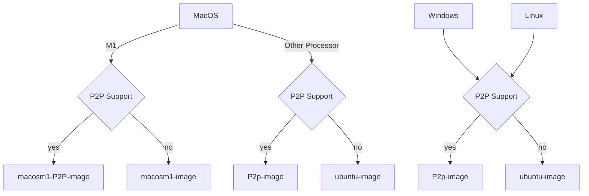

<h1 align="center"> 
Slips v1.0.7
</h1>

[Documentation](https://stratospherelinuxips.readthedocs.io/en/develop/) — [Features](https://stratospherelinuxips.readthedocs.io/en/develop/features.html) — [Installation](#installation) — [Authors](#people-involved) — [Contributions](#contribute-to-slips)


[](./LICENSE)
[](https://github.com/stratosphereips/StratosphereLinuxIPS)


[](https://GitHub.com/stratosphereips/StratosphereLinuxIPS/issues/)
[](https://GitHub.com/stratosphereips/StratosphereLinuxIPS/issues?q=is%3Aissue+is%3Aclosed)
[](https://github.com/stratosphereips/StratosphereLinuxIPS/pulls?q=is%3Aopen)
[](https://github.com/stratosphereips/StratosphereLinuxIPS/pulls?q=is%3Aclosed)
[](https://GitHub.com/stratosphereips/StratosphereLinuxIPS/contributors/)


[](https://GitHub.com/stratosphereips/StratosphereLinuxIPS/watchers/)

[](https://www.stratosphereips.org/blog/tag/slips)
[](https://discord.gg/zu5HwMFy5C)

<hr>


# Slips: Behavioral Machine Learning-Based Intrusion Prevention System


Slips is a powerful endpoint behavioral intrusion prevention and detection system that uses machine learning to detect malicious behaviors in network traffic. Slips can work with network traffic in real-time, pcap files, and network flows from popular tools like Suricata, Zeek/Bro, and Argus. Slips threat detection is based on a combination of machine learning models trained to detect malicious behaviors, 40+ threat intelligence feeds and expert heuristics. Slips gathers evidence of malicious behavior and uses extensively trained thresholds to trigger alerts when enough evidence is accumulated.


# Ways to Run
    
    1. Using Docker, which is the preferred option
    2. Native installation on Linux
 

## Running Slips Using Docker

The easiest way to run Slips is using Docker. The latest Slips docker image ```stratosphereips/slips:latest``` can analyze multiple types of network data, including pcaps, Zeek flows, Argus flows, and others. In Linux systems, it is possible to use the docker image to analyze real-time traffic from the host's interface. [Check the documentation](https://stratospherelinuxips.readthedocs.io/en/develop/usage.html) for a more detailed usage explanation.

Follow the next steps to perform a Slips test-run:

- Create a new container from the latest Slips docker image: `docker run -it -d --name slips stratosphereips/slips:latest`
- Access the container: `docker container exec -ti slips /bin/bash`
- Run Slips on a sample pcap to test things work as expected: `python3 slips.py -e 1 -f dataset/test7-malicious.pcap` 
- Checking Slips output files: `cd output/test7-malicious.pcap_<ts>/` && `cat alerts.log`

To download the Slips docker image, spawn a new container in daemon mode and run Slips on a 
test pcap in one command from your host computer:
```bash
    docker run -it -d --name slips stratosphereips/slips ./slips.py -e 1 -f dataset/test7-malicious.pcap
```

### Run Slips sharing files between the host and the container

The following instructions will guide you on how to run a Slips docker container with file sharing between the host and the container.

```bash
    # create a directory to load pcaps in your host computer
    mkdir ~/dataset
    
    # copy the pcap to analyze to the newly created folder
    cp <some-place>/myfile.pcap ~/dataset
    
    # create a new Slips container mapping the folder in the host to a folder in the container
    docker run -it --rm --net=host --name slips -v $(pwd)/dataset:/StratosphereLinuxIPS/dataset stratosphereips/slips:latest
    
    # run Slips on the pcap file mapped to the container
    ./slips.py -c config/slips.conf -f dataset/myfile.pcap
```

### Run Slips with access to block traffic on the host network

In Linux OS, the Slips can be used to analyze and **block** network traffic on the host network interface. To allow the container to see the host interface traffic and block malicious connections, it needs to run with the option `--cap-add=NET_ADMIN`. This option enables the container to interact with the network stack of the host computer. To block malicious behavior, run Slips with the parameter `-p`.

```bash
    # run a new Slips container with the option to interact with the network stack of the host
    docker run -it --rm --net=host --cap-add=NET_ADMIN --name slips stratosphereips/slips:latest
    
    # run Slips on the host interface `eno1` with active blocking `-p`
    ./slips.py -c config/slips.conf -i eno1 -p
```

### Build Slips from the Dockerfile

You can build the Docker of Slips, but consider that system requirements vary depending on the operating system, primarily because of TensorFlow. TensorFlow accesses the hardware directly, so Docker will not always work well. For example, in macOS M1 computers, the use of TensorFlow from inside Docker is still not supported. 





#### Building a Docker For macOS
To build a Docker image of Slips for macOS follow the next steps:

```bash
    # clone the Slips repository in your host computer
    git clone https://github.com/stratosphereips/StratosphereLinuxIPS.git
    
    # access the Slips repository directory
    cd StratosphereLinuxIPS/
    
    # build the MacOS image from the recommended Dockerfile
    docker build --no-cache -t slips -f docker/macosm1-image/Dockerfile .
```

To use Slips with files already inside the Docker you can do;
    
```
    # run a new Slips container from the freshly built local image
    docker run -it --rm --net=host --name slips slips
    
    # run Slips using the default configuration in one of the provided test datasets
    ./slips.py -c config/slips.conf -f dataset/test3.binetflow
```

To use Slips with files shared with the host, run:
```
    # run a new Slips container from the freshly built local image
    docker run -it --rm --net=host --name slips -v $(pwd)/dataset:/StratosphereLinuxIPS/dataset slips

    # Optionally put a new file
    cp yourfile.pcap $(pwd)/datasets/
    
    # run Slips using the default configuration in one of the provided test datasets
    ./slips.py -c config/slips.conf -f dataset/yourfile.pcap
```

To use Slips with packets from the host interface, run the following. BUT beware that the big limitation of using Docker in macOS for interface capture is that until 2022/06/28, Docker for macOS does not entirely pass all packets to the container when run in mode `--cap-add=NET_ADMIN`.
    
```
    docker run -it --rm --net=host --cap-add=NET_ADMIN --name slips slips
```


#### Building a Docker For Linux
    
To build a Docker image of Slips for Linux follow the next steps:

```bash
    # clone the Slips repository in your host computer
    git clone https://github.com/stratosphereips/StratosphereLinuxIPS.git
    
    # access the Slips repository directory
    cd StratosphereLinuxIPS/
    
    # build the docker image from the recommended Dockerfile
    docker build --no-cache -t slips -f docker/ubuntu-image/Dockerfile .
    
    # run a new Slips container from the freshly built local image
    docker run -it --rm --net=host --name slips slips
    
    # run Slips using the default configuration in one of the provided test datasets
    ./slips.py -c config/slips.conf -f dataset/test3-mixed.binetflow
```

#### First run

Be aware that the first time you run Slips it will start updating all the databases and threat intelligence files in the background. However, it will give you as many detections as possible _while_ updating. You may have more detections if you rerun Slips after the updates. Slips behaves like this, so you don't have to wait for the updates to finish to have some detections.

Depending on the remote sites, downloading and updating the DB may take up to 4 minutes. Slips stores this information in a cache Redis database, which is kept in memory when Slips stops. Next time Slips runs, it will read from this database. The information in the DB is updated periodically according to the configuration file (usually one day).

You can check if the DB is running this by looking at your processes:

```
    ps afx|grep redis
    9078 ?        Ssl    1:25 redis-server *:6379
```

You can destroy this database by running:

```
    ./slips.py -k
    Choose which one to kill [0,1,2 etc..]
    [0] Close all servers
    [1] conn.log - port 6379
```


# Modules

Slips is written in Python and is highly modular. Each module performs a specific detection in the network traffic. The complete documentation of Slips' internal architecture and instructions on how to implement a new module is available [here](https://stratospherelinuxips.readthedocs.io/en/develop/).
    
The following table summarizes all active modules in Slips, their status, and their purpose:

|   Module            | Status | Description | 
| --------------------|   :-:  |------------ |  
| HTTPS               |   ⏳   | training and testing of the Random Forest algorithm to detect malicious HTTPS flows |
| Port Scan Detector  |   ✅   | detects horizontal, vertical port scans and ICMP Sweeps |
| RNN C&C Detection   |   ✅   | detects command and control channels using recurrent neural network and the Stratosphere behavioral letters |
| Flow Alerts         |   ✅   | detects a malicious behaviour in each flow. There are more than 20 detections here |
| Flow ML detection   |   ✅   | detects malicious flows using ML pretrained models |
| Leak Detector       |   ✅   | detects leaks of data in the traffic using YARA rules |
| Threat Intelligence |   ✅   | checks IPs against known threat intelligence lists |
| ARP                 |   ✅   | checks for ARP attacks in ARP traffic  |
| Timeline            |   ✅   | creates a timeline of what happened in the network based on all the flows and type of data available  |
| VirusTotal          |   ✅   | lookups IP addresses on VirusTotal |
| Risk IQ             |   ✅   | lookups IP addresses on RiskIQ  |
| IP Info             |   ✅   | lookups Geolocation, ASN, RDNS information from IPs and MAC vendors |
| CESNET              |   ✅   | sends and receives alerts from CESNET Warden servers |
| Exporting Alerts    |   ✅   | exports alerts to Slack or STIX format |
| HTTP analyzer       |   ✅   | analyzes HTTP traffic |
| Blocking            |   ✅   | blocks malicious IPs connecting to the device |
| P2P                 |   ✅   | shares network detections with other Slips peers in the local network |
| Kalipso             |   ✅   | Slips console graphical user interface to show detection with graphs and tables |
| Web Interface       |   ✅   | Slips web graphical user interface to show detections and timeline |

#### Limitations

The main limitation of running Slips in a Docker is that every time the container stops, all files inside the container are deleted, including the Redis database of cached data, and you lose all your Threat Intelligence (TI) data and previous detections. Next time you run Slips, it will start making detections without all the TI data until downloading the data again. The only solution is to keep the container up between scans.

## Slips Bare Metal Installation

To install Slips in your host computer there are three core things needed: 

- installing Python dependencies

- installing Redis

- installing `zeek` (formerly `bro`) for network analysis. 

You can install Slips using out ```install.sh``` using:
    
    chmod +x install.sh
    ./install.sh

or manually using the following steps.

### Clone Slips repository

The first step is to clone the Slips repository to your host computer:

```bash
    # clone repository
    git clone https://github.com/stratosphereips/StratosphereLinuxIPS.git
    
    # access the Slips directory
    cd StratosphereLinuxIPS
```

### Installing Python dependencies

We recommend using [Conda](https://docs.conda.io/en/latest/) for the Python environment management:

```bash
    # create conda environment and download all Python dependencies
    conda env create -f conda-environment.yaml
    
    # activate the conda environment
    conda activate slips 
```

There's also a pip requirements.txt for pip users:
    
    pip3 install -r requirements.txt

### Installing Zeek for pcap analysis

Additionally, you may need to install either `zeek` or `bro` in order to have the capability to analyze pcap files. 
Follow the official installation guide from [Zeek Website](https://zeek.org/get-zeek/).


### Installing Redis

Slips needs Redis >= 7.0.4 for interprocess communication. Redis can be installed directly in the
host computer or can be run using Docker.

Starting, stopping managing of redis DBs is done automatically by Slips. 


[Check the documentation](https://stratospherelinuxips.readthedocs.io/en/develop/installation.html) for more detailed 
installation instructions.

### Run Slips

After all dependencies are installed and Redis is running,  you are ready to run Slips. Copy pcap files or other flow files in the ./dataset/ directory and analyze them:

```bash
    # run Slips with the default configuration
    # use a sample pcap of your own
    ./slips.py -c config/slips.conf -f dataset/myfile.pcap
```

## Viewing Slips Output

You can view Slips output using kalipso in your terminal using:

   ./kalipso.sh


Or use Slips' web interface by using:

   ./webinteface.sh

Then navigate to ```http://localhost:55000/``` from your browser.


## P2P Module
The peer to peer system os Slips is a highly complex automatic system to find other peers in the network and share data on IoC automatically in a balanced, trusted way. You just have to enable the P2P system. Please check the documentation [here](../docs/P2P.md)

You can use Slips with P2P directly in a special docker image by doing:

```bash
    # download the Slips P2P docker image
    docker pull stratosphereips/slips_p2p
    
    # run Slips on the local network
    docker run --name slipsp2p -d -it --rm --net=host --cap-add=NET_ADMIN stratosphereips/slips_p2p
```

# Train The Machine Learning Models With Your Data

Slips' machine learning models can be extended by running Slips in _training_ mode with the user network traffic, leading to a improvement in the detection.

To use this feature you need to modify the configuration file ```config/slips.conf``` to add in the ```[flowmldetection]``` section:

        mode = train

The machine learning model needs a label for this new traffic to know what type of traffic will it learn from. Add the following label:

        label = normal

Run Slips normally in your data, interface or any input file, and the machine learning model will be updated automatically.

To use the new model, reconfigure Slips to run in `test` mode by updating the ```config/slips.conf``` file with:

        mode = train
    
# Slips in the Media

- 2022 BlackHat Europe Arsenal, Slips: A Machine-Learning Based, Free-Software, Network Intrusion Prevention System [[web](https://www.blackhat.com/eu-22/arsenal/schedule/index.html#slips-free-software-machine-learning-tool-for-network-intrusion-prevention-system-29599)]
- 2022 BlackHat USA Arsenal, Slips: A Machine-Learning Based, Free-Software, Network Intrusion Prevention System [[web](https://www.blackhat.com/us-22/arsenal/schedule/index.html#slips-free-software-machine-learning-tool-for-network-intrusion-prevention-system-26687)]
- 2021 BlackHat Europe Arsenal, Slips: A Machine-Learning Based, Free-Software, Network Intrusion Prevention System [[slides](https://mega.nz/file/EAIjWA5D#DoYhJknH1hpbqfS2ayVLwA7ewNT50jFQb7S3dVAKPko)] [[web](https://www.blackhat.com/eu-21/arsenal/schedule/#slips-a-machine-learning-based-free-software-network-intrusion-prevention-system-25116)]
- 2021 BlackHat USA Arsenal, Slips: A Machine-Learning Based, Free-Software, Network Intrusion Prevention System [[web](https://www.blackhat.com/us-21/arsenal/schedule/#slips-a-machine-learning-based-free-software-network-intrusion-prevention-system-24105)]
- 2021 BlackHat Asia Arsenal, Slips: A Machine-Learning Based, Free-Software, Network Intrusion Prevention System [[web](https://www.blackhat.com/asia-21/arsenal/schedule/#slips-a-machine-learning-based-free-software-network-intrusion-prevention-system-22576)]
- 2020 Hack In The Box CyberWeek, Android RATs Detection With A Machine Learning-Based Python IDS [[video](https://www.youtube.com/watch?v=wx0V3qWdmyk)]
- 2019 OpenAlt, Fantastic Attacks and How Kalipso can Find Them [[video](https://www.youtube.com/watch?v=p2FL2sECpS0&t=1s)]
- 2016 Ekoparty, Stratosphere IPS. The free machine learning malware detection [[video](https://www.youtube.com/watch?v=IazEdK8R4YI)]

# People Involved

**Founder:** Sebastian Garcia, sebastian.garcia@agents.fel.cvut.cz, eldraco@gmail.com. 

**Main authors:** Sebastian Garcia, Alya Gomaa, Kamila Babayeva

**Contributors:**
- Veronica Valeros
- Frantisek Strasak
- Dita Hollmannova
- Ondrej Lukas
- Elaheh Biglar Beigi
- Maria Rigaki 
- kartik88363
- arkamar

# Contribute to Slips
All contributors are welcomed! How you can help?

- Read our [contributing](https://stratospherelinuxips.readthedocs.io/en/develop/contributing.html) guidelines.
- Run Slips and report bugs, make feature requests, and suggest ideas.
- Open a pull request with a solved GitHub issue and new feature.
- Open a pull request with a new detection module. The instructions and a template for new detection module [here](https://stratospherelinuxips.readthedocs.io/en/develop/).
- Join our community at [Discord](https://discord.gg/zu5HwMFy5C), ask questions, suggest new features or give us feedback.


# Acknowledgments

Slips was funded by the following organizations.

- NlNet Foundation, https://nlnet.nl/
- AIC Group, Czech Technical University in Prague, https://www.aic.fel.cvut.cz/
- Avast Software, https://www.avast.com/
- CESNET, https://www.cesnet.cz/

# Repo Stars Over Time

[](https://starchart.cc/stratosphereips/StratosphereLinuxIPS)
