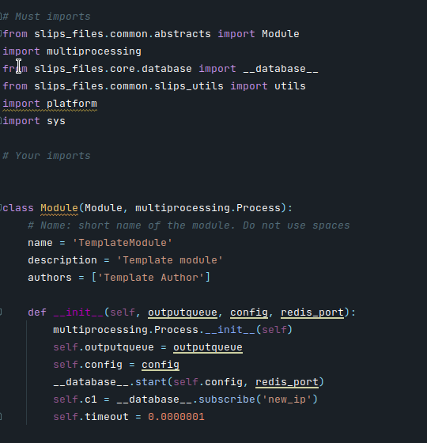

# Create a new module

Slips is a highly modular software that can be extended. 

Here we describe how to extend slips by creating a new module.

When Slips is run, It automatically loads all the modules inside the ```modules/``` dir

In ```modules/template/``` we have a template module that has all the structure needed by slips for the module to 
be integrated correctly.

So for example, let's create a module called ```scan_detector```

First, We copy the template module into a new dir called ```scan_detector``` and change the name of the .py file to ```scan_detector```

so now you should have something like this
```
modules/
├─ flowalerts/
├─ scan_detector/
│  ├─ __init__.py
│  ├─ scan_detector
```

the __init__.py is to make sure the module is treated as a python package, don't delete it

Now let's look at the modle structure


<p> Figure 1 </p>

In Figure 1 we have the import that must be included in each module under #Must Imports,
you can add your own imports in the #Your imports section 

Now we need to change the name of our module to ```Scan Detector``` change the description and author to something meaningful 

The names and descriptions of the modules are printed when slips is starting along with the module's PID.

You can add your own lines to the __init__() method, just don't delete the already existing lines as they're necessary

Let's look at what each line does:

        self.outputqueue = outputqueue

the outputqueue is used whenever the module wants to print something,
each module has it's own print() function that uses this queue.

So in order to print you simply write

    self.print("some text", 1, 0)

and the text will be sent to the outputqueue to process, log, and print to the terminal.

        self.config = config

This line is necessary if you need to read the ```slips.conf ``` configuration file for your own configurations

        __database__.start(self.config, redis_port)

This line starts the redis database, Slips mainly depends on redis Pub/Sub system for modules communications, 
so if you need to listen on a specific channel after starting the db you can add the following line to __init__()

        self.c1 = __database__.subscribe('new_ip')

now you'll get all msgs sent to that channel.

To get the list of available channels check ```slips_files/core/database.py```,
you can also create your own channel and it to that list.


        self.timeout = 0.0000001

Is used for listening on the redis channel, if your module will be using 1 channel, timeout=0 will work fine, but in order to 
listen on more than 1 channel, you need to set a timeout so that the module won't be stck listening on the same channel forever.


<hr>


Now here's the start() function, this is the main function of each module, it's the one that gets executed when the module starts.

All the code in this function should be run in a loop or else the module will finish execution and terminate.


<p> Figure 2 </p>

Let's explain Figure 2 line by line, first

        utils.drop_root_privs()

the above line is responsible for dropping root priveledges, so if slips starts with sudo and the module doesn't need the sudo permissions, we drop them.

    message = self.c1.get_message(timeout=self.timeout)

The above line listen on the c1 channel ('new ip') that we subscribed to earlier.

The messages recieved in the channel can either be stop_process or a message with data

        if message and message['data'] == 'stop_process':

The ```stop_message ``` is sent from the main slips.py to tell the module
that slips is stopping and the module should finish all the processing it's doing and shutdown.

So, for example if you're training a ML model in your module, and you want to save it before the module stops, 

You should place the save_model() function right above the following line, or inside the function

    self.shutdown_gracefully()

inside shutdown_gracefully() we have the following line

    __database__.publish('finished_modules', self.name)

This is the module, responding to the stop_message, telling slips.py that it successfully finished processing and
is terminating.

Now we have the following line

    if message and message['channel'] == 'new_ip':  

so inside this if statement you should do all the processing you need to do whenever slips sees a new ip.

The following lines are for handling exceptions by passing them to outputprocess for logging and printing,
depending on the verbose and the debug level.
    
    except Exception as inst:
        exception_line = sys.exc_info()[2].tb_lineno
        self.print(f'Problem on the run() line {exception_line}', 0, 1)
        self.print(str(type(inst)), 0, 1)
        self.print(str(inst.args), 0, 1)
        self.print(str(inst), 0, 1)
        return True


see [Verbose and debug flags docs here](https://https://stratospherelinuxips.readthedocs.io/en/develop/usage.html?highlight=verbose#running-slips-with-verbose-and-debug-flags)

Also the print() function docs have more details.