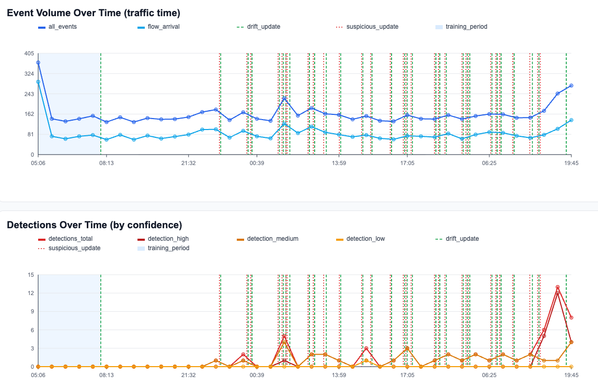

# HTTPS Anomaly Detection Module

This document describes how the `anomaly_detection_https` module detects anomalies from TLS/HTTPS traffic in Slips.

## Goal

Detect unusual HTTPS behavior per host, using:

- Hourly behavior changes (volume and novelty patterns).
- Flow-level deviations (for known servers).
- Adaptive baselines that update over time, with poisoning resistance.

## Input data used

The module subscribes to SSL/TLS events and reads related connection metadata from DB for the same UID.

Main fields used:

- SSL: `uid`, `server_name` (SNI), `ja3`, `ja3s`, `dport`, `sport`
- Conn (correlated): destination IP, total bytes, timing info

## Traffic-time logic

All detection windows are based on **traffic timestamps** (packet/log time), not wall clock time.

This keeps behavior consistent for:

- live interface capture,
- live Zeek folder input,
- offline PCAP,
- offline Zeek logs.

## Features

The module computes per-host hourly features:

- `ssl_flows`: number of SSL flows in the hour.
- `unique_servers`: number of distinct destination servers.
- `new_servers`: number of servers not seen before for that host.
- `ja3_changes`: number of new JA3 variants seen per server in the hour.
- `known_server_avg_bytes`: mean bytes for flows to already-known servers.

Flow-level feature:

- `bytes_to_known_server`: per-server bytes deviation on each flow.

## Baseline and training

Each host has independent models.

### Training phase (`training_hours > 0`)

For the first configured benign hours, the module does **fit-only** (Welford online moments):

- no detection decisions are emitted from hourly z-score rules before training ends,
- baseline mean/variance are learned strongly from this period.

Training fit strength is configurable with `training_alpha`:

Training fit technique is selected by `training_fit_method`:

- `training_fit_method = welford` -> Welford benign fit.
- `training_fit_method = ewma` -> EWMA-style training adaptation.

When `training_fit_method = ewma`, `training_alpha` controls strength:

- higher `training_alpha` = faster adaptation,
- lower `training_alpha` = slower adaptation.

### No explicit training (`training_hours = 0`)

Detection starts immediately using online adaptation.

Special fallback only for `ja3_changes`:

- if hourly `ja3_changes < ja3_min_variants_per_server`, that hourly signal is ignored until enough activity exists.

## Scoring

Each modeled feature uses robust scoring in three explicit steps:

1. Transform heavy-tail signals: `y = log(1 + x)` (`log1p`) for non-negative count/bytes features.
2. Estimate robust center/scale on recent transformed values:
   - `m = median(y)`
   - `MAD = median(|y - m|)`
   - `sigma_robust = max(1.4826 * MAD, min_std_floor)`
3. Score deviation:
   - `z_robust = |y_t - m| / sigma_robust`

Why this is used:

- HTTPS counts and byte volumes are typically right-skewed and heavy-tailed,
- mean/std-only scoring overreacts to bursts and underreacts after outliers,
- `log1p + median/MAD` is more stable under non-Gaussian traffic.

Thresholds:

- empirical thresholds calibrated from benign training when `training_hours > 0`,
- otherwise defaults (`hourly_zscore_threshold`, `flow_zscore_threshold`).

Calibration rule:

- per signal, collect robust z-scores on confirmed benign training data,
- set threshold to high benign quantile (`empirical_threshold_quantile`, default 0.995),
- fallback to defaults if training data is insufficient.

## Adaptation states

After each hour closes, the module chooses model update mode.

Update event semantics:

- `training_fit`:
  initial benign baseline fit while `trained_hours < training_hours`;
  uses training fit method (Welford-style), not EWMA alpha.
- `baseline_update`:
  normal post-training adaptation; uses EWMA with `baseline_alpha`.
  In ADWIN mode, this is used when ADWIN does not signal drift.
- `drift_update`:
  post-training drift adaptation; uses EWMA with `drift_alpha`.
  In ADWIN mode, this is used only after ADWIN drift signal and small/drift-like classification.
- `suspicious_update`:
  post-training conservative adaptation; uses EWMA with `suspicious_alpha`.
  In ADWIN mode, this is used only after ADWIN drift signal and suspicious classification.

When `use_adwin_drift=false`:

1. `training_fit`  
   During benign training: Welford fit (no EWMA alpha).

2. `drift_update`  
   If anomaly score is small (`hourly_score <= adaptation_score_threshold`) and flow anomaly count is small (`<= max_small_flow_anomalies`), update with `drift_alpha`.

3. `suspicious_update`  
   Otherwise update with `suspicious_alpha` (much smaller), to limit poisoning.

For normal non-anomalous periods outside training, per-feature EWMA uses `baseline_alpha`.

### ADWIN drift trigger (`use_adwin_drift=true`)

If `use_adwin_drift=true` and `river` is installed, ADWIN is the only drift trigger in both paths:

- **Hourly path**: ADWIN receives each raw hourly feature stream.
- **Flow path**: ADWIN receives each raw per-flow signal stream.
- ADWIN drift detected -> classify as `drift_update` or `suspicious_update` using existing thresholds.
- No ADWIN drift -> use `baseline_update` (`baseline_alpha`), even if anomalies exist.
- During benign training, ADWIN is still warmed with benign scores to reduce cold-start noise after training.

Why raw signals:

- drift is a distribution change in the observed variables, so ADWIN tracks the raw feature streams directly,
- z-scores are still used for anomaly magnitude and evidence reasons, but not as the primary drift input.

Performance note:

- hourly ADWIN cost scales with hourly feature count,
- flow ADWIN cost scales with per-flow signal count,
- both are constant-time scalar updates and usually lightweight.

Current tuned defaults for faster ADWIN reaction:

- `adwin_delta: 0.01`
- `adwin_clock: 1`
- `adwin_grace_period: 5`
- `adwin_min_window_length: 5`

## New server vs JA3 behavior

- `new_servers` is modeled as an hourly statistical feature and adapted over time.
- `new_server` can also appear as a direct flow-level novelty reason.
- `ja3_changes` is handled statistically at hourly level (with fallback gate only when training is zero).
- `new_ja3s` can appear as direct flow-level novelty reason.

## Confidence and threat level

Each detection computes confidence score `[0,1]` from multiple factors:

- anomaly severity,
- persistence in recent history,
- baseline quality,
- multi-signal agreement.

Mapped levels:

- low / medium / high confidence

Threat level used in evidence:

- `low` for low or medium confidence
- `medium` for high confidence

## Evidence format

Evidence description is human-readable and concise:

`HTTPS anomaly: type=<type>; confidence=<level> (<score>); reason=<reason>; value=<value>; why=<explanation>.`

Examples of reasons:

- New Server
- New JA3S
- Bytes to Known Server
- Hourly feature deviations (e.g., New Servers Count, JA3 Changes)

## Configuration keys

Section: `anomaly_detection_https` in `config/slips.yaml`.

Main keys:

- `training_hours`
- `training_fit_method`
- `training_alpha`
- `hourly_zscore_threshold`
- `flow_zscore_threshold`
- `adaptation_score_threshold`
- `baseline_alpha`
- `drift_alpha`
- `suspicious_alpha`
- `min_baseline_points`
- `max_small_flow_anomalies`
- `ja3_min_variants_per_server`
- `use_adwin_drift`
- `adwin_delta`
- `adwin_clock`
- `adwin_grace_period`
- `adwin_min_window_length`
- `empirical_threshold_quantile`
- `log_verbosity`

Defaults (from parser/config):

- `training_alpha: 1.0`
- `training_fit_method: welford`
- `use_adwin_drift: true`
- `adwin_delta: 0.01`
- `adwin_clock: 1`
- `adwin_grace_period: 5`
- `adwin_min_window_length: 5`

Reference:

- River ADWIN: https://riverml.xyz/latest/api/drift/ADWIN/
- Data transformations for skew/heavy tails: https://otexts.com/fpp3/transformations.html
- Robust scale (MAD): https://en.wikipedia.org/wiki/Median_absolute_deviation

## Operational logs

The module logs key events such as:

- flow arrivals,
- hour close and computed features,
- training fit updates,
- drift updates,
- suspicious updates,
- detections and emitted evidence.
