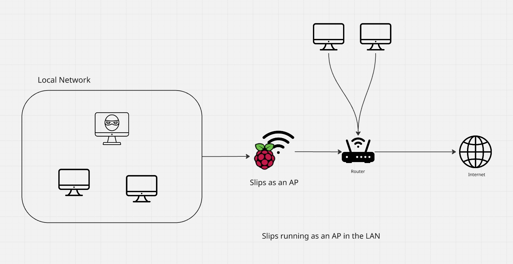
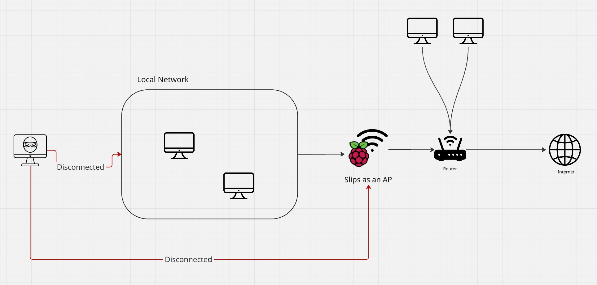
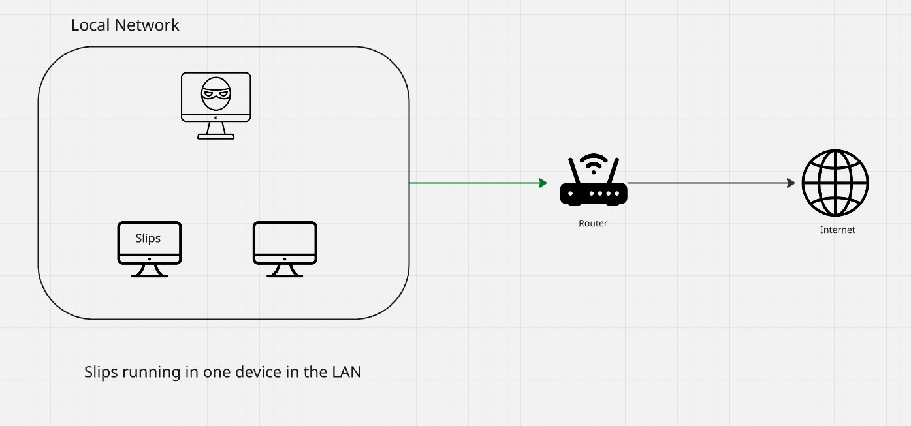
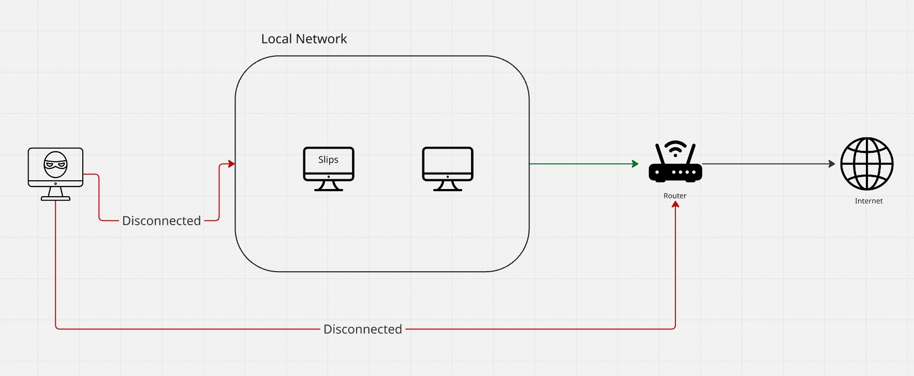

# Table Of Contents
- [ARP Poisoning](#arp-poisoning)
  * [How it works](#how-it-works)
    + [Slips as an AP](#slips-as-an-ap)
    + [Slips on a host’s computer in the network](#slips-on-a-host-s-computer-in-the-network)
    + [Why Slips can observe other hosts' unicast traffic](#why-slips-can-observe-other-hosts-unicast-traffic)
  * [Unblocking](#unblocking)
  * [How to use it](#how-to-use-it)


# ARP Poisoning

The ARP Poisoning Module is designed as a part of the Slips Immune, where Slips takes down attackers using ARP poisoning in addition to blocking them through the firewall, protecting the rest of the local network before the attacker reaches them.

ARP Poisoning module:
* <https://github.com/stratosphereips/StratosphereLinuxIPS/pull/1499>
* https://github.com/stratosphereips/StratosphereLinuxIPS/tree/develop/modules/arp_poisoner

## How it works

### Slips as an AP



<br>



Whether the attacker is connected to the AP on the RPI or connected directly to the router, once Slips detects an alert, it does the following

1. Cuts the attacker's internet by sending an unsolicited ARP reply to the attacker that maps the gateway IP to a random fake MAC address, so the real gateway is no longer reachable.

2. Isolates the attacker from the rest of the network by sending unsolicited ARP replies that map the attacker's IP to a fake MAC address, so the attacker is no longer reachable by the rest of the network.

3. Regularly sends ARP replies to local hosts that announce the attacker at a fake MAC, so the attacker does not have enough time to restore its real MAC mapping and become reachable again.

These attacks are done in a loop until the blocking period is over to ensure that the attacker stays isolated even after the ARP cache expires.


### Slips on a host’s computer in the network

Even if Slips is not controlling the AP where the rest of the clients are connected, it can protect the rest of the clients by attacking back the attackers using the same three steps above. And isolating them from the network.

**This means that even if one host only is running Slips on the network, the rest of the network will be protected.**


<br>



### Why Slips can observe other hosts' unicast traffic

This behavior is especially visible when Slips runs in Docker with host
networking and permission to administer the network:

```bash
docker run ... --net=host --cap-add=NET_ADMIN ...
./slips.py -i eth0 -p -w
```

The `-p` option enables prevention. When `arp_poisoner` receives a blocking
request, it generates random, nonexistent, locally administered MAC addresses
beginning with `02:` and sends unsolicited ARP replies that:

1. Tell the target that the gateway IP is at the fake MAC.
2. Tell the gateway that the target IP is at the fake MAC.
3. Tell other local hosts that the target IP is at the fake MAC.

The poisoner does **not** advertise the monitoring device's real MAC. Frames
are instead addressed to a fake MAC that the Ethernet switch has not learned.
The switch treats this as unknown unicast traffic and may flood copies through
multiple switch ports. A Raspberry Pi whose `eth0` is capturing in promiscuous
mode can therefore receive and record those copies:

```text
Target or gateway
        |
        | frame addressed to a fake 02:... MAC
        v
Ethernet switch
        |
        | unknown destination MAC -> flood
        v
Raspberry Pi capture interface
```

This explains why Zeek, tcpdump, or the Slips web interface may appear to show
TCP traffic between two other LAN hosts even though the Raspberry Pi is not
normally on their forwarding path. The exact flooding behavior depends on the
switch configuration; features such as port isolation or unknown-unicast
filtering can change what the capture interface receives.

#### Isolation, not transparent MITM

This is active ARP poisoning, but Slips uses it as an isolation or blackholing
mechanism rather than a conventional forwarding man-in-the-middle:

- Slips does not advertise the Raspberry Pi's real MAC address.
- Slips does not normally forward traffic addressed to the fake MAC.
- The affected connection is expected to fail or retransmit.
- Captured flows can be one-directional and must not automatically be treated
  as complete TCP connections.

#### Example from an observed run

In one investigation of `test1.pcap`:

- TCP frames addressed to the Raspberry Pi's real `eth0` MAC: **0**.
- TCP frames addressed to locally administered `02:...` MACs: **1,244**.
- The capture contained multiple random fake destination MACs.
- ARP replies emitted through the Raspberry Pi's Ethernet interface advertised
  gateway and host IP addresses at fake MAC addresses.
- The Slips output contained an entry such as:

  ```text
  Poisoned 192.168.1.185 at 2c:cf:67:5a:2e:bd.
  ```

The TCP conversation statistics were one-directional. This is consistent with
unknown-unicast copies caused by unresolved fake destination MACs, not with a
successful passive capture of complete connections.

#### Raspberry Pi access-point case

This mechanism is separate from normal access-point visibility. Devices using
the Raspberry Pi's Wi-Fi access point send traffic through the Pi as their
router or NAT gateway, so that traffic is naturally visible without ARP
poisoning. The unknown-unicast explanation applies to devices on the Ethernet
LAN when Slips monitors `eth0` and prevention has poisoned their ARP caches.


## Unblocking

Slips doesn’t keep poisoning attackers forever once they’re detected, instead, it implements a probation period of one timewindow. Meaning, it blocks the attacker for the rest of this timewindow and one extra timewindow once an alert is generated, if Slips detects no more attacks during that extra timewindow from this attacker, it unblocks the attacker after the probation period is over. if Slips detects more attacks, it extends the blocking/probation period by one more timewindow.

This way, the more attacks the attacker does, the longer Slips will isolate them.

Once the blocking period is over, Slips stops poisoning the attacker, which restores its internet connection, and stops announcing the attacker at a fake MAC, which allows the rest of the network to reach it.

Blocking and unblocking are tracked in arp_poisoning.log in the output directory.


## How to use it

1. Start Slips docker with admin capabilities to be able to use the blocking modules

```

docker pull stratosphereips/slips

docker run -it --rm --net=host --cap-add=NET_ADMIN stratosphereips/slips

```

2. Run slips on your interface and with -p for blocking modules
```
./slips.py -i eth0 -p
```

3. Once an attacker is detected and poisoned, slips will log it to arp_poisoning.log in your output directory
