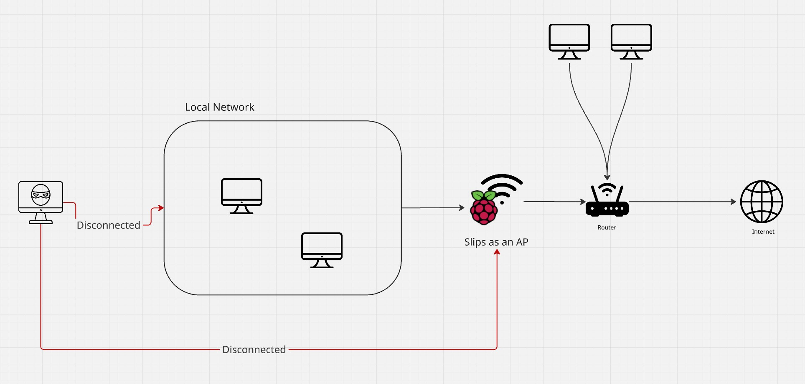

# Table Of Contents
- [ARP Poisoning](#arp-poisoning)
  * [How it works](#how-it-works)
    + [Slips as an AP](#slips-as-an-ap)
    + [Slips on a host’s computer in the network](#slips-on-a-host-s-computer-in-the-network)
  * [Unblocking](#unblocking)
  * [How to use it](#how-to-use-it)


# ARP Poisoning

The ARP Poisoning is designed as a part of the Slips Immune, where Slips takes down attackers using ARP poisoning in addition to blocking them through the firewall, protecting the rest of the local network before the attacker reaches them.

ARP Poisoning module: <https://github.com/stratosphereips/StratosphereLinuxIPS/pull/1499>


## How it works

### Slips as an AP





Whether the attacker is connected to the AP on the RPI or connected directly to the router’s WIFI, once Slips detects an alert, it does the following

1. Isolates the attacker from the internet by sending an ARP request to the attacker announcing the gateway at a fake mac, so it’s no longer reachable.

2. Isolates the attacker from the rest of the network by sending a gratioutos ARP request announcing the attacker at a fake mac, so it’s no longer reachable by the rest of the network.

3. Regularly sends ARP replies for all hosts in the network announcing the attacker at a fake MAC so it doesn’t give the attacker time to reply with it’s real MAC and be reached by the rest of the network..

These attacks are done on a loop until the blocking period is over to ensure that the attacker is still isolated even after the ARP cache expires.


### Slips on a host’s computer in the network

Even if Slips is not controlling the AP where the rest of the clients are connected, it can protect the rest of the clients by attacking back the attackers using the same three steps above. And isolating them from the network.

**This means that even if one host only is running Slips on the network, the rest of the network will be protected.**


## Unblocking

Slips doesn’t keep poisoning attackers forever once they’re detected, instead, it implements a probation period of one timewindow. Meaning, it blocks the attacker for the rest of this timewindow and one extra timewindow once an alert is generated, if Slips receives no more attacks during that extra timewindow from this attacker, it unblocks the attacker after that timewindow is over, if it receives more attacks, it extends the blocking/probation period by one more timewindow.

This way, the more attacks the attacker does, the longer slips will Isolate them. 

Once the blocking period is over, Slips stop poisoning the attacker, which restores its internet connection, and stops announcing the attacker at a fake MAC, which allows the rest of the network to reach it.

Blocking and unblocking are tracked in arp\_poisoning.log in the output directory.


## How to use it

1. Start Slips docker with admin capabilities to be able to use the blocking modules

```

docker pull stratosphereips/slips

docker run -it --rm --net=host --cap-add=NET_ADMIN stratosphereips/slips

```

2. Run slips on your interface and with -p for blocking modules
```
./slips.py -i eth0 -p
```

3. Once an attacker is detected and poisoned, slips will log it to arp_poisoning.log in your output directory
