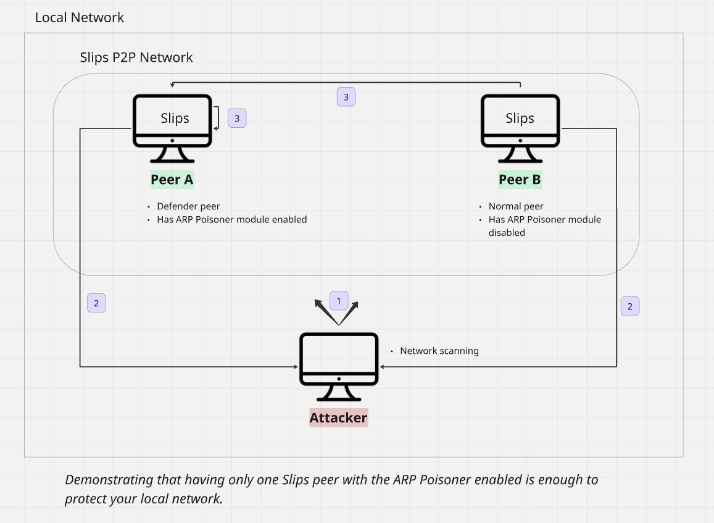

# Possible Risks of ARP Poisoning

### Table of Contents
- Risks of ARP Poisoning
  + [Slips setting evidence for its own self as malicious when it’s arp poisoning attackers](#slips-setting-evidence-for-its-own-self-as-malicious-when-it-s-arp-poisoning-attackers)
  + [Slips blocking other Slips instances in the network thinking they’re malicious when they’re ARP poisoning attackers](#slips-blocking-other-slips-instances-in-the-network-thinking-they-re-malicious-when-they-re-arp-poisoning-attackers)
  + [A Large amount of packets are sent when the ARP poisoner is keeping the attacker isolated (repeated poisoning of the attacker)](#a-large-amount-of-packets-are-sent-when-the-arp-poisoner-is-keeping-the-attacker-isolated--repeated-poisoning-of-the-attacker-)
  + [Legal Restrictions](#legal-restrictions)

- [ARP Filter Demo](#arp-filter-demo)

---

### Slips setting evidence for its own self as malicious when it’s arp poisoning attackers

This is now considered self-defense. Slips is now aware that the ARP poisoning module is enabled, so that any poisoning of attackers in the network wouldn’t be detected as evidence.

**Implementation**

<https://github.com/stratosphereips/StratosphereLinuxIPS/blob/develop/modules/arp/filter.py>

---

### Slips blocking other Slips instances in the network thinking they’re malicious when they’re ARP poisoning attackers

We have the P2P module for Slips to recognize other Slips instances in the local network. And a trust model to assign a trust value to each Slips peer based on their reliability and their suspicious activity. 

To avoid blocking other Slips instances, we simply need to recognize them as peers and trust them enough to skip reporting them when we detect them doing ARP poisoning.

Peer trust values are computed using a score set for them by Slips, so even if a trusted peer gets compromised, once Slips detects malicious activity by it and its “maliciousness” score increases, Slips will no longer trust it and will start setting ARP-related evidence for it normally.   

**Solution**

Both countermeasures are implemented in the ARP filter, detecting self defense and other slips attacking back.

**Implementation**

<https://github.com/stratosphereips/StratosphereLinuxIPS/blob/develop/modules/arp/filter.py>

---

### A Large amount of packets are sent when the ARP poisoner is keeping the attacker isolated (repeated poisoning of the attacker)

Slips discovers all the hosts in the network using repeated ARP scans. These scans are essential for isolating attackers, as they allow Slips to tell each host in the localnet that the attacker is at a fake MAC address.

When Slips detects an attacker, it cuts the attacker’s internet access by poisoning it, telling it that the gateway is located at a non-existent IP address. At the same time, it isolates the attacker from the rest of the network by poisoning all known hosts, informing them that the attacker’s IP maps to a fake MAC.

To make sure the attacker stays isolated and has no internet, it’s not enough to poison just once. The minute poisoning stops, we give the attacker space to announce its real MAC address to the network and become reachable again. We also give it space to reach the gateway and regain internet access.

That’s why the ARP poisoner keeps re-poisoning attackers every 10 seconds. This repeated poisoning ensures the attacker remains isolated, but it also results in a large amount of ARP packets being sent by Slips on the network.

**Solution**

We reduced the ARP packet flood by implementing a mechanism similar to TTLs, but for attacker ARP poisons. Instead of poisoning every 10 seconds, we slow it down to every 30 seconds. ARP caches on most OSes typically expire after 30 to 60 seconds, so poisoning every 30 seconds is enough to keep the cache poisoned while reducing network overhead.

Additionally, we implemented an adaptive delay between ARP scans. These scans are used to check for live hosts and send each one a poison packet for the attacker’s fake MAC, so tuning the scan frequency helps reduce unnecessary load while still maintaining effective isolation.

**Implementation**

<https://github.com/stratosphereips/StratosphereLinuxIPS/pull/1545>

---

### Legal Restrictions

ARP poisoning may be subject to legal restrictions in certain jurisdictions even when used as a defense mechanism. Users are responsible for ensuring compliance with all applicable local laws and regulations.

The ARP poisoning module is provided for legitimate security purposes only. Any use of this functionality is at the user's sole discretion and liability.

In regions where ARP poisoning is prohibited, users should disable this feature in the configuration file. When disabled, Slips will still be able to block attackers by using only firewall-based modules.

---

### ARP Filter Demo

Demonstrating the solution of the first 2 issues addressed here (The ARP filter in action)

****

**Phase 1:**

- An attacker in the local network is port scanning.

**Phase 2:**

- Slips peer A, with the ARP Poisoner module enabled, detects and poisons the attacker out of the network.

- Slips peer B, detects and sets an alert about the attacker, without blocking

**Phase 3:**

- This is where the ARP filter comes in;

  - Peer A detects itself ARP poisoning the attacker’s IP, but discards the evidence since it’s self defense. 

  - Peer B detects Peer A sending unsolicited ARP packets while isolating the attacker from the network, but discards the evidence since it’s a trusted Slips peer.

**Conclusion**

- Peer B was protected by Peer A even without having the poisoner enabled.

- Peer B would have been protected even without running slips, because another slips instance took care of isolating the attacker.

- Slips is now aware of itself and of other trusted peers using their immunity to attack back.
