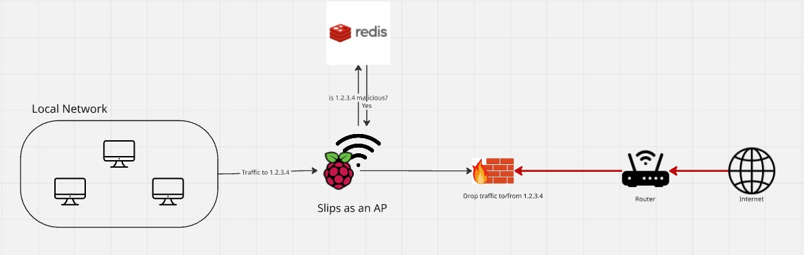
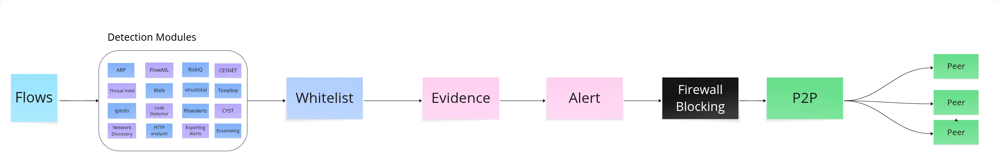

# Table of Contents
- [IDS-in-the-middle setup](#ids-in-the-middle-setup)
- [Demo: Firewall Blocking with Slips in the middlle](#demo--firewall-blocking-with-slips-in-the-middlle)
- [When does Slips decide to block an IP?](#when-does-slips-decide-to-block-an-ip-)
- [Blocking Module Implementation](#blocking-module-implementation)
- [Logs](#logs)
- [Requirements](#requirements)
- [Limitations](#limitations)

## IDS-in-the-middle setup

Slips runs as an IDS-in-the-middle, sitting between clients and the internet when running as an access point in the RPI or when running standalone in the host’s computer. All traffic passes through it, so it can inspect flows in real time.

With iptables support, Slips doesn’t just detect, it blocks malicious traffic. It protects clients from threats both inside the local network and online. 

The blocking module supports blocking local and public IPs and is done through a custom chain (slipsBlocking), inserted at the top of the INPUT, OUTPUT, and FORWARD chains in iptables Linux firewall. 

## Demo: Firewall Blocking with Slips in the middlle 

This diagram shows how Slips acts as a firewall and access point to protect a local network. When devices in the network try to communicate with an external IP (e.g., 1.2.3.4), Slips queries its detection modules to check whether the destination is malicious. If the module confirms that the IP is malicious, Slips enforces a blocking rule through its firewall. The firewall then drops all traffic to and from the malicious IP before it reaches the router and the Internet. 

This setup ensures that threats are identified in real time and contained at the network edge.

## When does Slips decide to block an IP?

1. Flows are fed to Slips detection modules. They get analyzed by the behavioural, machine-learning and signature-based modules.

2. When a flow is detected as malicious, Slips checks first if the user whitelisted the flow’s IPs, MACs, domains, etc.

3. If the flow wasn’t whitelisted, and evidence is set. 

4. Evidence keep accumulating until they reach a specific threshold, just then Slips generates an alert and sends a request to the blocking module.

5. The blocking module blocks all traffic to and from the IP using the firewall and schedules a probation period for unblocking it later. 

6. Slips notifies the P2P module about the alert and the attacker’s IP to tell the network about it.

7. Peers get notified about the attacker’s IP and decide whether to block it or not.

8. Blocked IPs get unblocked automatically once the blocking period is over only if no more evidence are found for them. 

More details about how unblocking works here <https://stratospherelinuxips.readthedocs.io/en/develop/immune/arp_poisoning.html#unblocking>

## Blocking Module Implementation

https://github.com/stratosphereips/StratosphereLinuxIPS/tree/develop/modules/blocking

## Logs

Slips stores the blocking and unblocking logs in `blocking.log `in the used output directory.

## Requirements

Usage of the firewall requires root access, which can be achieved by:

1. Locally by running slips with sudo

2. In docker by using the \``--cap-add=NET_ADMIN`\` flag.

## Limitations

1. Blocking only works on **Linux with iptables.**

2. Slips uses the firewall to block IPs and DNS answers of domain, it doesn’t directly block domains.

3. Slips blocks all traffic to and from the detected malicious IP until the probation blocking period is over.
