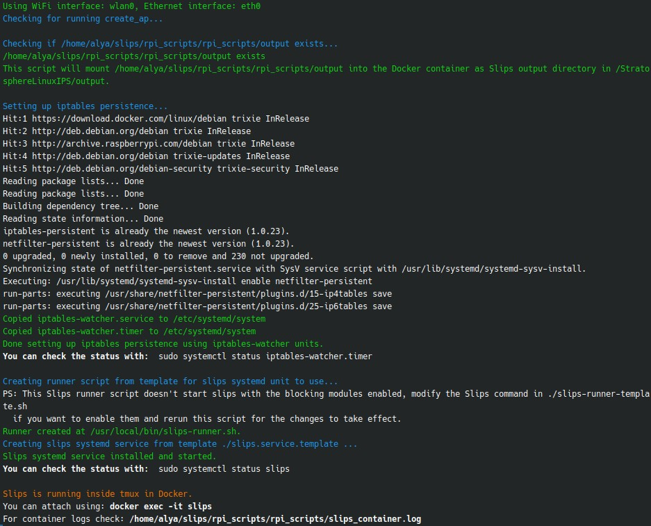

# Failover Mechanisms

The project has a few failure points listed below that we explicitly want to control instead and try to recover from.

Our goal if something breaks, is to try to recover automatically where possible, but if recovery is not possible or the failure is critical, the user must lose internet so they are forced to debug and restart Slips manually instead of staying connected without Slips protection.


All failure points are handled by the ```failover_handler.sh``` script located in ```StratosphereLinuxIPS/rpi_scripts/```.

## Prerequisites

- Raspberry Pi with docker installed
- StratosphereLinuxIPS cloned. (or just the rpi_scripts/ directory)
- Root access to the Raspberry Pi.
- A [running access point](https://stratospherelinuxips.readthedocs.io/en/develop/immune/installing_slips_in_the_rpi.html#protect-your-local-network-with-slips-on-the-rpi).


## How to use

Run the following command from Slips main directory as root:

```bash
sudo  ./rpi_scripts/failover_handler.sh <wifi_interface>,<ethernet_interface>
```

**Where**

- ```<wifi_interface>``` is the name of the wifi interface used by the access point (e.g. ```wlan0```, etc).

- ```<ethernet_interface>``` is the name of the ethernet interface connected to the router (e.g. ```eth0```, etc).

**You should see output similar to the image below:**




**Output:**

The script will
- Log Slips docker container status, used command, and any errors to ```slips_container.log``` for debugging purposes. This file should be checked in case you notice any issues with the AP or Slips.
- Start Slips and iptables watcher services through systemd so they start automatically on reboot and on failure.
- Start slips inside a docker container monitring your ethernet and wifi interfaces.
- Mount your local ```StratosphereLinuxIPS/output``` to ```/StratosphereLinuxIPS/output``` inside the started Slips container so any output generated by Slips will be available on the host machine.


## How Failovers are Handled

Slips in the Raspberry Pi has 3 main failure points that we want to handle:
1. The access point dies
2. Slips dies
3. The Raspberry Pi reboots

### The access point dies

If the AP dies, clients get disconnected. There's nothing to handle here. Slips keeps monitoring the ethernet interface and when the AP is back up, clients can reconnect and Slips continues protecting them.


### Slips dies

Failovers when Slips dies consist of:

* **Iptables firewall rules persistence**: The iptables firewall rules are saved periodically by the systemd unit that watches for iptables changes and saves them using ```netfilter-persistent``` whenever a change is detected.
* **Shutting down the AP process**: If Slips crashes we do not want the AP to keep running without Slips protection so we intentionally shut down the access point for the user to notice, debug and restart Slips manually instead of staying connected without Slips protection.
* **Restarting Slips automatically through systemd:** Slips restarts automatically through systemd on failure and on reboot.
* **Logging Slips container status to a file for debugging**: Slips container logs are places in ```slips_container.log``` for debugging purposes.


### The Raspberry Pi reboots

Failovers consist of:

* **Iptables firewall rules persistence**
* **Automatic start of Slips service through systemd**


When the Pi reboots, we want Slips to start automatically, and we want the iptables rules added by Slips to persist. The automatic restart is handled by systemd through the generated ```slips.service``` file, and firewall persistence is handled using the custom iptables watcher through the generated ```iptables-watcher.service```.


Both units are generated and started and added to the user's ```/etc/systemd/system``` by the ```failover_handler.sh``` script.

---

## File Descriptions

All the files involved in failover mechanisms are placed in ```StratosphereLinuxIPS/rpi_scripts/``` and are described in the table below:


| File                                      | What it does                                                                                                                                                                                                                                                                                                                                  |
|-------------------------------------------|-----------------------------------------------------------------------------------------------------------------------------------------------------------------------------------------------------------------------------------------------------------------------------------------------------------------------------------------------|
| failover_handler.sh                       | The central orchestrator that checks AP status, ensures root access, prepares directories, sets up iptables persistence, builds the Slips runner script, generates the systemd unit, and enforces all failover behavior. This is the piece that links every component together and decides how the system should react when something breaks. |
| iptables_autosave/check-iptables-hash.sh  | Keeps track of the hash of the current iptables rules and triggers a save when change is detected.                                                                                                                                                                                                                                            |
| iptables_autosave/iptables-watcher.service | The systemd service that runs check-iptables-hash.sh (because we can't run the script directly by the timer), this is triggered by the iptables-watcher.timer every 10s to check for iptables changes.                                                                                                                                        |
| iptables_autosave/iptables-watcher.timer  | A systemd timer that periodically runs iptables-watcher.service so iptables rule changes are captured and saved automatically.                                                                                                                                                                                                                |
| slips_container.log                        | A runtime log collecting Docker container output, commands, and status. useful for investigating restarts, failures, or unexpected behavior.                                                                                                                                                                                                  |
| slips-runner-template.sh                   | The script that launches Slips container and launches slips inside of it in a tmux. This runner keeps the container up as long as Slips is running.                                                                                                                                                                                           |
| slips.service.template                     | The systemd unit that starts slips on reboot and on failure, it runs the slips-runner-template.sh.                                                                                                                                                                                                                                            |


---
