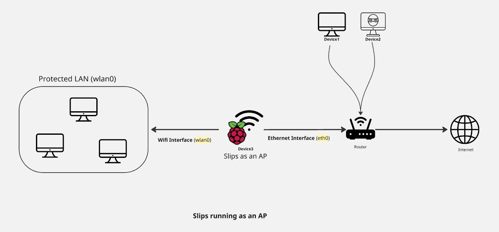

# IDS-in-the-middle Traffic Routing


# Problem Statement
With the current design of Slips, Slips only supports monitoring one interface with Zeek.
This causes a limitation when Slips is running as an access point in the RPI.

For example, consider the following setup:




In this setup, originally, Slips was designed to monitor the wlan0 interface only. Which is the wifi interface of the access point
started on the RPI.
This interface has access to all the incoming and outgoing traffic of the devices connected to the RPI's wifi.


However, when monitoring wlan0, Slips is unaware of all the traffic happening in the router's main wifi, which means,
If device 2 is doing any attack, like nmap or an ARP scan, the device running Slips (RPI on Device 3) will be affected
by the attack, but it won't be able to detect or stop it because it's not monitoring the interface that receives the
attack (eth0 in this case) and it doesn't have access to the attacker's IP.


This makes out goal is to find a way to access and monitor both interfaces (wlan0 and eth0) when Slips is running as
an access point in the RPI.

# Researched Solutions

Here we list the researched solutions to monitor both interfaces in Slips, they all manage to give slips access to the network
traffic from both interfaces, but they all have their limitations that made us discard them.

#### Using Bridge mode instead of NAT for the RPI Access Point:

**Goal:**
The plan here was to use a bridge when starting the access point, and have Slips monitor the bridge interface instead of wlan0.
and to achieve NAT-like protection, we would set up iptables rules to isolate the devices connected to the RPI access
point from the router's network.


**Limitations:**
- Bridge mode isn't reliable in the RPI 5 due to the lack of hardware support [#1639](https://github.com/stratosphereips/StratosphereLinuxIPS/issues/1639).
causing frequent reconnection of AP clients, client failing to get an IP address, and extremely slow internet connection for connected clients.
- Iptables only filter L3 attacks, L2 (ARP scans) attacks will not be filtered. which affects the protection of the AP clients.


#### Port Mirroring

**Limitations:**
- Requires users to change their router settings, which is not feasible for all users.

#### A Zeek Cluster with two workers monitoring each interface

**Limitations:**
- Complex to set up and manage by Slips and by users, especially for users unfamiliar with Zeek clustering.
- Restarting the Zeek cluster each time Slips is rerun (including stopping, redeploying, and starting) takes about five
minutes, which is too long to be practical for Slips users.


# Working Solution

Support monitoring 2 interfaces and start 2 instances of Zeek (without a cluster),
one monitoring each interface (wlan0 and eth0).

**Pros:**
- Integrates well with the current Slips architecture.
- Traffic from both interfaces isn't mixed, each goes to its own Zeek directory.

**Cons:**
- Duplicate traffic. When a connected AP client sends traffic to the internet, the traffic will be seen by both
Zeek instances resulting in duplicate zeek logs.

**Workaround:**

- For solving the duplicate traffic issue, thanks to the flexibility of zeek, we added a filter to show incoming traffic only
in the logs produced by the zeek instance monitoring the ethernet interface.


# Usage

To use this feature, simply pass the `--access-point` or `-ap` argument followed by a comma-separated list of interfaces
to monitor when running slips.

The wifi interface should be listed first, followed by the ethernet interface.

```./slips.py --access-point  wlan0,eth0```

or

```./slips.py -ap wlan0,eth0```
