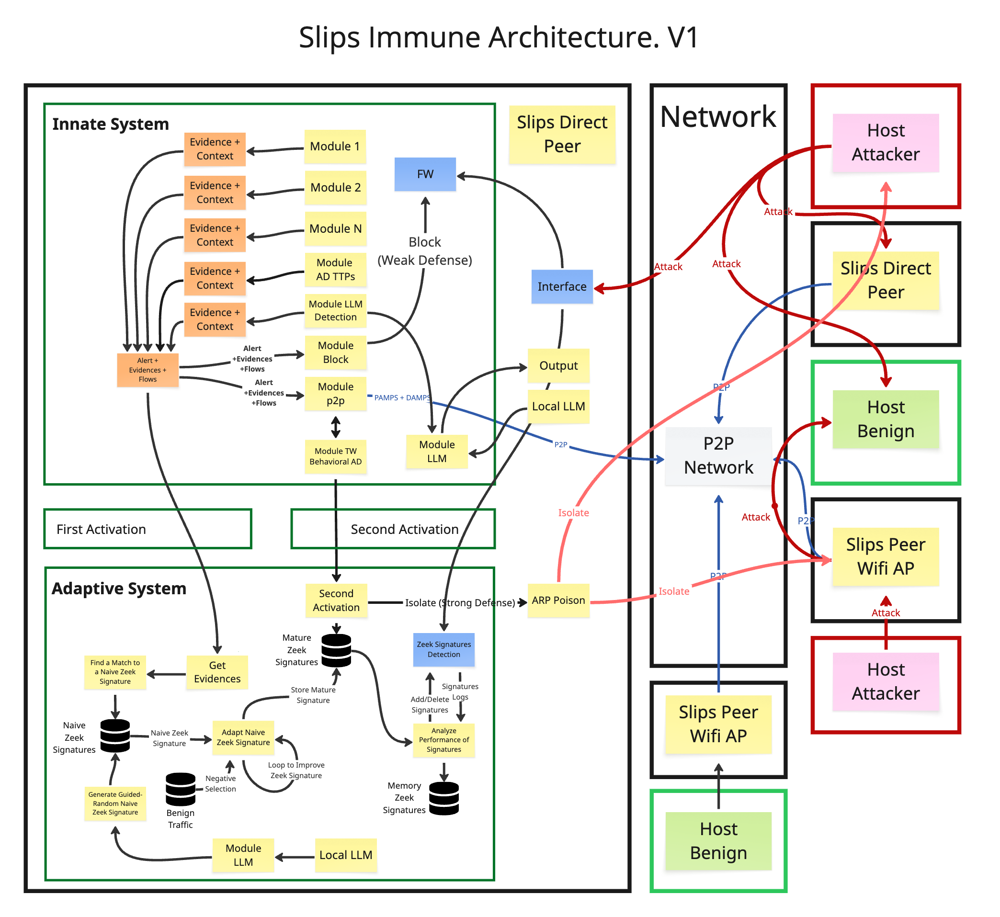
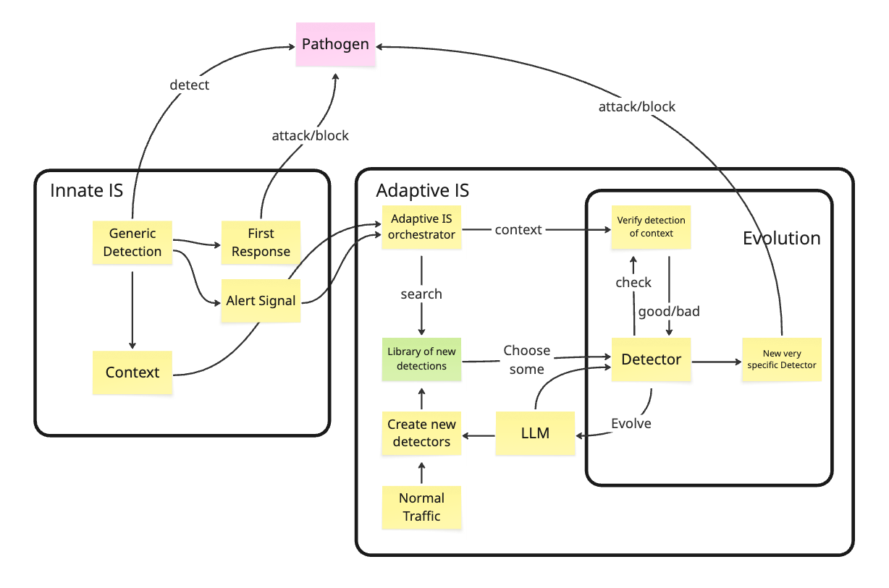

# Architecture Design of Slips Immune 

## Introduction
The new Slips architecture takes inspiration from the field of immunology to (i) better detect attacks, (ii) better avoid false positives, (iii) better decide when to react to an attack, and in general to (iv) improve its capabilities as an intrusion detection system.

This document describes the main aspects of the new Slips architecture, how each part interacts with the others, and why. Future documents will describe (i) the details of the human immune system, (ii) the reasons why Slips uses immunology concepts, (iii) the similarities and differences between the real human immune system and other artificial immune proposals, and (iv) additional immunology concepts not implemented in this version of Slips.

## Quick terminology agreement
Since there are many terms and acronyms used in the field, we will use human in front of any concept from biology (e.g., human immune system). If we do not use it, such as in adaptive system, then we refer to the version implemented in Slips. This avoids having to use words like artificial and others repeatedly.

## Immunology principles used in Slips
For this version of Slips we chose to implement only some of the human immune system concepts, as described in the following sections. For each main concept, we provide a brief biological description and explain how it was translated into Slips.

This is a summary of the design changes to the current Slips architecture to incorporate immunology concepts:
- Clear separation of the innate system for generic fast detection, and the adaptive system for slower-to-activate but very precise and powerful detection.
- Use of two-pathway activation of the adaptive system to reduce false positives.
- Use, in the innate system, of PAMP-type signals as the first pathway for activating the adaptive system. This corresponds to detectors of generic malicious attacks and TTPs of malicious actors (based on standard immunology theory).
- Use, in the innate system, of DAMP-type signals as the second pathway for activating the adaptive system. This corresponds to stress or danger signals detected by anomaly detection in the P2P system (based on the danger theory of immunology).
- Creation, in the adaptive system, of semi-random precise detectors, using negative selection and genetic-based adaptation.
- Implementation, in the adaptive system, of memorization for activated and successful detectors, allowing them to be reused very quickly in the future.
- Implementation of mechanisms to stop threats in two modalities: firewall blocks and ARP poisoning attacks in the local network.
- Implementation of communication signals on top of the current P2P communication network, including DAMP and PAMP signals.

## General Diagram of Slips Immune Architecture

## From Immunology to Cybersecurity
The human immune system is an evolved, vast, complex, and not fully understood network of millions of interacting parts that produce emergent behaviours to protect humans and help the species survive.

The first proposal to apply immunology concepts to cybersecurity appeared in the 1987 paper Computer Viruses, Theory and Practice, which described malicious software as a “virus” [1]. In the 1980s and 1990s, many papers, software projects, and companies proposed, implemented, and described a “computer immune system,” “cybersecurity immune system,” or even an “Internet immune system.” These proposals explored different ways to protect computers by attempting to learn from the human immune system.

However, although many papers exist in the area, most only adopt a very simple and limited part of immunology ideas—or merely call their technique “immunology” because they use anomaly detection algorithms. We do not consider any of these proposals to be a real, complete, or valid transcription and implementation of immunology concepts into cybersecurity. To the best of our knowledge, as of 2025, there is no software that can be downloaded, run, or purchased that truly uses immunology concepts and not just anomaly detection.

Our own ideas of how immunology can be used as an analogy for computer security are at best simplistic, and at worst completely wrong.

 # First Concept: Innate and Adaptive Systems in Slips
In Slips, the innate and adaptive systems are implemented through a separation of functions inside the modules and capabilities of Slips. Slips tries to resemble a single cell in its operation, but current network communication and operation technologies are not strong enough in most networks to support multiple Slips instances playing different cell roles. For now, therefore, Slips will also play the role of different immune cells inside a single host.

## Innate System
The human innate system is composed of a large group of cells and activities, but in principle it is able to:

- React very quickly.
- Detect generic traits of pathogens based on the detection of specific Pathogen-Associated Molecular Patterns (PAMPs).
- Regulate and sense Damage-Associated Molecular Patterns (DAMPs).

The non-self detection theory of the human immune system says that there is no such thing as detecting the concept of self in cells. The only concept of self is trained during weak matching in the training of new T-cells and B-cells, to ensure they only receive pathogen parts from MHC Class II molecules. Apart from this, the human immune system does not have a concept of self. What it has is a concept of non-self, achieved by explicitly detecting the PAMPs of known pathogens.

### Detection of Non-self with PAMPs in Slips
Most of the current modules in Slips version <= 1.1.12 play the role of the innate system. These include: Input, Output, mlflowdetection, arp, cesnet, cyst, ensembling, exporting_alerts, http_analyzer, ip_info, irisModule, kalipso, leak_detector, network_discovery, p2ptrust, riskiq, rnn_cc_detection, threat_intelligence, virustotal, and update_manager. Some core parts of Slips are also part of the immune system, such as output. 

These modules are part of the innate system because they are very generic (e.g., port scan detector, unknown HTTP User-Agent, etc.), which makes them easy to create and train but also prone to false positives. Therefore, detections like unknown HTTP User-Agent are considered PAMPs by Slips since they are attack-associated patterns.

A new addition to the innate system in Slips will be the module to detect TTP (Tactics, Techniques, and Procedures) signatures. This new module will focus on detecting generic signs of the TTPs used by most internal attackers. In the 'Diagram of General Slips Architecture. V1', this module is called _Module AD TTPs_, because it will also use anomaly detection. It will be pre-trained with known tools and traffic expected during the TTPs of certain APT groups. This module will be trained in a counterintuitive direction compared to most classical detectors: it will be more general and deliberately tolerate false positives. Therefore, some TTPs are also considered PAMPs since they are directly related to attack-associated patterns.

The speed of response required by the innate system is implemented in Slips by directly adding rules to the host computer’s firewall. This is a defensive mechanism, not an attacking mechanism. More about this decision can be read in Section [[#Attacking or Defending]]. We have not found any faster response to a network attack than a firewall rule to stop it.

### Detection of Danger Signals with DAMPs
In the human innate system there is also the concept of detecting DAMPs (Damage-Associated Molecular Patterns), which occur when many different cells find signs that something bad has happened. DAMPs can be molecules that induce inflammation, molecules that raise body temperature, or even evidence that a normal cell has died incorrectly.

The critical difference between PAMPs and DAMPs is that PAMPs are patterns of pathogens, while DAMPs are patterns of damage. They are related but not the same, and they do not come from the same source. This difference is key because these signals are the two pathways for activating the adaptive system later, and therefore for reducing false positives. They cannot come from the same source. They reduce false positives because they provide independent evidence of the same phenomenon.

Generating DAMPs in Slips is not an easy task because, when running on a single computer, it is hard to find two related but independent signals that indicate an attack. DAMPs should represent damage, danger, or indirect evidence of something bad happening.

We decided that DAMPs in Slips will be represented in two ways:

- By using its P2P network to send signals to other peers.
- By computing the behavioural profile of all other hosts in the network and identifying anomalies in their behaviour.

### DAMPs as Damage signals in the P2P Network
Each peer in the P2P network is connected to the others and capable of exchanging information. Each peer also computes how much it trusts each of the other peers.

In the current version of Slips, this is already implemented: Slips exchanges alerts with its peers. Slips also defines its own terminology for alerts and evidences. An alert is a signal to block or stop a computer after enough evidence of maliciousness has been observed. An evidence is the output of a specific detector, with a confidence value and numerical threat level. When enough evidence is collected to pass the threshold, an alert is generated for that host. Therefore, Slips currently exchanges alerts (e.g., “block host A”) but not evidences (e.g., “unknown HTTP User-Agent”).

These alerts between peers provide an initial view of what is happening elsewhere in the network and which attacks are being received. This enables faster protection, since peers can defend against attackers that have not yet targeted them, based solely on reports from others.

### DAMPs as Anomaly Detection on Behaviours
One of the most innovative additions to Slips will be the analysis of behavioural changes in known hosts across the network, used as a proxy to measure damage and stress.

Slips currently tracks each host it communicates with or receives traffic from, and divides this traffic into time windows. A time window (typically one hour) holds all the summarized flows, communications, services, evidences, and alerts for that host. Each time window for each host contains around 15 features.

The new idea is to use anomaly detection algorithms to track and study the behaviour of all known hosts in order to detect when their behaviour changes.

A change in behaviour is not sufficient on its own to prove that something bad has happened, but it is enough to show that something has changed. The algorithm will be trained with new data so it adapts over time. Training will occur when no alerts are present for that host over several consecutive time windows.

Anomalies in behaviour will be considered DAMPs, since we assume that after an attack a host’s traffic pattern will change.

These behavioural changes may also be sent as a special type of evidence in the P2P network, since each peer only has a partial view of the traffic. Sharing this information with others is particularly valuable.

### Trained Immunity
A recently discovered concept in human immunology is _trained immunity_. It means that even the innate system can be trained. The mechanisms are not yet completely understood, but under certain conditions the innate system appears to develop memory.

In Slips, training of the innate system is currently done in two ways:

- By the experts designing Slips when new versions are created and published. These updates are received whenever Slips is upgraded.
- By the user, when Slips is run in train mode on their local traffic, which modifies the machine learning module of mlflowdetector. Currently there are no safeguards on this training, but they will be added.

## Adaptive Immune System
The human adaptive immune system has many characteristics described, but for the purposes of our work only some of them will be recreated in Slips. In Slips, the adaptive system must be created from scratch.

- The parts of the adaptive system implemented in Slips will be:
- Creation of guided-random new detectors.
- Negative selection.
- Two-pathway activation.
- Evolution of pattern matching to improve accuracy.
- Memory cells of successful detectors.
- Slow activation, fast action.

### Guided-random new detectors
For the adaptive immune system, Slips implements the creation of many Zeek detection scripts that are guided-randomly adapted (not evolved and not a genetic algorithm) to get very precise fast rule-based detectors with context information.

The negative selection will be done using a local offline database of benign traffic (described later). 

The idea of the guided-random creation is to:
1. Create many guided-random detection scripts for Zeek using the new local LLM module. It is random only for certain parts of the Zeek script.
	1. A basic template of the detector is given 
	2. An LLM choses each part of the template according to what it is expected. If it is a URL then a URL, if it is a domain, then a domain.
2. __Positive Selection__. Each script should:
	1. Recognize some traffic
	2. Be syntactically correct
	3. Compile and load
	4. Compile 
3. __Negative Selection__. Each script should:
	1. Be tested against a large DB of benign traffic.
	2. If any match happens the script is discarded.

The following is a more detail diagram of how the innate and adaptive system relate to the new ideas of generating new detectors.

### Negative Selection
Negative selection will be carried out as follows:

1. Obtain a global predefined database of benign traffic. This will be in the form of Zeek text flows. Sometimes it will consist of a single isolated flow, and sometimes an entire time window of traffic.
2. It is crucial to also include the benign traffic of the local computer. This will be done by waiting for the following conditions:
    1. The user runs Slips in train mode with the label benign.
    2. No alerts are generated in this mode.
3. Each created Zeek script is run against all of this traffic, and if the script generates a detection, it is discarded.
4. Each Zeek script will also have a time-to-live value, which will be used to decommission it later as a false positive reduction technique, inspired by the behaviour of the human immune system.

### Confirmed Activation, Fast Strong Action
The detectors of the adaptive system must be confirmed before activation because their response is very strong and can have significant consequences. This is achieved through [Two Pathway Activation](#Two-Pathway-Activation).

For the action to be fast, the detector must be directly injected as a Zeek script into the running Zeek process. These scripts are designed to be very fast, simple, and highly performant. This is handled directly by Zeek.

For the action to be strong, Slips will block and isolate the attacker in the local network using an ARP poisoning attack.

#### Two Pathway Activation
The two pathway activation works like this
1. The first activation are the PAMPs detected by the innate system. These are the alerts in Slips, built from most evidences of the current modules in Slips. Slips also may share these PAMPs in the P2P network.
2. Since Slips has many different working topologies, such as checking its own traffic, checking a computer behind the wifi-mode, checking an external computer in the local network and checking external computers in a WAN, then sometimes there is no concept of _receiving_ a PAMP from other Slips peer.
3. When a PAMP is received or generated, it is stored.
4. The reception or generation of a PAMP triggers a simple defensive response, that is to block the IP address of the threat in the local Firewall.
5. The second activation comes from the DAMPs. DAMPs can be generated by the local Slips or received from the P2P network.
6. Only when both signals are received then the stronger defense is used and Slips isolates or blocks the attacker using ARP cache poisoning techniques.
### Evolution of Pattern Matching Detectors Upon Search
When the adaptive system receives a PAMP detection together with some context flows, it will try to search if it has stored detectors Zeek scripts that can detect the context. 

Depending how the Zeek detectors are created, they may output the percentage of matching, or the percentage of confidence of the detection. These numbers should give an idea of how _good_ the match is. This is a metric to measure the _goodness of fit_ of the detector. 

For example, the URL https://www.test.com will be matched by a regex `\b(https?://\w+\.\w{2,})\b` . However this regex is too generic and will also match many other URLs. These second regex `\b(https?:\/\/\w+\.([a-zA-Z]{2,})\.\w{2,})\b` will actually match more tightly the URL.

Another idea to test will be the complexity of the detector, more complex detectors that still match the URL can be considered probably more restricted.

If a good metric can be found then this can be used as basic metric for a simple evolutionary algorithm to improve the Zeek detectors.

The algorithm can be
1. When a Zeek detector has more than X% match (or only for the best detector)
2. Ask the LLM module to adapt the detector, given the context, to improve the restriction and very likely only detect those strings.
3. It is true that the best and more restrict detector would be to _directly_ use the context strings and block them, but we are not sure if that is the best approach. It is important to note that the original context of the alert can __not__ be directly used for detection without a Zeek detector that matches. This is because the context can be wrong or detect benign patterns. The only way to be sure the context can be used is by extending a currently verified Zeek detector what went through negative selection.
4. When the Zeek detector is improved, it is measured again against the context flows and the loop continues until a Zeek detector with more than a threshold is created (probably between 95% and 99%).
5. Curiously, the human immune system has a small flaw in this part, which is that the newly created detector (b-cell or t-cell) is not double-checked against the benign (self). This is too much for the body that does not have the resources nor time for that. But in Slips adaptive system there may be some extra time to run the Zeek detector again agaist some bening traffic to re-check it does not have false positives.
### Decommission of Detectors
The performance of each detector will be stored, specially when there is some feedback from false positives. 

The performance will be used, together with the time-to-live value, to know when to decommission or keep detectors. If a detector does not have good enough performance, it will be deleted after time-to-live _days_. If it does have performance, see [[#Memory cells]].
### Memory cells
Since the performance of each detector is stored, those good detectors will be simply stored for later faster use by being kept in the Zeek detection configuration. What is a good detector will be selected with a fixed threshold for starters.

One problem will be what would happen when there are too many good detectors to keep and the detection is not fast enough. If that happens, Slips will rank them by performance and time of last detection. Good detectors that keep detecting will have priority in the DB, which will be cut to have a fixed maximum of remembered detectors.
### Anergy
Anergy, in the human immune system, is the killing of detector cells that used to be good and have good performance, but they started to detect self later on.

In Slips this will be done by tracking the performance of each detector when enough information is received from the context of human operator regarding a false positive. When a detector is bad enough, it will be deactivated, or its threshold decreased.

There are many reasons why a good detectors starts to fail, the most commons are related with all the variants of concept drift.

In a way no Slips does Anergy when the designers detect a false positive and adjusts or delete a detector. But this is hand-made and slow.

## Immuno regulation
Immuno regulation are all the actions taken by the immune system to 
1. __Amplification__. Be sure all the system knows about the threat and is not missed.
2. __Control Power of Answer__. Do not overdo the answer to a threat.
3. __Be Sure the Answer is on Time__. Act on time to answer to a threat.
4. __Slowdown After the Threat is Gone__. Be sure the actions are stopped once the treat is removed.

In Slips this will be done in two ways. First, inside the local Slips host. Second, by communicating with the other peers in the P2P network.

### Slips Host
#### Amplification
There is no need for amplification inside one alone Slips hosts since the whole system has the information.
#### Control Power of Answer
The innate system blocks in the firewall.
The adaptive system blocks in the ARP poisoning attack.
#### Be Sure the Answer is on Time
The firewall rules are added to the local firewall to be fast.
The Zeek scripts are added to the Zeek process.
The ARP poisoning attack is executed as soon as approved by the adaptive system.
#### Slowdown After the Threat is Gone
The slowdown depends on the number of evidences and alerts generated in the current timewindow. 

Currently Slips implements that after the attacker is blocked all the new alerts from the attacker are still stored. When the attacker stops attacking it enters a probation period of 1 timewindow where it is expected for the attacker host not to generate any alert in the first time window after the last block. If this is true, then on the second time window after the last block the attacker is unblocked. If the attacker continues to attack and generate evidences and alerts, it is continued to be blocked.
### P2P Network
#### Amplification
For alerts generated from PAMPs and profile violations (DAMPs) do:
- Every time the local Slips generates an alert, send it in the P2P network.
- Every time the local Slips receives in the P2P an alert from other peer, and that alert happened in that peer, then resend to the P2P network (this gets alerts sent by peer A and generated inside peer A, but ignores alerts sent by peer A but generated by peer B).
#### Control Power of Answer
The innate system blocks in the firewall.
The adaptive system blocks in the ARP poisoning attack.
#### Be Sure the Answer is on Time
The firewall rules are added to the local firewall to be fast.
The Zeek scripts are added to the Zeek process.
The ARP poisoning attack is executed as soon as approved by the adaptive system.
#### Slowdown After the Threat is Gone
The slowdown of the response must depend of the number of PAMPs and DAMPs that are still received by all the peers in the network. 

When the attack stops, then no more evidences are generated on the peers and no more alerts should be sent, then no more alerts should be amplified. When the PAMPs stop, then the firewall block and ARP poison should stop too (the FW only needs PAMPs to be activated, but ARP attack must have both PAMPs and DAMPs to be activated). 

When the attack stops, also the behavior of the host should go back to normal and the DAMPs should stop (this will take more time).

There will be some waiting function depending on the timewindow in order to apply these changes, so it will not be immediately after each flows are stopped received.

# Stopping the Threats
The main goal of the human immune system is to protect us by killing pathogens, neutralising them, or expelling them. Slips needs to do the same to be effective.

To stop the threats Slips implements two actions:

1. Block in the local firewall.
	1. When an alert is generated for a host (PAMPs are detected by the innate system only), it is blocked in the firewall of the local host.
2. ARP Cache Poison Attack
	1. When PAMPs and DAMPs are seen, then the attacker host is isolated by an ARP cache poison attack.
