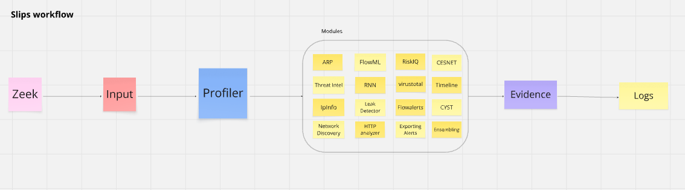
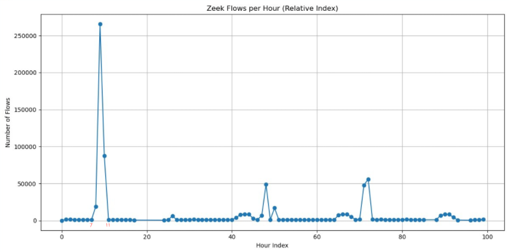
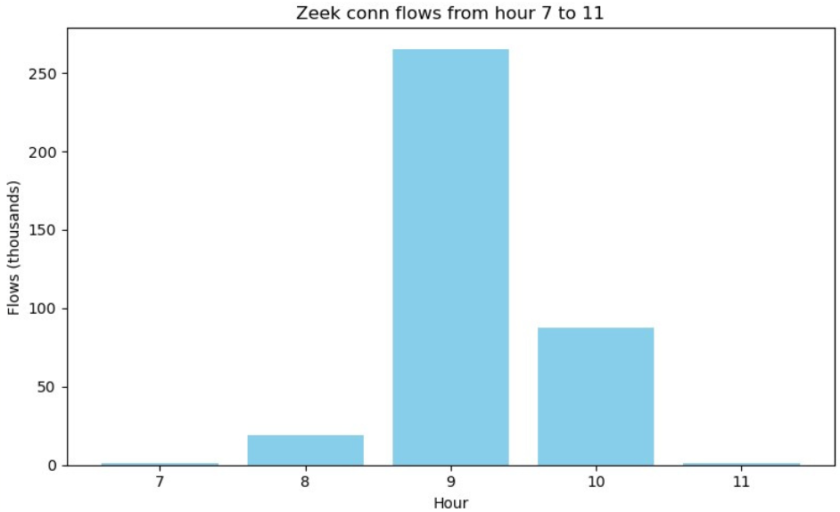
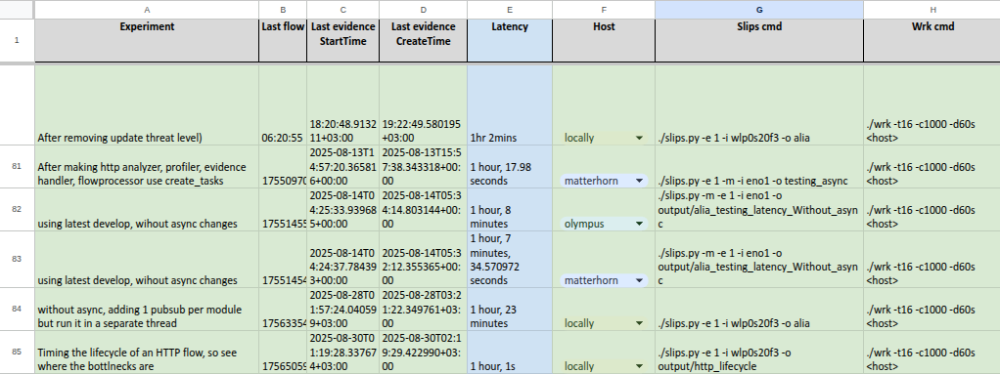

# Table Of Contents
* [Performance Evaluation](#performance-evaluation)
* [How Slips works](#how-slips-works)
* [Scope of Performance Bottlenecks](#scope-of-performance-bottlenecks)
* [Detection speed (latency)](#detection-speed--latency-)
  + [Definitions](#definitions)
  + [Experiment](#experiment)
* [Proposed Solutions](#proposed-solutions)
    - [Make major parts of Slips async](#make-major-parts-of-slips-async)
  + [Cooldown when under attack](#cooldown-when-under-attack)
* [Conclusion](#conclusion)

# Performance Evaluation

The following experiments are done by running Slips with an IP exposed to the internet (public-facing) with real-life traffic, and monitoring the performance under normal conditions and when under attack.

The goal of these experiments is to push Slips close to the limits but
not to the point of breaking (not stress testing) and evaluate it.

This is considered load testing, It's testing that evaluates how an application behaves under expected user loads. It answers the following question "Does Slips behave correctly and fast enough under expected conditions?".

Non-public facing hosts (the majority of hosts) encouter less attacks, receive less flows, and hence have better benchmarks by definition. Slips is stable when handling these scenarios, that's why we decided to push slips testing further to evaluate the performance under more aggressive, high-pressure conditions.

The major performance metrics we've monitored are:

1. Detection speed
2. Performance degradation over long durations

The following experiments are done using Slips in a docker container with RAM and CPU limits to be able to have artifacts to debug issues without the host getting killed.

## How Slips works

In brief, when running on an interface or when analyzing a PCAP, Slips uses zeek for flow generation, and starts the input process which reads flows from zeek as fast as possible, and send the flows for processsing in the profiler process.

The profiler process puts the flows in a format that Slips can understand, and distributes flows among different Slips modules for detections.

For more detailed info [check here](https://stratospherelinuxips.readthedocs.io/en/develop/contributing.html#how-does-slips-work)

## Scope of Performance Bottlenecks

Here we define what is acceptable and what is not in terms of latency.

* Any issue including latency in earlier stages (zeek, input, profiler) affect the performance of all modules.
* Issues in single modules only affect the module and can be tolerated.

## Detection speed (latency)

### Definitions

Slips has no issue detecting attacks in real-time, as soon as they happen, but what happens when Slips encounter a high traffic attack? can it keep up and detect the start and end in real time? does it crash? does it slow down?

For this experiment we focus on latency. The latency we're interested in here means "how long did Slips take to detect a given attack after the attack was completed".

Latency in Slips can occur due to one or more of the following reasons:
* Ingestion latency (Zeek → Slips sees flow)
* Processing latency (Profiler → detection modules)
* Detection latency (Modules)
* Reporting latency (Modules → log files)

### Experiment

In this experiment we ran slips for 8+ hours. At the 9th hour, Slips was killed and it showerd the following latency:

The graph shows that Slips was processing and detecting in real-time (with 0 latency) until something happened around the 8th hour of running. Slips then had growing latency then it crashed.

The logs show that Slips crashed after ~9 hours of running.

While debugging a few things, we checked the number of flows per hour as seen in the Zeek conn.log.

So the sudden increase of flows given to Slips by Zeek from the 7th hour to the 11th hour caused the crash.

How many flows per second caused slips to crash?

The graph shows that the max number of flows in the 9th hour is 265414 flows which is around 4423 per minute.

Checking the flows done within this hour shows that this huge number of flows was a DoS attack.

This experiment and similar ones were conducted several times to confirm that Slips does suffer latency and crash under high traffic (brute force attacks, port scans, etc).

To confirm, we conducted several high traffic HTTP brute-force attack, and noted Slips latency.

The attacks were done using [wrk](https://github.com/wg/wrk) a modern HTTP benchmarking tool capable of generating significant load for testing.

Experiments show ~1h latency when under high-traffic attacks. This means
1. Slips detects that start of the attack in real-time
2. Slips is late by 1h to detect the last flow of the attack.
3. Slips gets slower over time when under attack because it's overwhelmed with the huge amount of flows.

## Proposed Solutions

Our goal is for slips to process the given flows faster.

#### Make major parts of Slips async

If we eliminate the latency that happens when waiting for I/O, network operations,
DB access, etc. (especially the ones that happen per flow), the flow processing speed will increase.

### Cooldown when under attack

The goal here is to prevent huge amount of flows resulting from an attack from slowing down slips or causing a crash.

If sample flows when under heavy load,
1. This may slow down the reading of flows from zeek so slips wouldn't be overwhelmed and crash.
2. Slips will be able to detect the start and end of the attack in real time.

The tradeoff here is: Slips will miss the detection of flows that happen in the middle of a high traffic attack for a limited amount of time, these flows include benign flows from the user and malicious flows from the attack. But since high traffic attack flows are almost identical, detecting the start and end of the attack is enough.

So instead of users getting 1000 evidence when under a portscan attack, they may get 10 evidence instead. This way the user still knows about the portscan, and would know when it started, and when it ended without having slips analyzing every single flow of the attack.

## Conclusion

This was a high-level brief of the performance evaluation of Slips.

Here we documented the experiments, observations, debugging, and issues found. Solutions to the found issues are in progress.
