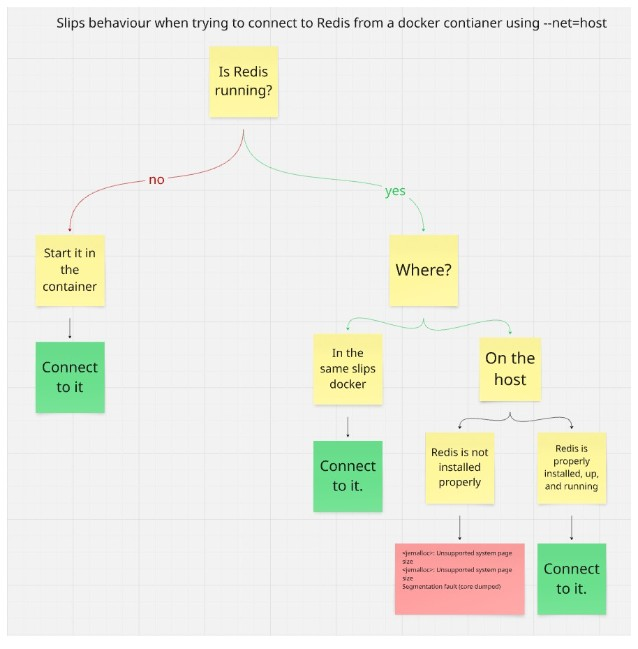
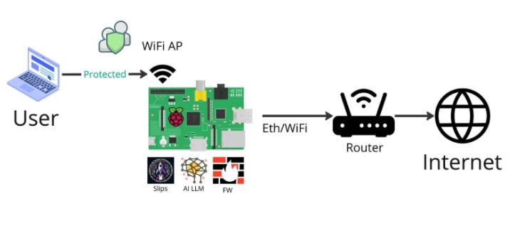

# Table Of Contents

- [Challenges](#challenges)
  * [Adding ARM Support for Slips Docker Image](#adding-arm-support-for-slips-docker-image)
  * [RPI 5 uses 16K Page Size](#rpi-5-uses-16k-page-size)
  * [Slips docker uses the host’s Redis when docker is started with –net=host](#slips-docker-uses-the-host-s-redis-when-docker-is-started-with--net-host)
- [Features working as expected in the RPI](#features-working-as-expected-in-the-rpi)
- [Features re-implemented for the RPI](#features-re-implemented-for-the-rpi)


Note:

- This documentation is a bit technical to save the research time of future RPI/Redis/Slips developers. :)

***


# Challenges

## Adding ARM Support for Slips Docker Image

Docker can run amd64 images on arm devices using emulation, but this method comes with performance overhead which we would rather save for Slips, the P2P, and the ML models.

So we decided to go for an ARM docker image specifically for ARM devices and the RPI. This is doable without maintaining 2 different Dockerfiles one for each architechture thanks to docker buildx multiplatform support.

**Commands for building the ARM image**

docker buildx create --name slips\_builder

docker buildx use slips\_builder

export BUILDKIT\_CONTAINERD=1

docker buildx build --platform linux/amd64,linux/arm64 -t stratosphereips/slips:latest -f docker/Dockerfile --push .

Our goal is to maintain one Dockerfile that is able to run on both ARM and AMD architectures.

Because if we create two Dockerfiles one for each platform, the AMD Slips Dockerfile will always be our primary focus. Meaning it will be more tested by us, and used in Github CI daily, and used by the majority of Slips users. As a result, issues are more likely to be discovered, reported, and resolved quickly, either by us or the community, compared to the ARM-specific image.

That’s why one multi-arch image is better than an ARM specific image (Dockerfile).


## RPI 5 uses 16K Page Size

Page size is usually determined by the processor architecture. The Raspberry Pi 5 uses a kernel with a default page size of 16KB, which is an increase from the traditional 4KB page size used in earlier models. This change aims to improve performance but it comes at the cost of software support. Some software, like Redis, only supports 4k pages.


When trying to connect Slips to a Redis instance downloaded with apt in the RPI, we encountered the following error due to the page size incompatibility:

```bash
<jemalloc>: Unsupported system page size
<jemalloc>: Unsupported system page size
Segmentation fault (core dumped)
```

Using a 4K Page Size Kernel on the Raspberry Pi is doable but requires changing kernel configurations of the RPI, which is suboptimal and goes against the simplicity we planned for Slips installation.

After some trials we decided to manually compile redis with malloc instead of jemalloc in the default slips docker image instead of using apt to install it. The cost of this is that now redis has active defragmentation disabled and cannot be enabled.

Active fragmentation is the ability to combine non-contiguous memory chunks into one large chunk that can be allocated easily while the redis server is up and running. The alternative to this is to restart redis when defragmentation is needed. The performance cost is almost negligible and I noticed it is disabled by defualt in the apt and snapd versions of redis.

***


## Slips docker uses the host’s Redis when docker is started with –net=host

By default, Slips uses the Redis running on 127.0.0.1 and requires sharing the host’s network namespace using the –net=host docker parameter to be able to find other peers in the local network.

Sharing the network namespace means that 127.0.0.1 (localhost) inside the container is the same as 127.0.0.1 on the host.

Once the –net=host docker parameter is used and the user runs Slips, Slips will attempt to connect to the running redis instance on 127.0.0.1:6379, if the host was using that IP and port for running redis, Slips will connect and use the Redis running on the host.

If there's no redis server running on the host, Slips will start a redis server on 127.0.0.1:6379 in docker and connect to it.

The issue arises when the host has redis improperly installed. Leading to the jemalloc issue above. If that’s the case, Slips will not start because it cannot connect to redis.

There’s nothing that we can do to prevent this other than inform users that in order to run the P2P in the RPI in docker, make sure to not have a redis server improperly installed on the host or else slips will try to connect to it and fail.



***


## Features working as expected in the RPI

- All unit and integration tests pass in the RPI, meaning slips can read zeek files, directories, suricata logs, nfdump flows, it’s able to set evidence and generate the expected amount of profiles for each traffic. etc.

- Local P2P is working perfectly, Set up 2 RPIs (peers), both are able to communicate and find each other in the local network.

- The RPI is able to act as an access point while connected to the router through ethernet.



- Slips is able to analyze the traffic captured from the AP.

- The Blocking module is using iptables as expected.


## Features re-implemented for the RPI

- The main Dockerfile is rebuilt with a compiled version of redis using malloc by default.

  - <https://github.com/stratosphereips/StratosphereLinuxIPS/pull/1434>

- Github CI now supports automatically building multi-architecture slips docker images (linux/amd64 and linux/arm64) on every released new version of slips.

  - <https://github.com/stratosphereips/StratosphereLinuxIPS/blob/develop/.github/workflows/publish-slips-images.yml>

- Memory and CPU profilers were developed to be able to extract the graphs done [here](https://stratospherelinuxips.readthedocs.io/en/develop/immune/research_rpi_limitations_and_define_acceptable_performance_benchmarks.html#acceptable-performance-benchmarks)

  - Memory profiler

    - <https://github.com/stratosphereips/StratosphereLinuxIPS/blob/alya/immune/memory_profiler/slips_files/common/performance_profilers/ram_usage_tracker.py>

  - CPU Profiler

    - <https://github.com/stratosphereips/StratosphereLinuxIPS/blob/alya/cpu_profiler_for_slips_immune/slips_files/common/performance_profilers/cpu_percentage_logger.py>

- Added a flow per minute tracker to be able to compare the speed of Slips in the RPI and in normal computers

  - <https://github.com/stratosphereips/StratosphereLinuxIPS/pull/1382>


***
