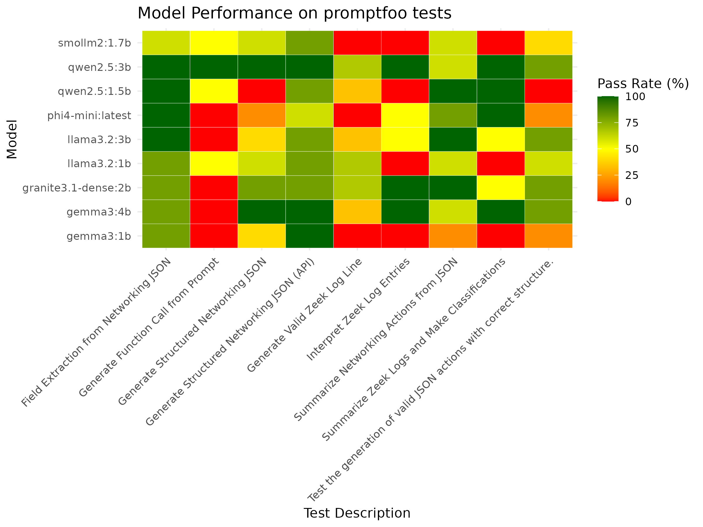

# Research and Selection of LLM for small-device viability

# Table of Contents

- [Initial Evaluation Criteria](#initial-evaluation-criteria)
- [Setup for Evaluating the LLM Performance](#setup-for-evaluating-the-llm-performance)
  - [Evaluation Tests Overview](#evaluation-tests-overview)
- [Model Performance Results](#model-performance-results)
- [Key Findings](#key-findings)
- [Conclusions](#conclusions)
- [References](#references)

## Initial evaluation Criteria

As part of the  SLIPS Immune I project and  presents an analysis of the most suitable Large Language Models (LLMs) capable of running efficiently with small computer resources, with a focus on models with **at most  4 billion parameters**. The evaluation emphasized **licensing terms**, **tool usage capabilities**, and **compatibility with fine-tuning and inference frameworks**.

The model selection was based on data obtained from [LLM Explorer](https://llm.extractum.io/), with filters applied to include only models:

* Released in **2024 or later**  
* With a model size **under 4GB**  
* That provide metadata such as **VRAM usage**, **context length**, and **license type**

An initial screening of models considering the above criteria produced a list of 20 model candidates. 

The the initial models were orderede using the following criteria:

* **LLM explorer Score:** The LLM Explorer Rank (Score) is a comprehensive metric for dynamic evaluation of language models. More info about the score can be found [here](https://llm.extractum.io/static/blog/?id=the-llm_explorer-rank)  
* **License**: Priority was given to open or permissive licenses.  
* **Fine-tuning support**: Compatibility with popular frameworks such as **TRL** and **Unsloth**.  
  **Inference support**: Compatibility with inference engines like **Ollama** and **Transformers**..

| Model Name                    | Score | Size | License    | Finetuning toolset | Inference tools       |
|------------------------------|-------|------|------------|--------------------|------------------------|
| Phi 4 Mini Instruct          | 0.58  | 4B   | mit        | unsloth, TRL       | transformers, ollama   |
| SmolLM2 1.78 Instruct        | 0.52  | 2B   | apache-2.0 | TRL                | transformers, ollama   |
| Gemma 3 1B Instruct          | 0.51  | 1B   | gemma      | unsloth, TRL       | transformers, ollama   |
| Gemma 3 4B Instruct          | 0.51  | 4B   | gemma      | unsloth, TRL       | transformers, ollama   |
| Llama 3.2 3B Instruct        | 0.51  | 3B   | llama3.2   | unsloth, TRL       | transformers, ollama   |
| Granite 3.1 2B Instruct      | 0.48  | 2B   | apache-2.0 | unsloth, TRL       | transformers, ollama   |
| Llama 3.2 1B Instruct        | 0.47  | 1B   | llama3.2   | unsloth, TRL       | transformers, ollama   |
| Qwen2.5 1.5B Instruct        | 0.44  | 2B   | apache-2.0 | unsloth, TRL       | transformers, ollama   |
| Qwen2.5 3B Instruct          | 0.44  | 3B   | apache-2.0 | unsloth, TRL       | transformers, ollama   |
| SmolLM2 135M Instruct        | 0.37  | 135M | apache-2.0 | unsloth, TRL       | transformers, ollama   |

**Table1**: Overview of the initial set of selected models with the evaluation criteria. Complete list of evaluated model can be found [here](https://docs.google.com/spreadsheets/d/1hiqAtiL7GatHnMShCuJlXR2_rbMbl89mszzBshsWdeE/edit?gid=1569959296#gid=1569959296)

## Setup for evaluating the LLM performance

After an initial screening, a subset of ten language models was selected for further evaluation (see Table 1). To support this process, a dedicated evaluation framework was built using the [**Promptfoo**](https://www.promptfoo.dev/) toolset—an open-source framework designed for systematically testing and comparing language model outputs.

As part of this effort, nine targeted unit tests were developed to evaluate the key capabilities required for integration into the SLIPS immune architecture. All evaluations were conducted on a computer based on the x64 architecture. Evaluation on Raspberry Pi (RPI) hardware will be carried out in future tasks, and the results will be contrasted accordingly. 

All the models were deployed on an [**Ollama**](https://ollama.com/) server, and all versions were quantized to Q4_K_M. This could be considered a limitation, as the performance is not equivalent to that of models using full precision. As a result, the reported performance provides only an initial indication of the models' true capabilities. 

The evaluation tests were grouped into three main categories to assess distinct capabilities of the language models. **Information Extraction** tests focus on the model's ability to retrieve specific fields or data points from structured inputs like JSON or logs. **Summarization & Decision making** tests evaluate how well models can convert technical data into clear, human-readable insights and take a simple decision such as a classification. **Data Generation**, including API-compatible formatting, assesses whether models can produce well-structured outputs such as JSON objects, log entries, or function calls that align with defined schemas or interfaces. 

### Evaluation Tests Overview

A list of the implemented test as well as a brief description is described as follows:

1. **Field Extraction from Networking JSON:** Tests if language models can accurately extract specific values (like IPs or services) from structured JSON logs of networking actions based on natural language questions.

2. **Summarize Networking Actions from JSON:** Evaluates if models can translate JSON-based representations of network actions into simple, human-readable summaries, maintaining accuracy of details like hosts, protocols, and services.

3. **Generate Structured Networking JSON:** Assesses whether models can generate correctly structured JSON objects representing specific networking actions, ensuring field names, formats, and values align with schema constraints.

4. **Generate Structured Networking JSON:** Similar to test 3\. But the name and length of the parameters are not tested. It is a simpler version of test 3\.

5. **Interpret Zeek Log Entries:** Tests model understanding of Zeek logs by requiring summarization of key data points such as IP addresses and network protocols, ensuring the information is correctly identified and communicated.

6. **Generate Valid Zeek Log Line** Validates the ability of models to generate realistic Zeek log entries in JSON format for specific services, source/destination IPs, and protocols, ensuring output adheres to logging structure.

7. **Summarize Zeek Logs and Make Classifications** Evaluates if a model can analyze Zeek logs to extract high-level insights—like listing user agents or classifying IPs as suspicious or normal—based on behavioral patterns.

8. **Generate Function Call from Prompt** Tests whether the model can generate a correctly formatted function call, using the appropriate function name and JSON arguments, based on a prompt requesting data (e.g., weather for a location).

9. **Generate Structured Networking JSON (API):** Similar to test 3\. But using [OPENAI API compatibility](https://www.ollama.com/blog/openai-compatibility)  in Ollama for parsing and checking valid JSON. We realized that most of the model were actually generating some valid JSON but between backticks or some other differences, so by using the `response format` in the call to API, the results were much better. 

---
## Model Performance Results

The results of the tests can be summarized in the heatmap visualization from Figure 1\.

**Figure 1**:Performance comparison of various language models on **Promptfoo** test suite for different tasks. Each cell represents the pass rate (%) of a model on a specific test, with color coding from red (0%) to green (100%).

By using `promptfoo` tests, recent models can be easily added to the list and evaluated. 

A special repository for storing the tests and other utilities used for evaluating SLIPS IMMUNE is available [here](https://github.com/stratosphereips/Slips-tools/). The complete procedure for running the tests is described [here](https://github.com/stratosphereips/Slips-tools/blob/main/llm-unittest/README.md).

## Key Findings

The heatmap shows that no single model excels across all **Promptfoo** tests, highlighting the need for task-specific model selection. Models like **qwen2.5:3b** and **llama3.2:3b** perform consistently well across multiple tasks, making them strong general-purpose candidates. **smollm:2:1.7b** also performs well, particularly on structured tasks like field extraction and function generation.

Some tasks, such as “Field Extraction from Networking JSON,” are well-handled by most models. In contrast, more complex tasks like “Summarize Zeek Logs and Make Classifications” show poor performance across the board, indicating these are more challenging.

Interestingly, larger models don't always outperform smaller ones. For example, ollama:phi4-mini:latest shows competitive results, while ollama:granite3.1-dense:2b underperforms in several areas. This suggests that fine-tuning and architecture are more influential than size alone.

## Conclusions

From an initial set of 20 models, the list has been narrowed down to 10 high-potential candidates. Of these, **Qwen**, **smolLM2 and llama3.2** models emerge as the most promising options, balancing performance, licensing, and deployability on low-resource hardware.

1. **Qwen Models:** (Alibaba): These recently released models show strong performance and meet all licensing requirements, making them highly viable candidates.  
2. **smolLM2 Family** (Hugging Face):  
   1. Beside the 1.7B parameters the models have version with extremely compact with sizes at **135M**, **630M**, and **1.7B parameters**  
   2. Ideal for tiered LLM systems — e.g., smaller models for summarization, larger ones for decision-making  
3. **LLaMA 3.2 Family**: (Meta)  
   1. Demonstrates excellent performance metrics  
   2. Licensing remains restrictive or unclear, but included in the shortlist due to technical strength

### References

\[1\] A detailed comparison table including parameters, VRAM usage, license type, context length, tool usage support, and fine-tuning/inference compatibility is available \[[here](https://docs.google.com/spreadsheets/d/1hiqAtiL7GatHnMShCuJlXR2_rbMbl89mszzBshsWdeE/edit?gid=1569959296#gid=1569959296)\].

\[2\] [Repository](https://github.com/stratosphereips/Slips-tools/tree/main/llm-unittest) with **promptfoo** unittest and the scripts used for generating the heatmap
