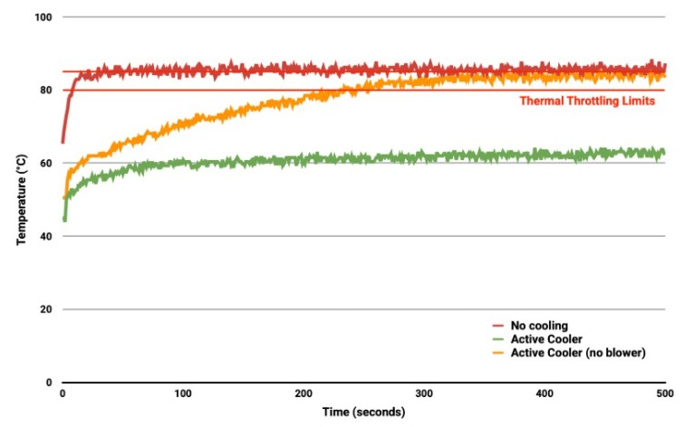
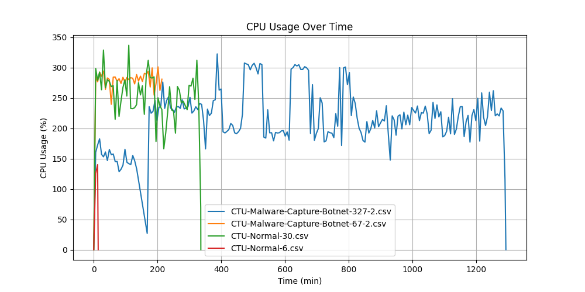
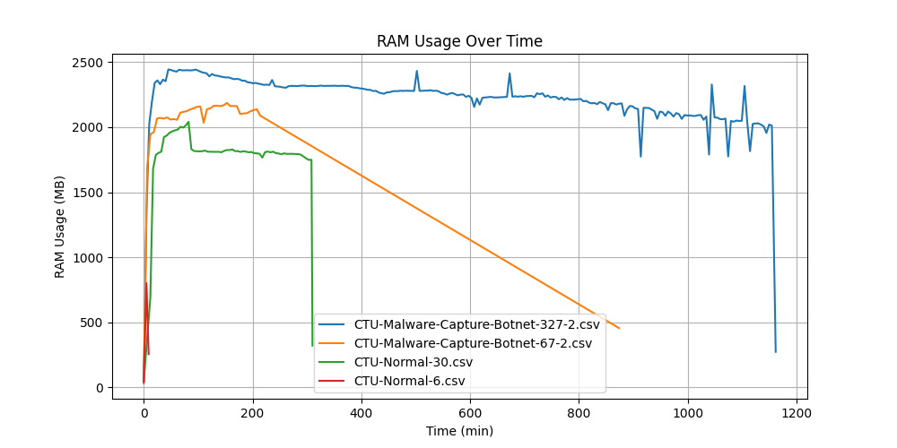
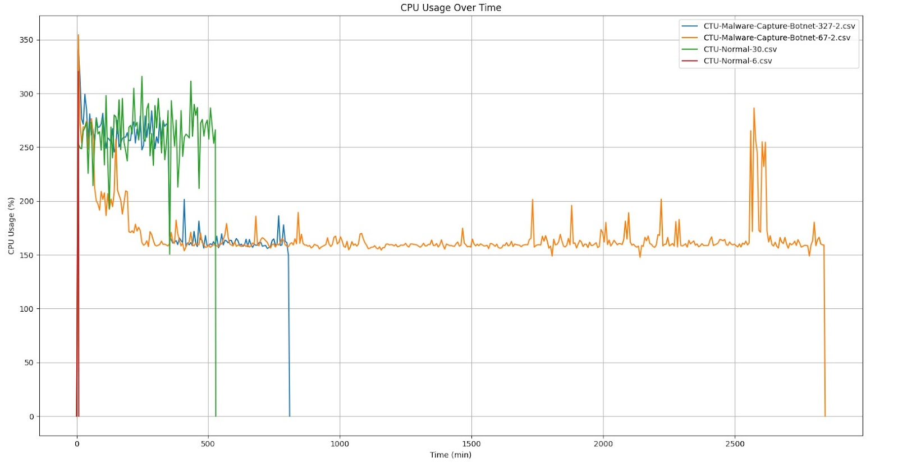
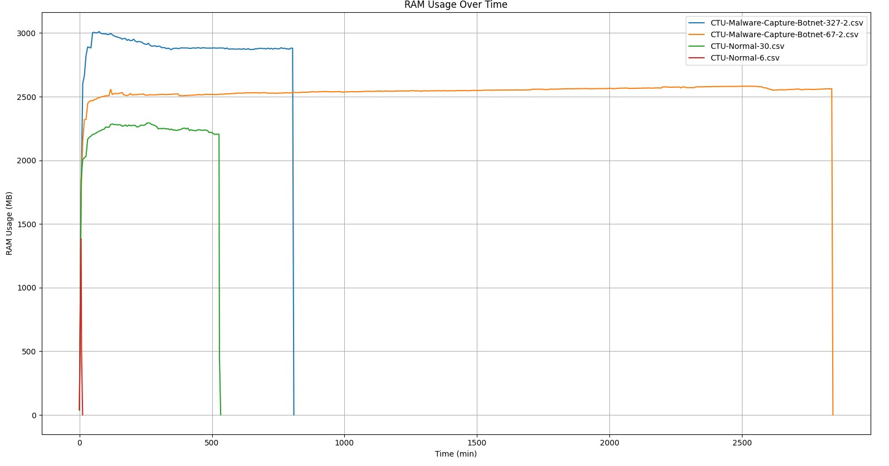
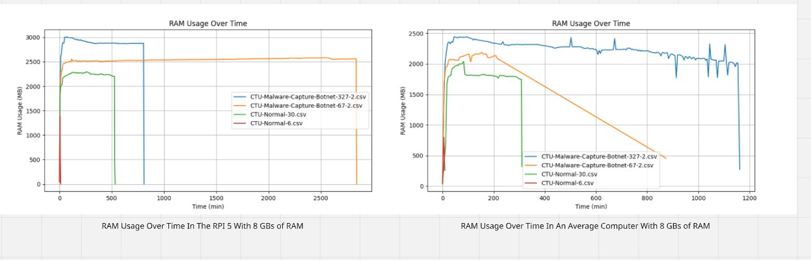
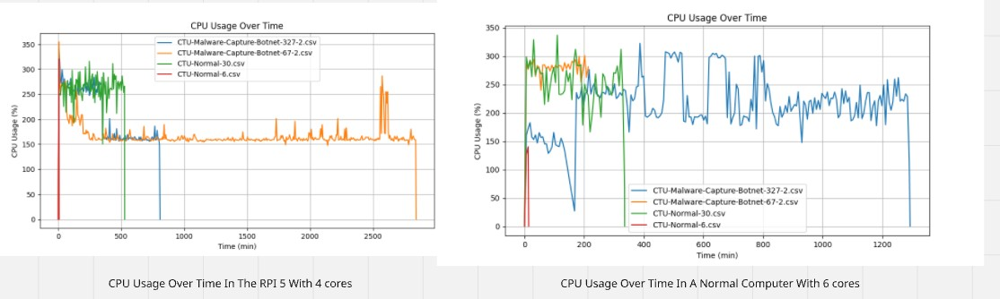

# Table Of Contents
- [RPI Hardware](#rpi-hardware)
  * [Used Hardware](#used-hardware)
  * [Hardware Limitations That May Affect Performance](#hardware-limitations-that-may-affect-performance)
- [RPI Software](#rpi-software)
  * [Used Software](#used-software)
  * [Software Limitations That May Affect Performance](#software-limitations-that-may-affect-performance)
- [Acceptable performance benchmarks](#acceptable-performance-benchmarks)
  * [Current Benchmarks](#current-benchmarks-732025)
    + [CPU, RAM, and disk usage under normal conditions](#cpu-ram-and-disk-usage-under-normal-conditions)
      - [CPU usage](#cpu-usage)
      - [RAM Usage](#ram-usage)
      - [Disk usage](#disk-usage)
      - [Analysis Time](#analysis-time)
    + [Slips on RPI Benchmarks](#slips-on-rpi-benchmarks)
      - [CPU Usage](#cpu-usage-1)
      - [RAM Usage](#ram-usage-1)
      - [Disk Usage](#disk-usage-1)
      - [Analysis Time](#analysis-time-1)
  * [Compare Benchmarks on RPI and on normal computers and define limitations](#compare-benchmarks-on-rpi-and-on-normal-computers-and-define-limitations)
    + [RAM Usage Comparison](#ram-usage-comparison)
    + [CPU Usage Comparison](#cpu-usage-comparison)
    + [Disk Usage Comparison](#disk-usage-comparison)
    + [Analysis Time Comparison](#analysis-time-comparison)

# **RPI Hardware**

## Used Hardware

- Used RPI Version: RPI5 with 8GB of RAM

- Used RPI Specifications:

  - Broadcom BCM2712 2.4GHz quad-core 64-bit Arm Cortex-A76 CPU, with cryptography extensions, 512KB per-core L2 caches and a 2MB shared L3 cache

  - VideoCore VII GPU, supporting OpenGL ES 3.1, Vulkan 1.2

  - Dual 4Kp60 HDMI® display output with HDR support

  - 4Kp60 HEVC decoder

  - LPDDR4X-4267 SDRAM 8GB

  - Dual-band 802.11ac Wi-Fi

  - Bluetooth 5.0 / Bluetooth Low Energy (BLE)

  - microSD card slot, with support for high-speed SDR104 mode

  - 2 × USB 3.0 ports, supporting simultaneous 5Gbps operation

  - 2 × USB 2.0 ports

  - Gigabit Ethernet, with PoE+ support (requires separate PoE+ HAT)

  - 2 × 4-lane MIPI camera/display transceivers

  - PCIe 2.0 x1 interface for fast peripherals (requires separate M.2 HAT or other adapter)

  - 5V/5A DC power via USB-C, with Power Delivery support

  - Raspberry Pi standard 40-pin header

  - Real-time clock (RTC), powered from external battery

- Used Memory for RPI:

  - Brand: Sandisk

  - Capacity: 128GB

  - Type: Extreme MicroSDXC Memory Card

  - Speed Class: U3, V30

  - Application Performance Class: A2

  - Maximum Read Speed: Up to 190MB/s

- Used power for RPI:

  - Input: 100-240V

  - Input Frequency Range: 50/60Hz

  - Input Current: 600mA Max

  - Output voltage: 5V

  - Output Current: 3000mA

  - Power: 15W

  - Output Connector: Type C

- Ethernet Cable

- Cooler used:

  - None

## Hardware Limitations That May Affect Performance

- Thermal Throttling

_Processor temperature in °C against time in seconds. At time T=T₀ stress testing was started._

- When the core temperature is between 80°C and 85°C, the ARM cores will be throttled back. And the GPU will be throttled back when it exceeds 85°C

- When the soft limit is reached, the clock speed is reduced from 1.4GHz to 1.2GHz

- **Workaround**: A cooler can be used if necessary.

* Limited GPU and Hardware Acceleration Support

  - **Reason**: Raspberry Pi’s integrated GPU is useless for any of the AI workloads as it isn’t compatible with CUDA language. Some LLMs and computer vision models can still run there but will be slower.

  - **Workaround**: Connect External GPUs using the PCIe slot if necessary.

* Power Constraints and Stability Issues

  - The RPI CPU can suffer performance throttling or sudden reboots if power demand exceeds supply.

* Storage Reliability

  - microSD storage is still less robust and slower compared to a direct‑attached SSD, but it’s more affordable hence used by most potential users.

***

# **RPI Software**

## Used Software

- OS:

  - Distributor ID: Debian

  - Description: Debian GNU/Linux 12 (bookworm)

  - Release: 12

  - Codename: bookworm

## Software Limitations That May Affect Performance

- ARM processor:

  - Many applications including Slips are designed for x86 architecture, so running them on ARM requires emulation or translation layers, which can reduce performance.

  - **Workaround**: Use alternatives or emulation.

* The RPI has a limit for the number of clients that can connect to the RPI in AP mode at the same time. The exact number is undocumented and can vary between models.

  - **Workaround:** Use a soft limit of maximum 6 devices connected at the same time to the RPI when it’s running in AP mode.

***

# Acceptable performance benchmarks

## Current Benchmarks \[7/3/2025]

To be able to determine whether Slips is going to run with full capabilities on RPI 5 or not, First, we need to know how Slips behaves under normal conditions. This is our baseline benchmark.

**Testing Setup:**

- Testing will be done using docker, since this is the recommended way to run Slips on computers and on RPIs, and also to be able to introduce limitations.

- Slips supports reading zeek logs, PCAPs, netflow files, and many different formats. We chose PCAPs to be able to mimic real-life scenarios and control the speed of the flows Slips receives to be able to benchmark different flow speeds and network loads.

**Here are the specifications of the computer on which we will be doing our baseline benchmarks:**

- CPU: Intel(R) Xeon(R) CPU E5-2603 v3 @ 1.60GHz 12 cores

- RAM: 66 GBs

- Storage: 4 TBs

- GPUs:

  - AMD FirePro W5100 (Bonaire)

  - Matrox G200eR2

  - Nvidia NVS 310 (GF119)

Since this is a very powerful server, we decided to limit some of the resources to see how slips behaves on average computers. These limits are added as limits to the docker container that’s used to run slips.

**Here are the limits we will be introducing:**

- CPU: The container is assigned 6 cores only.

- Memory: 8 GBs

- Swap Memory Limit: The container can use up to 8 GB of swap space in addition to the RAM limit.

- Storage: Unlimited.

**Docker command used in the experiments:**

- docker run -dit --rm
--net=host
--cpus=6
--memory=8g
--memory-swap=8g
--shm-size=512m
stratosphereips/slips:latest /bin/bash

**Python Version**

- 3.10.12

**PCAPs used:**

- For the sake of benchmarking we will be using 4 PCAPs of different sizes.

* All the given PCAPS are capturing 24 hs worth of traffic and passing it to slips in minutes, the intensity of the traffic is usually less resource intensive in everyday use.

| PCAP                                                            | Size  | Type of traffic |
| --------------------------------------------------------------- | ----- | --------------- |
| CTU-Normal-6/2013-10-21\_capture-1.pcap                         | 96MB  | Benign          |
| CTU-Normal-30/2017-05-01\_normal.pcap                           | 833MB | Benign          |
| CTU-Malware-Capture-Botnet-327-2/2018-03-27\_win3.capture1.pcap | 67MB  | Malicious       |
| CTU-Malware-Capture-Botnet-67-2/2014-06-06\_capture-win14.pcap  | 1.1G  | Malicious       |

### CPU, RAM, and disk usage under normal conditions

- Slips is shipped with its own performance profilers done by one of our GSoC contributors. However, the CPU profilers included in Slips are for pinpointing functions that take the most CPU time, which is not what we’re interested in in for benchmarking. And the memory profiler profiles each slips module separately, and doesn’t profile slips as a whole. So there’s no graph showing RAM usage that is aggregated for all processes.

- We developed our own CPU and RAM profilers for benchmarking Slips.

#### CPU usage

- CPU profiling is done using psutil library

* CPU usage of Slips is captured every 5 minutes in this graph.

#### **Key Takeaways:**

- In Normal and Malicious traffic, Slips uses less than 100% of 4 cores. This is the 350% in the graph. Each 100% represents full usage of 1 core.

- Slips takes longer time and uses more CPU the more malicious the traffic gets, because malicious flows trigger more logic in Slips detection modules, branches more, and does more database calls for storing and tracking suspicious activity.

  - Slips analyzed the normal PCAP (CTU-Normal-6) in 14 minutes, but took 21 hours and 33 minutes for the similarly sized malicious PCAP (CTU-Malware-Capture-Botnet-327-2) due to the different traffic types.

  - Slips taking longer to analyze malicious PCAPs is expected.

#### RAM Usage

- RAM profiling is done using psutil library

- RAM usage is captured every 5 minutes in the following graph.

|               PCAP               |  Size  | Type of traffic | Average RAM |
| :------------------------------: | :----: | :-------------: | :----------: |
|           CTU-Normal-6           |  96 MB |      Benign     |     2 GB     |
|           CTU-Normal-30          | 833 MB |      Benign     |     2 GB     |
| CTU-Malware-Capture-Botnet-327-2 |  67 MB |    Malicious    |    2.2 GB    |
|  CTU-Malware-Capture-Botnet-67-2 | 1.1 GB |    Malicious    |    1.9 GB    |

#### **Key Takeaways:**

- The average RAM usage across the four experiments was around 2 GBs, an acceptable number considering the typical RAM capacity of modern computers. It’s also reasonable given that Slips simultaneously runs two machine learning models and twelve detection/threat intelligence models in Python.

#### Disk usage

- These numbers are measured with zeek logs rotation disabled.

|               PCAP               |  Size  | Type of traffic | Total Disk Usage | Zeek log files | Slips logs and databases | Total number of Zeek flows |
| :------------------------------: | :----: | :-------------: | :--------------: | :------------: | :----------------------: | :------------------------: |
|           CTU-Normal-6           |  96 MB |      Benign     |       11 MB      |     7.6 MB     |          3.4 MB          |            15248           |
|           CTU-Normal-30          | 833 MB |      Benign     |      246 MB      |      55 MB     |          191 MB          |           117964           |
| CTU-Malware-Capture-Botnet-327-2 |  67 MB |    Malicious    |      347 MB      |     123 MB     |          224 MB          |           456869           |
|  CTU-Malware-Capture-Botnet-67-2 |  1.1G  |    Malicious    |      251 MB      |     100 MB     |          151 MB          |           247536           |

#### Analysis Time

|               PCAP               |  Size  | Type of traffic | Analysis Time |
| :------------------------------: | :----: | :-------------: | :-----------: |
|           CTU-Normal-6           |  96 MB |      Benign     |  9.02 minutes |
|           CTU-Normal-30          | 833 MB |      Benign     |   5.16 hours  |
| CTU-Malware-Capture-Botnet-327-2 |  67 MB |    Malicious    |  19.36 hours  |
|  CTU-Malware-Capture-Botnet-67-2 | 1.1 GB |    Malicious    |   7.5 hours   |

***

## Slips on RPI Benchmarks

- For these experiments, Slips is running in docker on the Raspberry Pi.

- The docker container uses an image built for ARM64, so no emulation is involved.

- The CPU and RAM profilers used here are the same ones used in the normal profiling experiments.

**Docker command used in the experiments:**

docker run -dit --rm
--memory=8g
--memory-swap=8g
--shm-size=512m
--net=host
--name slips
stratosphereips/slips:latest /bin/bash

Note: The used RPI 5 has 8 GBs of RAM, we’re not limiting them in the docker container.

### CPU, RAM, and disk usage

#### CPU Usage

**Key Takeaways**

- CPU spikes at the beginning are expected due to how Slips processes the given flows. As soon as slips starts, it reads all the given flows at once, and gradually processes them. These heavy I/O operations of reading the flows from disk at the beginning followed by categorizing, profiling and passing them to detection modules may not be the main cause of the CPU spikes, but contributes greatly to them.

- Clock speed reduction or some form of performance degradation for a short period of time (until the CPU spikes are flattened) may happen in the RPI if other resource-intensive programs are run alongside Slips.

- Whether the Raspberry Pi can simultaneously run other resource-intensive applications alongside Slips remains under investigation and depends on the performance of Slips' new ML models.

#### RAM Usage

|               PCAP               |  Size  | Type of traffic | Average RAM |
| :------------------------------: | :----: | :-------------: | :----------: |
|           CTU-Normal-6           |  96 MB |      Benign     |    646 MB    |
|           CTU-Normal-30          | 833 MB |      Benign     |    2.1 GB    |
| CTU-Malware-Capture-Botnet-327-2 |  67 MB |    Malicious    |    2.8 GB    |
|  CTU-Malware-Capture-Botnet-67-2 | 1.1 GB |    Malicious    |    2.5 GB    |

**Key Takeaways**

- RAM usage in Slips typically remains stable until it terminates.

- On average, all experiments use 2.5 GB of the available 8 GBs of RAM, leaving reasonable room for the new ML models and other applications on the RPI to run when required.

- Slips uses Redis as its main cache for flow-related data. While we're working to reduce memory usage by invalidating more cache entries, it might not be our top priority given Slips' acceptable performance on the RPI.

**Conclusion**

- While the RAM usage indicates capacity for running programs alongside Slips on the RPI, the CPU usage suggests that doing so could negatively impact performance of Slips and the other running programs.

#### Disk Usage

|               PCAP               | Size  | Type of traffic | Total Disk Usage | Zeek log files | Slips logs and databases |
| :------------------------------: | ----- | --------------- | ---------------- | -------------- | ------------------------ |
|           CTU-Normal-6           | 96MB  | Benign          | 11 MB            | 7.6 MB         | 3.4 MB                   |
|           CTU-Normal-30          | 833MB | Benign          | 158 MB           | 55 MB          | 103 MB                   |
| CTU-Malware-Capture-Botnet-327-2 | 67MB  | Malicious       | 344 MB           | 123 MB         | 221 MB                   |
|  CTU-Malware-Capture-Botnet-67-2 | 1.1G  | Malicious       | 217 MB           | 100 MB         | 117 MB                   |

**Key takeaways**

- Log rotation of zeek logs, Slips logs and Slips SQLite database is a necessity if Slips is going to be running non-stop on the RPI’s limited SD card.

#### Analysis Time

|               PCAP               |  Size  | Type of traffic | Analysis Time |
| :------------------------------: | :----: | :-------------: | :-----------: |
|           CTU-Normal-6           |  96 MB |      Benign     |  7.8 minutes  |
|           CTU-Normal-30          | 833 MB |      Benign     |   8.8 hours   |
| CTU-Malware-Capture-Botnet-327-2 |  67 MB |    Malicious    |   17.3 hours  |
|  CTU-Malware-Capture-Botnet-67-2 | 1.1 GB |    Malicious    |    4 hours    |

 ***

## Compare Benchmarks on RPI and on normal computers and define limitations

#### RAM Usage Comparison

**Key Takeaways**

- Despite the RPI experiments averaging higher RAM usage (2.5 GB) compared to a normal computer (2 GB), both memory footprints are acceptable within their operating environments.

- Even though both devices have similar RAM capacity (8 GB), the overhead and efficiency of memory use can differ greatly between a RPI and a typical computer which causes the difference shown in both graphs.

- Both graphs indicate that analyzing malicious captures consistently consumes more RAM than analyzing normal captures.

#### CPU Usage Comparison

- The RPI frequently shows usage above 300% (i.e., using about 3 or all 4 cores intensely), especially for the malware datasets. This indicates that the RPI is being pushed close to its maximum capacity for a substantial portion of the analysis.

- Both graphs indicate that analyzing malicious captures consistently consumes more CPU than analyzing normal captures.

#### Disk Usage Comparison

|               PCAP               |  Size  | RPI Disk Usage | Normal Computer Disk Usage | RPI Zeek Logs | Normal Computer Zeek Logs | RPI Slips Logs | Normal Computer Slips Logs |
| :------------------------------: | :----: | :------------: | :------------------------: | ------------- | :------------------------: | -------------- | :------------------------: |
|           CTU-Normal-6           |  96 MB |      11 MB     |            11 MB           | 7.6 MB        |           7.6 MB           | 3.4 MB         |           3.4 MB           |
|           CTU-Normal-30          | 833 MB |     158 MB     |           246 MB           | 55 MB         |            55 MB           | 103 MB         |           191 MB           |
| CTU-Malware-Capture-Botnet-327-2 |  67 MB |     344 MB     |           347 MB           | 123 MB        |           123 MB           | 221 MB         |           224 MB           |
|  CTU-Malware-Capture-Botnet-67-2 |  1.1 G |     217 MB     |           251 MB           | 100 MB        |           100 MB           | 117 MB         |           151 MB           |

#### Analysis Time Comparison

|               PCAP               |  Size  | RPI Analysis Time | Normal Computer Analysis Time |
| :------------------------------: | :----: | :---------------: | :---------------------------: |
|           CTU-Normal-6           |  96 MB |    7.8 minutes    |          9.02 minutes         |
|           CTU-Normal-30          | 833 MB |     8.8 hours     |           5.16 hours          |
| CTU-Malware-Capture-Botnet-327-2 |  67 MB |     17.3 hours    |          19.36 hours          |
|  CTU-Malware-Capture-Botnet-67-2 | 1.1 GB |      4 hours      |           7.5 hours           |

- Despite its limited resources compared to a standard computer, the Raspberry Pi unexpectedly demonstrated better analysis time in most cases.

***

Ultimately, the performance comparison between the Raspberry Pi and a standard computer depends on various factors, including RAM speed, CPU frequency, and overall hardware capabilities. Our results represent an initial measurement of the Raspberry Pi's performance, but these outcomes can vary significantly depending on system configuration and workload.

In conclusion, Slips is able to run on the Raspberry Pi . In fact, the performance results not only confirmed its viability on the platform but also exceeded our expectations.
