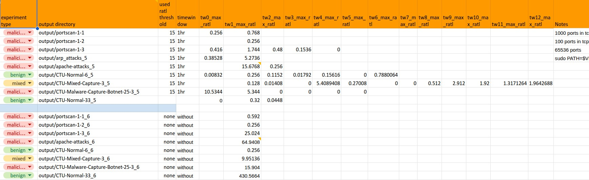
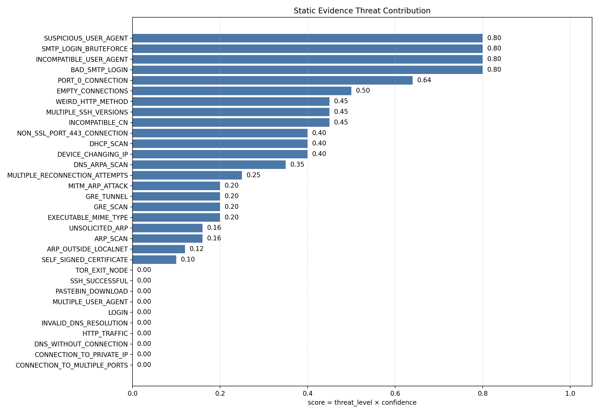
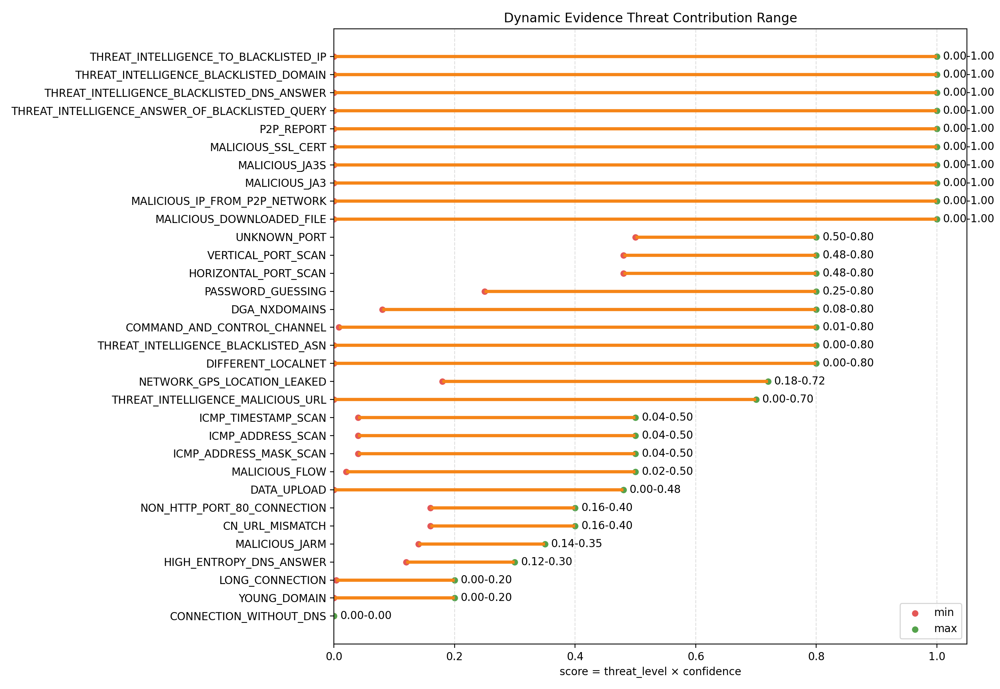
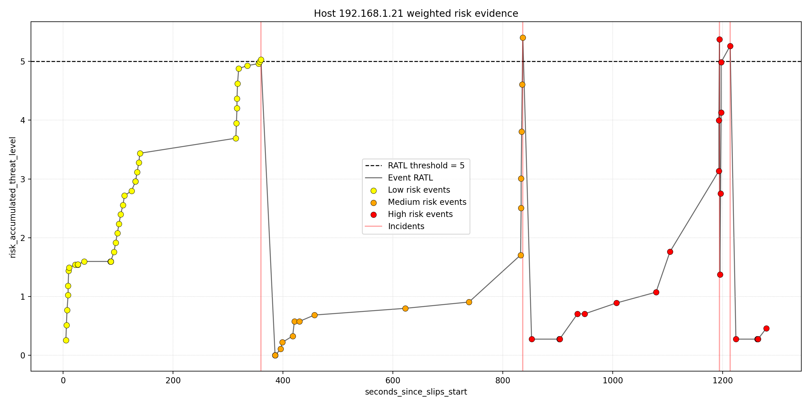

# Risk Levels in Slips

## Table of contents
* [Overview](#overview)
* [Goal](#goal)
* [Old Design](#old-design)
* [New Design: Risk Levels](#new-design--risk-levels)
  + [Experiments](#experiments)
  + [Algorithm](#algorithm)
  + [Decided thresholds](#decided-thresholds)
  + [Why risk levels reset every timewindow](#why-risk-levels-reset-every-timewindow)
  + [Why risk levels are only implemented in live traffic](#why-risk-levels-are-only-implemented-in-live-traffic)
* [Logs](#logs)
* [How to configure your own risk levels](#how-to-configure-your-own-risk-levels)
* [Demo](#demo)
* [How to use it](#how-to-use-it)
* [How AI was used here](#how-ai-was-used-here)

## Overview

- Slips now has three risk levels:
  - `low`
  - `medium`
  - `high`
- Each level is represented by a configurable weight:
  - `low_risk_weight`
  - `medium_risk_weight`
  - `high_risk_weight`
- In live traffic, Slips uses these weights to become more sensitive when under attack, and less sensitive when no malicious behaviour is detected.
- In offline analysis, such as PCAPs and Zeek directories, Slips keeps using the old design (the regular `evidence_detection_threshold`).

## Goal

The goal of introducing risk levels to Slips is to make Slips more sensitive the more attacks it sees, and less sensitive if the host is not attacking anyone or being attacked.

Sensitivitiy in Slips is represented by risk levels. The more sensitive Slips is, the more alerts it generates, the faster it blocks attackers.

## Old Design

This is how alerts and blocking in Slips were done before the introduction of risk levels:

1. each generated evidence has a score = threat_level * confidence
2. each score contributes to the accumulated threat levels of all evidence generated in a given timewindow
3. slips compares this "accumulated threat level" against `evidence_detection_threshold` from the config to determine whether to set an alert or not
4. when running with the current defaults:
   - `evidence_detection_threshold = 0.25`
   - `time_window_width = 3600`
   - the effective threshold becomes `0.25 * 3600 / 60 = 15`
5. once the threshold is reached, slips sets an alert, and if blocking is enabled, slips blocks the attacker IP

For example:
If slips detects an SMTP login bruteforce evidence. Slips assigns this evidence threat_level = `high`, and confidence= `1.0`.
The high threat level has a score of 0.8.
That score would contribute `0.8 * 1.0 = 0.8` to the accumulated_threat_level of all evidence in the current timewindow, and would then be compared to `evidence_detection_threshold` from the config to see if slips set an alert or not.
With the current default config, that threshold is `15` for the default 1 hour timewindow.
So in this design, whether slips sees 10 attacks or a 100, the accumulated scores of each evidence must sum up to 15 for an alert to be generated.
Nothing speeds up the alert generation, and nothing slows it down. it's static.

This old design is not adaptive. slips maintains the same level of sensitivity whether it's heavily under attack or if the host is stable.

## New Design: Risk Levels


Our goal in this new design in to make slips dynamically adapt to the risk levels it is currently in when analyzing live traffic.
Be more sensitive when under attack, less sensitive when not under attack, and automatically decide which level Slips is in based on the generated evidence.

### Experiments
Based on the following experiments



and the malicious, benign, and mixed experiment graphs are available [here](https://github.com/stratosphereips/StratosphereLinuxIPS/tree/develop/docs/images/immune/c9/experiments).

And given the current design of evidence weights (As of August 4, 2026):

1. static evidence weights



2. Dynamic evidence weights



We came up with the following algorithm

### Algorithm

1. each generated evidence has a score = threat_level * confidence
2. each score contributes to the accumulated threat levels of all evidence generated in a given timewindow
so if slips generated 2 evidence
the accumulated threat level = the score of evidence1 + the score of evidence2
3. instead of comparing this "accumulated threat level" to the threshold from the config to determine whether to set an alert or not, we introduce: risk accumulated threat level = "accumulated threat level" * the current risk weight
- Every new timewindow is slips starts with risk weight = low, and after 1 alert in the risk level, slips moves to the next risk level.
- the weight (multiplier) of each level is taken from the config file, and is determined by the experiments above.
4. for every new evidence, we compare the final "risk accumulated threat level" against a threshold to determine whether slips should set an alert and advance to the next level, or whether slips thinks the evidence so far are still low risk level and not alert-worthy
- the "risk accumulated threat level threshold" is determined based on the experiments above, and can be changed in the config file
- in the current config, this threshold is `5`

5. once slips generates the first alert, and moves from low to medium risk level, it doesn't lower the sensitivity within the same timewindow.
- So, Within one timewindow, Slips can move from:
  - `low` to `medium`
  - `medium` to `high`
- Within one timewindow, Slips does not move down again.
6. once a new timewindow starts, slips resets the risk level to low again.

### Decided thresholds

and we came up with the following thresholds:

- `low_risk_weight = 0.32`, which is the baseline
- `medium_risk_weight = 1`, makes the same amount of evidence reach an alert faster
- `high_risk_weight = 1.72`, makes Slips very sensitive, and alerts easier to reach
- `risk_accumulated_threat_level = 5`, decided based on monitorin the malicious and normal traffic and how much each evidence weights.


### Why risk levels reset every timewindow

1. This matches how Slips correlates evidence:
  - evidence is grouped and evaluated per timewindow
  - alerts are built from evidence inside that timewindow
2. Resetting avoids carrying old tension into fresh traffic. Without a reset, a noisy or malicious past window could permanently bias the next window and make new evidence look more severe than it really is.
3. The reset keeps each timewindow interpretable: each window starts from the same baseline and escalation has to be earned again by current activity


### Why risk levels are only implemented in live traffic

Because risk levels only reset to low every 1h (1 timewindow) and tws are read and registered very fast in PCAPs. Slips might read a zeek log file with a month-worth of traffic in minutes. this fast reading of the flows results in new registering of timewindows very fast (as soon as slips reads them) hence, there's no time to advance risk levels or properly detect in which one we're in, slips is constantly changing timewindows.

Risk levels reset to low only once per hour (one time window). When processing PCAPs or zeek logs, Slips can read and register time windows much faster than real time. For example, it may process a Zeek log containing one month of traffic in only a few minutes.

Because new time windows are registered as soon as their flows are read, Slips moves between timewindows very quickly. This does not leave enough time for the risk level to advance normally or for Slips to correctly determine the current risk level.

So risk levels (the current design) are only applicable in live traffic.


## Logs

- each evidence and alert logged to alerts.json now has the following values to allow analysts to inspect the current state:
  - accumulated_threat_level
  - risk_accumulated_threat_level
  - risk_level
  e.g
```json
{"Version": "2.D.V03", "Analyzer": {"IP": "192.168.1.21", "Name": "Slips", "Model": "1.1.21", "Category": ["NIDS"], "Data": ["Flow", "Network"], "Method": ["Statistical"]}, "Status": "Event", "ID": "fd225e1b-aaa8-4081-9e9e-d9897c763cdc", "Priority": "Low", "StartTime": "2026-08-04T00:17:12.064347+03:00", "CreateTime": "2026-08-04T00:17:12.673591+03:00", "Confidence": 0.5356, "Description": "HTTPS anomaly: type=flow; confidence=low (0.536); reason=New Server; value=mirostatic.com; why=not seen before in this host baseline. Threat level: low.", "Note": "{\"risk_level\": \"high\", \"uids\": [\"Cv54Gg4VIF2ogmcU3g\"], \"accumulated_threat_level\": 0.26712, \"risk_accumulated_threat_level\": 0.45944640000000003, \"threat_level\": \"low\", \"confidence\": \"low\", \"timewindow\": 1}", "Source": [{"IP": "192.168.1.21", "Port": [35618], "Protocol": ["TCP"]}], "Target": [{"Hostname": "mirostatic.com", "Note": "{\"SNI\": \"mirostatic.com\"}", "Port": [443]}]}
```


## How to configure your own risk levels

The risk levels are configured in the `detection` section in [`config/slips.yaml`](../../config/slips.yaml).
- The relevant keys are:

```yaml
detection:
  low_risk_weight: 0.32
  medium_risk_weight: 1
  high_risk_weight: 1.72
  risk_accumulated_threat_level: 5
```

NOTE: Keep the ordering:
  - `low_risk_weight < medium_risk_weight < high_risk_weight`


## Demo

- The following graph shows Slips advancing risk levels inside one timewindow.



- This graph shows how slips
  - generated evidence (events) until the threshold (5) is reached
  - escalates if malicious activity keeps building


## How to use it

1. run slips normally on your interface
```
./slips.py -i en01
```
2. Slips will report the current risk level every 5s.

3. attack your other devices for the risk levels to go up.
4. wait for the end of the timewindow ffor the risk level to reset to low.
5. for more details while running, monitor alerts.json.

## How AI was used here
- Helped with brainstorming the algorithm and debugging
- helped with generating the plots, csv files and traffic generation scripts for testing.
- helped with the structuring of this report
- and fixing unit tests.

## PR

https://github.com/stratosphereips/StratosphereLinuxIPS/pull/2013
