# Stress Testing Slips

- [Stress Testing Slips](#stress-testing-slips)
  * [Goal](#goal)
  * [Context](#context)
  * [Baseline](#baseline)
    + [Baseline experiments overview](#baseline-experiments-overview)
    + [Baseline Experiment 1 - CTU-Mixed-Capture-1](#baseline-experiment-1---ctu-mixed-capture-1)
    + [Baseline Experiment 2 - CTU-Mixed-Capture-2](#baseline-experiment-2---ctu-mixed-capture-2)
    + [Baseline Experiment 3 - CTU-Normal-18](#baseline-experiment-3---ctu-normal-18)
    + [Baseline conclusions](#baseline-conclusions)
  * [Stress testing](#stress-testing)
    + [Sudden traffic spikes](#sudden-traffic-spikes)
      - [Sudden-spikes experiment overview](#sudden-spikes-experiment-overview)
      - [Percentile metrics](#percentile-metrics)
      - [Sudden-spikes plots and commentary](#sudden-spikes-plots-and-commentary)
      - [Flows/min for all profilers combined](#flows-min-for-all-profilers-combined)
      - [Flows/min for each profiler](#flows-min-for-each-profiler)
      - [Latency over time](#latency-over-time)
      - [Sudden-spikes conclusions](#sudden-spikes-conclusions)
    + [Soak testing - sustained high traffic (scenario 2)](#soak-testing---sustained-high-traffic--scenario-2-)
      - [Soak testing experiment overview](#soak-testing-experiment-overview)
      - [Percentile metrics](#percentile-metrics-1)
      - [Soak-testing plots and commentary](#soak-testing-plots-and-commentary)
      - [Flows/min for all profilers combined](#flows-min-for-all-profilers-combined-1)
      - [Flows/min for each profiler](#flows-min-for-each-profiler-1)
      - [Latency over time](#latency-over-time-1)
      - [Soak-testing conclusions](#soak-testing-conclusions)
  * [Fixes](#fixes)

## Goal

The goal of the following expirements is to figure out the pressure at which Slips breaks.

Slips breaks may take one of the following forms:

**Soft Break**
The state of Slips at which Slips shows significantly reduced unacceptable performance. (for example, when input reading speed diverges from profiler throughput, or latency increases sharply).

**Hard Break**
Complete system crash or failure of the Slips processes.

But before trying to break Slips, we first need to identify what is normal (the baseline). This answers the question, “How does Slips behave under normal conditions?” Then, during stress testing, when we observe something that deviates from the baseline, we can identify it easily.

## Context

In the following experiments we will be focusing mainly on the performance of the Input and Profilers of Slips as they are the two main performance bottlenecks, and we will be comparing them to the amount of flows slips receives to determin latency and speed issues.

The latency we're interested in here means "how long did Slips take to detect a given attack after the attack was completed".

Please check [how Slips works](https://stratospherelinuxips.readthedocs.io/en/develop/immune/performance_evaluation.html#how-slips-works) for context on what profilers/input process are.

## Baseline

### Baseline experiments overview

We conducted 3 experiments on mixed traffic (normal and malicious) to measure slips performance. These PCAPs were chosen because they mimic normal user traffic. mostly benign with a few malicious/suspicious things going on every now and then.

| Experiment name | Input avg (flows/min) | Input peak (flows/min) | Profiler avg (flows/min) | Avg gap (input vs profiler) | Latency avg (seconds) | Latency p95 | Latency p99 | Max latency | Summary (plots + metrics) |
|---|---:|---:|---:|---:|---:|---:|---:|---:|---|
| CTU-Mixed-Capture-1 | 10,836.20 | 23,404 | 10,426.60 | 3.78% | 0.04 | 0 | 0 | 32 | Five throughput samples only; small average gap and only two non-zero latency samples. |
| CTU-Mixed-Capture-2 | 7,607.50 | 15,215 | 7,425.00 | 2.40% | 1.93 | 20 | 29 | 32 | Two throughput samples only; profiler drains backlog after input falls to zero and latency tail is short. |
| CTU-Normal-18 | 11,688.33 | 21,277 | 8,925.00 | 23.64% | 1.44 | 8.40 | 30 | 52 | Largest baseline throughput gap, but latency is still mostly zero aside from a few isolated spikes. |

### Baseline Experiment 1 - CTU-Mixed-Capture-1

**Traffic**

https://mcfp.felk.cvut.cz/publicDatasets/CTU-Mixed-Capture-1/

**Flows/min for all profilers combined**

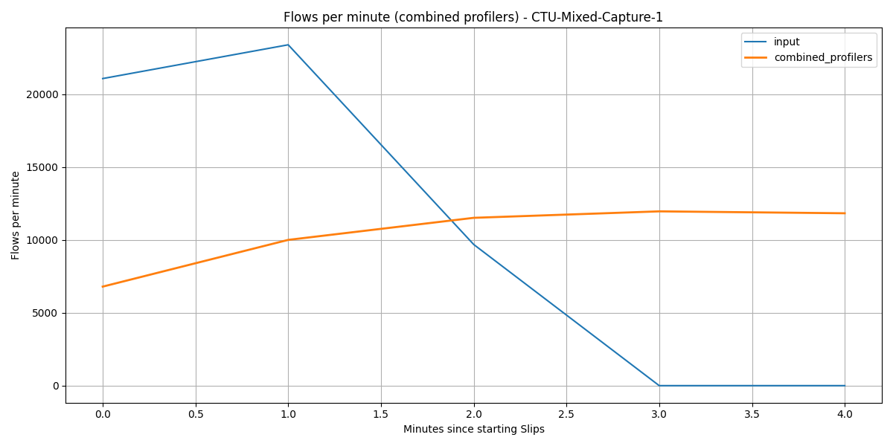

Input peaks at 23,404 flows/min, while combined profiler throughput peaks at 11,967 flows/min and continues draining after input drops to zero.

**Flows/min for each profiler**

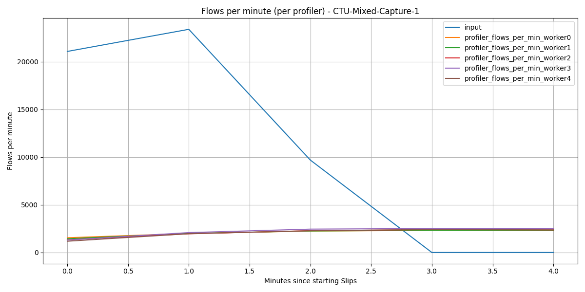

The five profilers are closely balanced; their per-minute peaks range from 2,316 to 2,514 flows/min.

**Latency over time**

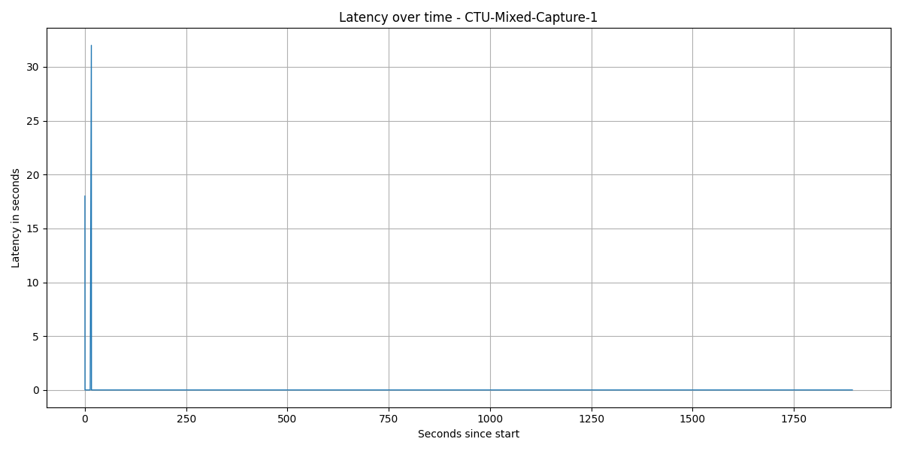

Latency is effectively flat: 1,214 of 1,216 samples are 0s, with only two spikes at 18s and 32s.

### Baseline Experiment 2 - CTU-Mixed-Capture-2

**Traffic**

https://mcfp.felk.cvut.cz/publicDatasets/CTU-Mixed-Capture-2/

**Flows/min for all profilers combined**

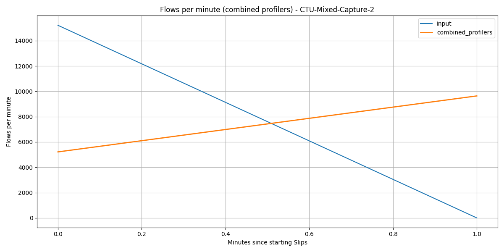

There are only two throughput samples: 15,215 input flows/min followed by a drain minute where profiler throughput reaches 9,636 flows/min after input is already zero.

**Flows/min for each profiler**

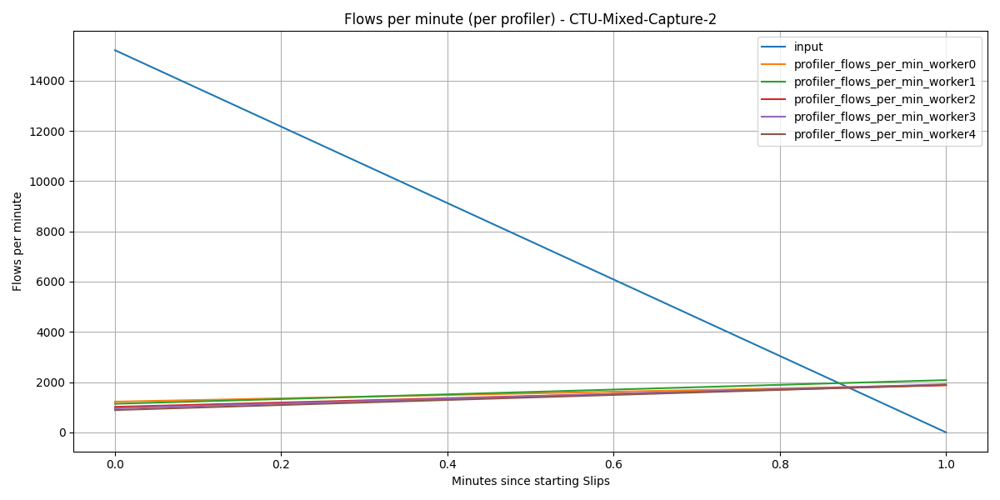

The workers remain fairly even during the drain minute, peaking between 1,876 and 2,080 flows/min.

**Latency over time**

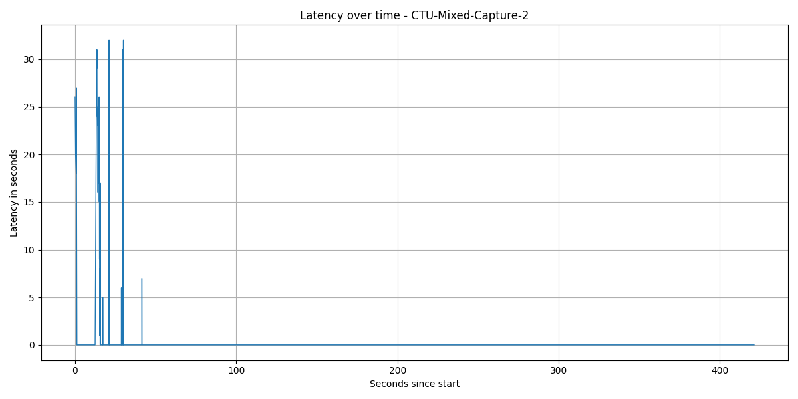

Latency is mostly 0s, with a short early tail up to 32s; p95 is 20s and p99 is 29s.

### Baseline Experiment 3 - CTU-Normal-18

**Traffic**

https://mcfp.felk.cvut.cz/publicDatasets/CTU-Normal-18/

**Flows/min for all profilers combined**

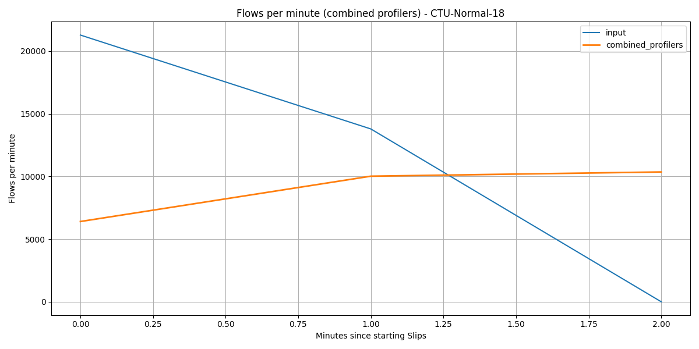

The first minute reaches 21,277 input flows/min versus 6,402 profiled, and the profilers keep draining until they peak at 10,355 flows/min after input stops.

**Flows/min for each profiler**

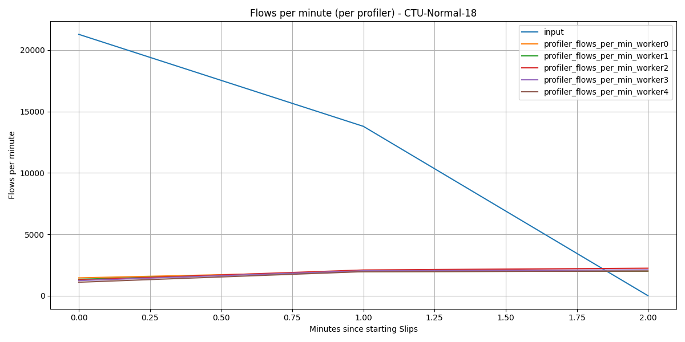

Profiler load is still balanced overall, with worker 2 slightly ahead and peaking at 2,239 flows/min.

**Latency over time**

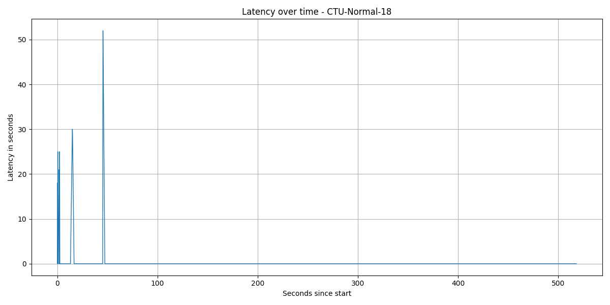

Most latency samples are 0s; the tail comes from a handful of spikes, including a single 52s maximum.

---

### Baseline conclusions
| Check | Result | Reason |
|---|---|---|
| Soft Break FPS | Not reached in baseline | CTU-Mixed-Capture-1 and CTU-Mixed-Capture-2 stay at 3.78% and 2.40% average throughput gap. CTU-Normal-18 reaches a 23.64% gap, but its latency still stays mostly at 0s with p95 at 8.40s. |
| Hard Break | Not observed | All experiments produced metrics and plots; no indication of process failure in outputs. |

---

## Stress testing

Now we try to get Slips to break.

### Sudden traffic spikes

This scenario covers sudden-spikes experiment. The input traffic pattern is designed to simulate sudden bursts of network activity, with spikes reaching up to 10,281 flows/min every 10 minutes. The goal is to evaluate how Slips handles these abrupt increases in load and whether it can maintain performance without significant degradation or failure.

#### Sudden-spikes experiment overview

| Experiment name | Input avg (flows/min) | Input peak (flows/min) | Profiler avg (flows/min) | Profiler peak (flows/min) | Avg gap (input vs profiler) | Latency avg (seconds) | Latency p95 | Latency p99 | Summary (plots + metrics) |
|---|---:|---:|---:|---:|---:|---:|---:|---:|---|
| sudden_spikes | 439.08 | 10,281 | 439.07 | 10,281 | 0.0006% | 1,134.63 | 11,610 | 17,715 | Combined throughput almost perfectly matches input, but latency degrades severely late in the run. |

#### Percentile metrics

| Metric | p50 | p95 | p99 | Avg |
|---|---:|---:|---:|---:|
| Input flows/min | 253.5 | 944.5 | 5,200.44 | 439.08 |
| Profiler flows/min (all) | 254.0 | 1,222.2 | 5,049.02 | 439.07 |
| Latency (seconds) | 166.0 | 11,610.0 | 17,715.0 | 1,134.63 |

#### Sudden-spikes plots and commentary

#### Flows/min for all profilers combined

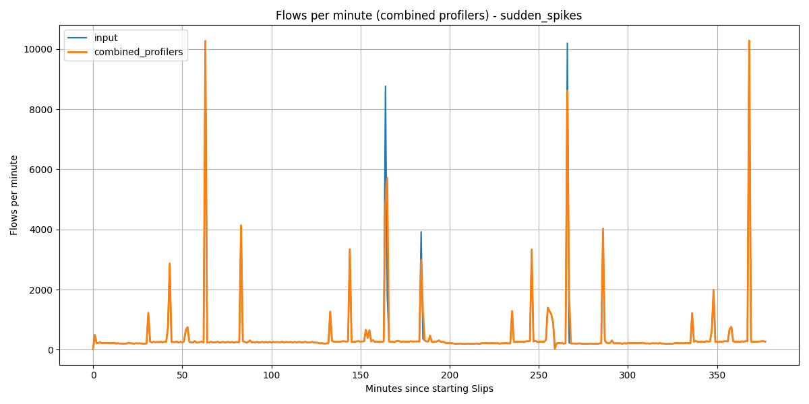

The combined profiler series matches input exactly in 310 of 378 minutes; the visible mismatches are short catch-up periods immediately after large bursts.

#### Flows/min for each profiler

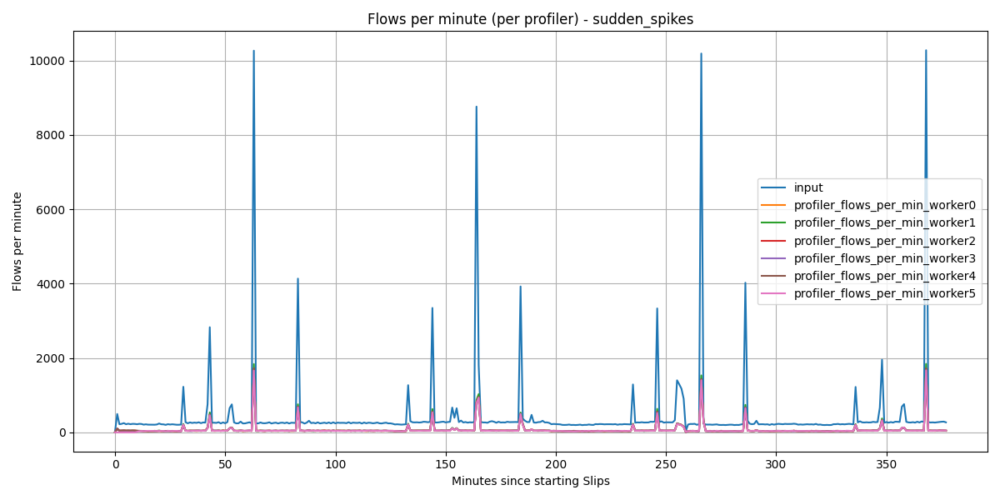

Spike load is spread fairly evenly across the profilers, but worker 5 does not contribute until 10 minutes into the run.

#### Latency over time

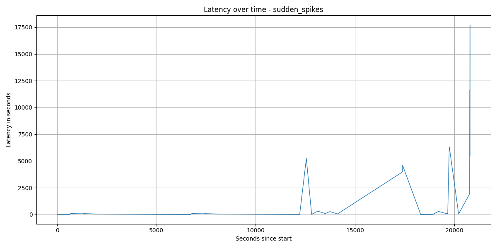

Latency starts in the low hundreds of seconds and then explodes late in the run; the last quarter alone pushes p95 to 17,715s and the maximum to 17,718s.

#### Sudden-spikes conclusions
| Check | Result | Reason                                                                                                       |
|---|---|-----------------------------------------------------------------------------------------------------------------|
| Soft Break FPS | Reached (latency-driven) | Throughput keeps up with input, but latency rises to 19 mins on average with p95 at 11,610s and p99 at 17,715s. |
| Hard Break | Not observed | Metrics and plots are complete; no evidence of a process crash.                                                 |

---
### Soak testing - sustained high traffic (scenario 2)

This scenario covers soak-testing experiment. The input traffic pattern is designed to simulate sustained high traffic activity. The goal is to evaluate how Slips handles these increases in load for a long period of time and whether it can maintain performance without significant degradation or failure.

#### Soak testing experiment overview

| Experiment name | Input avg (flows/min) | Input peak (flows/min) | Profiler avg (flows/min) | Profiler peak (flows/min) | Avg gap (input vs profiler) | Latency avg (seconds) | Latency p95 | Latency p99 | Summary (plots + metrics) |
|---|---:|---:|---:|---:|---:|---:|---:|---:|---|
| soak_testing | 8,686.36 | 10,391 | 4,974.73 | 5,892 | 42.73% | 688.37 | 1,134.0 | 1,206.76 | Profiler throughput stays well below input throughout the run, and latency keeps rising instead of stabilizing. |

#### Percentile metrics

| Metric | p50 | p95 | p99 | Avg |
|---|---:|---:|---:|---:|
| Input flows/min | 8,846.0 | 9,991.05 | 10,381.54 | 8,686.36 |
| Profiler flows/min (all) | 5,343.0 | 5,770.70 | 5,878.24 | 4,974.73 |
| Latency (seconds) | 708.0 | 1,134.0 | 1,206.76 | 688.37 |

#### Soak-testing plots and commentary

#### Flows/min for all profilers combined
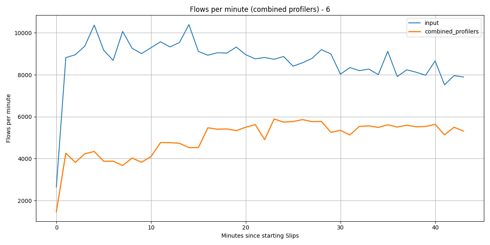

Input stays high between 2,643 and 10,391 flows/min, while combined profiler throughput never exceeds 5,892 flows/min.

#### Flows/min for each profiler

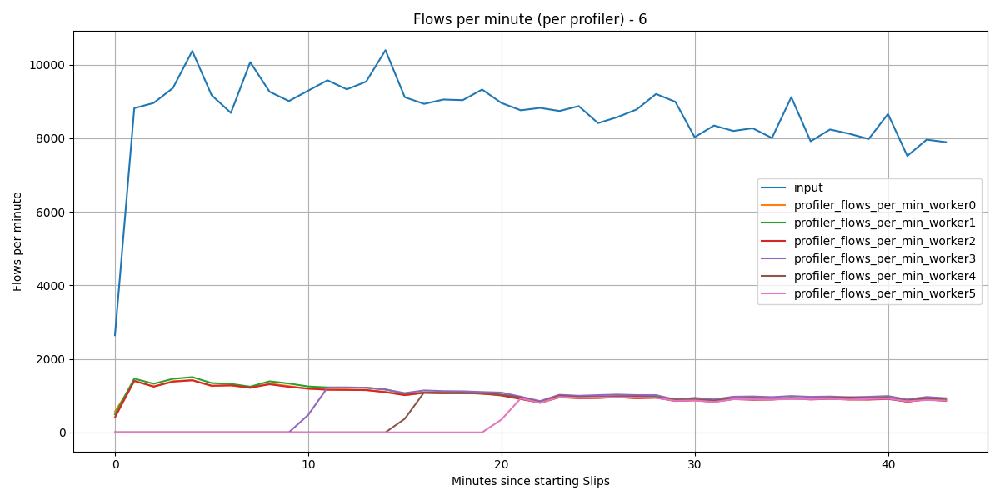

Only workers 0-2 carry traffic at the start; workers 3, 4, and 5 begin contributing roughly 10, 15, and 20 minutes into the run because slips adds more workers the more throughput it detects. here, the throughput gap remains large.

#### Latency over time

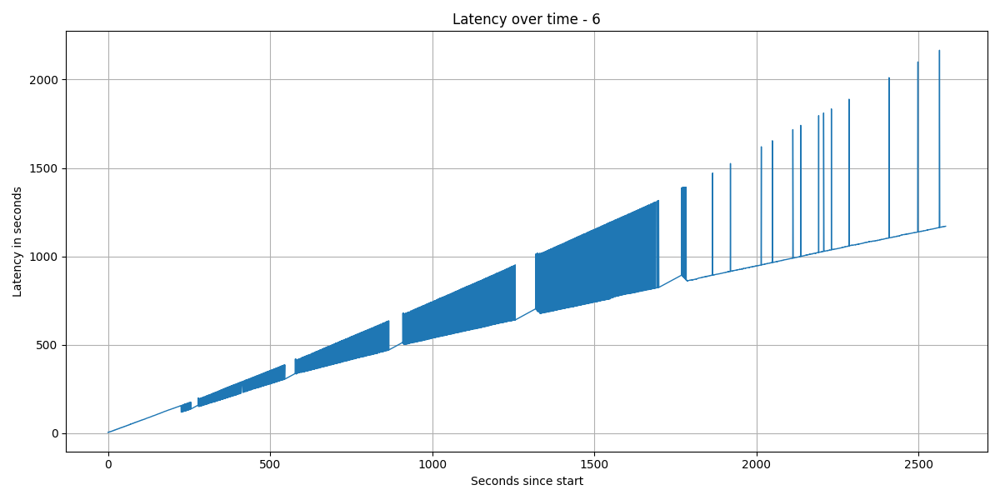

Latency grows through the run instead of flattening. This is considered a soft break. Slips is unable to keep up a tolerable performance under constant heavy load. We consider this the main issue that needs to be solved.

#### Soak-testing conclusions
| Check | Result      | Reason                              |
|---|-------------|----------------------------------------|
| Soft Break FPS | Reached | Profiler throughput averages 4,974.73 flows/min against 8,686.36 input flows/min, and latency grows from a 708s median to a 2,166s maximum. |
| Hard Break | Not observed | The CSV series continue through the end of the run, so the data shows severe degradation but not a crash. |

## Fixes
After many experiments, trials and failures, and optimizations, we managed to get acceptable latency in Slips under high traffic

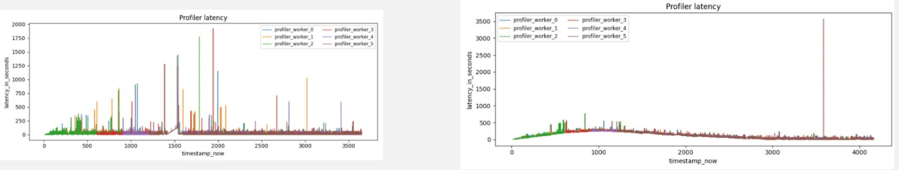

**PRs solving the above issues, and resource-related issues discovered while testing can be found here:**

* DoS Protector: https://github.com/stratosphereips/StratosphereLinuxIPS/issues/1767
* Latency issue https://github.com/stratosphereips/StratosphereLinuxIPS/issues/1838 and https://github.com/stratosphereips/StratosphereLinuxIPS/pull/1858
* Incomplete processing of flows: https://github.com/stratosphereips/StratosphereLinuxIPS/issues/1848

Resource related issues:

http://github.com/stratosphereips/StratosphereLinuxIPS/issues/1827
https://github.com/stratosphereips/StratosphereLinuxIPS/issues/1815
