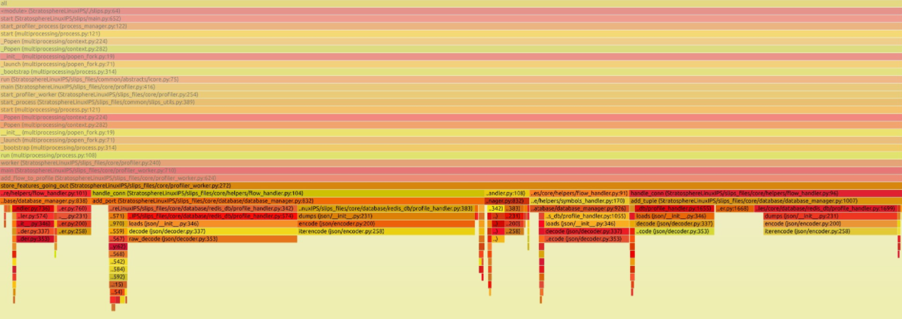
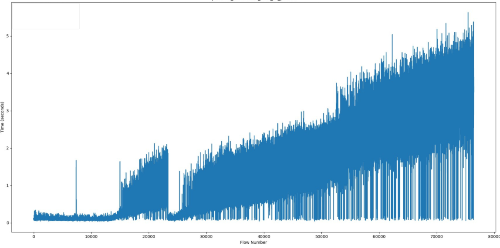
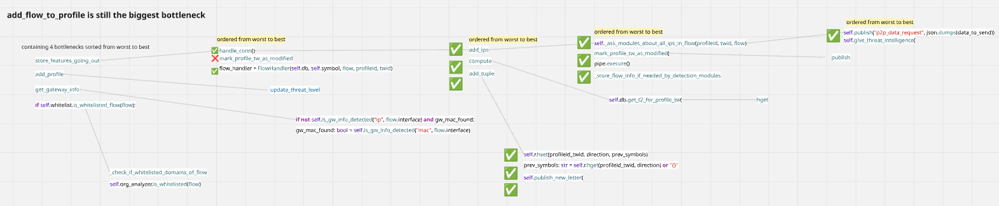

## Table Of Contents
  * [Performance Evaluation](#performance-evaluation)
  * [Experiment Details](#experiment-details)
  * [Resource exhaustion: RAM issues](#resource-exhaustion--ram-issues)
    * [Slips usage of RAM](#slips-usage-of-ram)
    * [Experiments](#experiments)
    * [TLDR;](#tldr-)
  * [Resource exhaustion: CPU issues](#resource-exhaustion--cpu-issues)
    * [TLDR;](#tldr--1)
  * [Proposed solutions](#proposed-solutions)
* [Conclusion](#conclusion)


# Testing

The following experiments are done by running Slips with an IP exposed to the internet (public-facing) with real-life traffic, and monitoring the performance under normal conditions and when under attack.

The goal of these experiments is to push Slips close to the limits but
not to the point of breaking (not stress testing) and evaluate it.

This is considered load testing, it's testing that evaluates how an application behaves under expected user loads. It answers the following question "Does Slips behave correctly and fast enough under expected conditions?".

Non-public facing hosts (the majority of hosts) encouter less attacks, receive less flows, and hence have better benchmarks by definition. Slips is stable when handling these scenarios, that's why we decided to push slips testing further to evaluate the performance under more aggressive, high-pressure conditions.


This report primarily focuses on **identifying CPU and RAM resource exhaustion**.

The following experiments are done using Slips in a docker container with RAM and CPU limits to be able to have artifacts to debug issues without the host getting killed.


Refer to this link for Slips definition of high-traffic vs normal flow rate:  https://stratospherelinuxips.readthedocs.io/en/develop/immune/performance_evaluation.html#defining-high-traffic

## Experiment Details

**Slips**

- Version: v1.1.16
- Commit hash: 97c32c2

**Redis**

- Version: Redis v7.x

**Zeek**

- Version: Zeek v8.x

**Docker image**

- Image: stratosphereips/slips:latest
* Network mode: host
* CPU shares: 700
* Memory limit: 10 GB
* Memory + swap limit: 10 GB (swap effectively disabled)
* Shared memory size: 512 MB

## Resource exhaustion: RAM issues

### Slips usage of RAM

Slips relies on [Redis](https://redis.io/) for storing detection related info.

> Redis is an open-source, in-memory data store that can be used as a database, cache, or message broker.

The info stored by Slips in Redis is our main focus when discussing RAM-related issues.

### Experiments

The first few experiments we ran slips for 8+ hours. The experiments showed weird behavior where Slips doesn't shutdown for hours, while 0 new flows are being processed and 0 new evidence was generated.


[htop](https://htop.dev/) shows zombie children of slips, 2 children terminate in all experiments and Slips was running without them.


Debugging the parent with gdb and collecting the zombies' exit codes showed the following

```
(gdb) set $status_ptr = (int*) malloc(sizeof(int))
(gdb) call waitpid(-1, $status_ptr, 1)
$3 = 1034
(gdb) print *$status_ptr
$4 = 9
```

both processes were killed with SIGKILL (9 is the code for SIGKILL).

Why SIGKILL happens? It May be one of the following
1. Explicit kill -9 (manual or automated)
2. [OOM killer](https://neo4j.com/developer/kb/linux-out-of-memory-killer/) (Linux kills process due to out-of-memory)
3. Container or cgroup enforced limits
4. Parent or supervisor process deliberately killing it


In our case it may be point 2 or 3. since the parent was running no issue and we didn't kill them manually.


So did Slips cause the docker to run out of RAM and got killed by the OOM killer?

To verify that we need to check OOM logs, max allowed RAM usage, and peak RAM usage:


Checking max allowed RAM usage in bytes
```
cat /sys/fs/cgroup/memory.max 2>/dev/null || cat /sys/fs/cgroup/memory/memory.limit_in_bytes
8589934592
```

Checking peak RAM usage in bytes
```
cat /sys/fs/cgroup/memory.peak 2>/dev/null || cat /sys/fs/cgroup/memory/memory.max_usage_in_bytes
8590934016

```

Max container usage - RAM limit:
8590934016 - 8589934592 = 999424 bytes

that's ~1MB. so this docker did reach it's max memory because of Slips, and it's not using swap. The OOM stepped in, and killed the 2 troublesome processes that took the most RAM.

One thing left to confirm, did the container receive any OOM kills?

This is a counter dump telling us how the kernel has been throttling or killing processes in this memory cgroup

```
cat /sys/fs/cgroup/memory.events
low 0
high 0
max 51807
oom 9
oom_kill 5
oom_group_kill 0
```
The number we're interested in here is:
**oom_kill 5**.
(5 processes were killed by the kernel’s OOM killer in this cgroup)

And this is how we discovered that Slips has RAM-related issues and discovered the two offending children of slips, the input process and the profiler process.


### TLDR;

* Flow ingestion continues without bounds while processing lags behind.
* There is no effective backpressure or memory guardrail to prevent unbounded in-memory accumulation of pending flows.
* As a result, Slips exceeds its container memory limit and is partially killed by the kernel.


## Resource exhaustion: CPU issues

This issue is closely related to the one above.

We had one major question: "Ok why is the RAM growing so much to the point of being killed by the OS?"

And the answer was,
1. Slips was retrieving and processing huge amounts of data at once from the Redis database, which also caused CPU bottlenecks.
2. While Slips was slowly processing flows because of the CPU bottlenecks, it was still receiving more and more flows from zeek (because Zeek is not affected by slips bottlenecks), so the received flows were accumulated in memory until it's their turn to be processed (hence the RAM issues discussed above).

So the processing speed was slower than the speed of reading new flows. and the data stored in the Redis database needs optimizations.


To confirm, we profiled the main "flow processor" of Slips, the profiler process, using py-spy.
This is one of the 2 processes running out of RAM and getting killed in the previous experiment.



The good news is, zooming in a little to see, we identified the major CPU bottleneck: the ```add_flow_to_profile()``` function. It is growing linearly.



And the bad news is, it contains a few function calls and they all need optimizations.




And this is how we discovered that Slips has CPU-related issues that also cause RAM related issues.

### TLDR;
* The profiler process is slow and doesn’t handle large flow batches efficiently.
* CPU gets maxed out, so flows pile up in memory while waiting to be processed.
* There’s nothing in place to slow down incoming flows when the profiler can’t keep up.

## Proposed solutions

1. Add backpressure. This is basically telling Slips "Don't read more flow than what you can handle, pause when you are overwhelmed and continue consuming more flow when you're ready."
2. Add heartbeat or health checks from children. Slips should kill the rest of its children when the major parts of it crashes.
3. Batch processing of redis commands; leading to fewer DB access.
4. Pre-processing of the info needed for detections and stored in redis so they can be accessed in O(1).
5. More parallelism; Use processes instead of threads for true parallelism of profiler workers.
6. Increase slips profilers when needed. so instead of 1 profiler sending flows to all modules for processing, we can start with 3 and add more when under pressure depending on the ratio of the input:profiler flows processed.
7. Expire old info in redis; to avoid RAM growing indefinitely, slips will keep track of the present (current and past 1 timewindow) and forget about the past or offload to disk (SQLite).


# Conclusion

This was a high-level brief of the testing and evaluation done.

Here we documented the experiments, observations, debugging, and issues found.

Solutions to the found issues are in progress.
