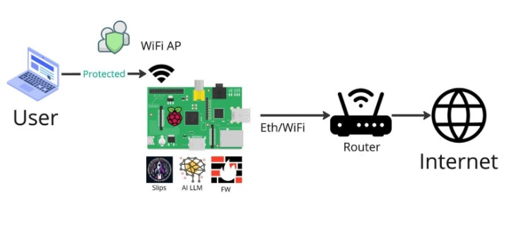

# Installation

There are two ways to install and run Slips: inside a Docker or in your own computer. We suggest to install and to run Slips inside a Docker since all dependencies are already installed in there. However, current version of docker with Slips does not allow to capture the traffic from the computer's interface. We will describe both ways of installation anyway.


## Table of Contents

* [Docker](https://stratospherelinuxips.readthedocs.io/en/develop/installation.html#slips-in-docker)
  * Dockerhub (recommended)
    * [Linux and windows hosts](https://stratospherelinuxips.readthedocs.io/en/develop/installation.html#linux-and-windows-hosts)
    * [MacOS hosts](https://stratospherelinuxips.readthedocs.io/en/develop/installation.html#macos-hosts)
    * [Light Slips Image](#minimal-slips-docker-image)
  * [Docker-compose](https://stratospherelinuxips.readthedocs.io/en/develop/installation.html#running-slips-using-docker-compose)
  * [Dockerfile](https://stratospherelinuxips.readthedocs.io/en/develop/installation.html#building-slips-from-the-dockerfile)
* Native
  * [Using install.sh](https://stratospherelinuxips.readthedocs.io/en/develop/installation.html#install-slips-using-shell-script)
  * [Manually](https://stratospherelinuxips.readthedocs.io/en/develop/installation.html#installing-slips-manually)
* [on RPI (Beta)](https://stratospherelinuxips.readthedocs.io/en/develop/installation.html#installing-slips-on-a-raspberry-pi)


## Requirements

- Python 3.10.12
- 5 GBs of disk space (for the docker image)
- at least 4 GBs of RAM

## Slips in Docker

Slips can be run inside a Docker. Either using our docker image with from DockerHub (recommended)
or building Slips image from the Dockerfile for more advanced users.

In both cases, you need to have the Docker platform installed in your computer.
For instructions how to install Docker check https://docs.docker.com/get-docker/.

The recommended way of using slips would be to
* Run Slips from Dockerhub

For more advanced users, you can:
* [Run Slips using docker compose](#Running-Slips-using-docker-compose)
* [Build Slips using the dockerfile](#Running-Slips-using-the-dockerfile)


### Running Slips from DockerHub

#### Linux And Windows Hosts

###### Analyse your own traffic
    docker run --rm -it -p 55000:55000 --cpu-shares "700" --memory="8g" --memory-swap="8g" --net=host --cap-add=NET_ADMIN -v $(pwd)/output:/StratosphereLinuxIPS/output -v $(pwd)/dataset:/StratosphereLinuxIPS/dataset --name slips stratosphereips/slips:latest /StratosphereLinuxIPS/slips.py -i eno1

Please change the name of the interface for your own.
Check the alerts slips generated

      tail -f output/eno1*/alerts.log


#### MacOS Hosts

###### Analyse your own traffic
    docker run --platform linux/amd64 --rm -it -p 55000:55000 --cpu-shares "700" --memory="8g" --memory-swap="8g" --net=host --cap-add=NET_ADMIN -v $(pwd)/output:/StratosphereLinuxIPS/output -v $(pwd)/dataset:/StratosphereLinuxIPS/dataset --name slips stratosphereips/slips:latest /StratosphereLinuxIPS/slips.py -i eno1

Please change the name of the interface to your own.
Check the alerts slips generated

      tail -f output/eno1*/alerts.log

---

To analyze your own files using slips, you can mount it to your docker using -v

	mkdir ~/dataset
	cp <some-place>/myfile.pcap ~/dataset
	docker run -it --rm --net=host -v ~/dataset:/StratosphereLinuxIPS/dataset stratosphereips/slips:latest
	./slips.py -f dataset/myfile.pcap


#### Minimal Slips Docker Image
In addition to the full stratosphereips/slips:latest image, there is now a minimal Docker image available: using `docker pull stratosphereips/slips_light:latest`. This image excludes the following modules to reduce size and resource usage:

* rnn_cc_detection/
* timeline/
* kalipso/
* p2ptrust/
* flowmldetection/
* cyst/
* cesnet/
* exporting_alerts/
* riskiq/
* template/
* blocking/
* virustotal/

Additionally, several directories and files have been removed from this minimal image, including:
dataset/, docs/, tests/

Slips' two GUIs, kalipso and the web interface, aren't available in this image. The only way to check the slips output there is by going through the generated logs.

The stratosphereips/slips_light:latest image is recommended for users who do not require these specific modules and want a more lightweight deployment.


### Update slips image

	docker pull stratosphereips/slips:latest


### Run Slips sharing files between the host and the container

The following instructions will guide you on how to run a Slips docker container with file sharing between the host and the container.

```bash
    # create a directory to load pcaps in your host computer
    mkdir ~/dataset

    # copy the pcap to analyze to the newly created folder
    cp <some-place>/myfile.pcap ~/dataset

    # create a new Slips container mapping the folder in the host to a folder in the container
    docker run -it --rm --net=host --name slips -v $(pwd)/dataset:/StratosphereLinuxIPS/dataset stratosphereips/slips:latest

    # run Slips on the pcap file mapped to the container
    ./slips.py -f dataset/myfile.pcap
```

### Run Slips with access to block traffic on the host network

In Linux OS, the Slips can be used to analyze and **block** network traffic on the host network interface. To allow the container to see the host interface traffic and block malicious connections, it needs to run with the option `--cap-add=NET_ADMIN`. This option enables the container to interact with the network stack of the host computer. To block malicious behavior, run Slips with the parameter `-p`.

Change eno1 in the command below to your own interface

```bash
    # run a new Slips container with the option to interact with the network stack of the host
    docker run -it --rm --net=host --cap-add=NET_ADMIN --name slips stratosphereips/slips:latest

    # run Slips on the host interface `eno1` with active blocking `-p`
    ./slips.py -i eno1 -p
```

---

### Running Slips using docker compose


Change enp1s0 to your current interface in docker/docker-compose.yml and start slips using

    docker compose -f docker/docker-compose.yml up

Now everything inside your host's ```config``` and ```dataset``` directories is
mounted to ```/StratosphereLinuxIPS/config/``` and ```/StratosphereLinuxIPS/dataset/``` in Slips docker.

To run slips on a pcap instead of your interface you can do the following:

1. put the pcap in the ```dataset/``` dir in your host
2. change the entrypoint in the docker compose file to
    ["python3","/StratosphereLinuxIPS/slips.py","-f","dataset/<pcapname>.pcap"]
3. restart slips using ```docker compose -f docker/docker-compose.yml up```


#### Limitations

The main limitation of running Slips in a Docker is that every time the container stops,
all files inside the container are deleted, including the Redis database of cached data,
and you lose all your Threat Intelligence (TI) data and previous detections.
Next time you run Slips, it will start making detections without all the TI data until downloading the data again.
The only solution is to keep the container up between scans.


---

### Building Slips from the Dockerfile

Before building the docker locally from the Dockerfile, first you should clone Slips repo or download the code directly:

	git clone https://github.com/stratosphereips/StratosphereLinuxIPS.git

**NOTE**: you have to be in the main Slips directory to build this.

If you cloned Slips in '~/StratosphereLinuxIPS', then you can build the Docker image with:

	cd ~/StratosphereLinuxIPS
	docker build --no-cache -t slips -f docker/Dockerfile .
	docker run -it --rm --net=host slips
	./slips.py -c config/slips.yaml -f dataset/test3-mixed.binetflow

If you don't have Internet connection from inside your Docker image while building, you may have another set of networks
defined in your Docker. For that try:

	docker build --network=host --no-cache -t slips -f docker/Dockerfile .

You can also put your own files in the /dataset/ folder and analyze them with Slips:

	cp some-pcap-file.pcap ~/StratosphereLinuxIPS/dataset
	docker run -it --rm --net=host -v ~/StratosphereLinuxIPS/dataset/:/StratosphereLinuxIPS/dataset slips
	./slips.py -f dataset/some-pcap-file.pcap


Note that some GPUs don't support tensorflow in docker which may cause "Illegal instruction" errors when running slips.
You can read more about it [here](https://stratospherelinuxips.readthedocs.io/en/develop/FAQ.html#getting-illegal-instruction-error-when-running-slips)

---


## Installing Slips natively

Slips is dependent on three major elements:

Python 3.10.12
Zeek
Redis database 7.0.4

To install these elements we will use APT package manager. After that, we will install python packages required for Slips to run and its modules to work. Also, Slips' interface Kalipso depend on Node.JS and several npm packages.


**Instructions to download everything for Slips are below.**
<br>

### Install Slips using shell script
You can install it using install.sh

	sudo chmod +x install.sh
	sudo ./install.sh


### Installing Slips manually
#### Installing Python, Redis, NodeJs, and required python and npm libraries.

Update the repository of packages so you see the latest versions:

	apt-get update

Install the required packages (-y to install without asking for approval):

    apt-get -y install tshark iproute2 python3.10.12 python3-tzlocal net-tools python3-dev build-essential python3-certifi curl git gnupg ca-certificates redis wget python3-minimal python3-redis python3-pip python3-watchdog nodejs redis-server npm lsof file iptables nfdump zeek whois yara
    apt install -y --no-install-recommends nodejs

Even though we just installed pip3, the package installer for Python (3.10.12), we need to upgrade it to its latest version:

	python3 -m pip install --upgrade pip

Now that pip3 is upgraded, we can proceed to install all required packages via pip3 python packet manager:

	sudo pip3 install -r install/requirements.txt

_Note: for those using a different base image, you need to also install tensorflow==2.16.1r via pip3._


As we mentioned before, the GUI of Slips known as Kalipso relies on NodeJs v19. Make sure to use NodeJs greater than version 12. For Kalipso to work, we will install the following npm packages:

    curl -fsSL https://deb.nodesource.com/setup_21.x |  sudo -E bash - && sudo apt install -y --no-install-recommends nodejs
    cd modules/kalipso && npm install

####  Installing Zeek

The last requirement to run Slips is Zeek. Zeek is not directly available on Ubuntu or Debian. To install it, we will first add the repository source to our apt package manager source list.
The following two commands are for Ubuntu, check the repositories for the correct version if you are using a different OS:

	echo 'deb http://download.opensuse.org/repositories/security:/zeek/xUbuntu_18.04/ /' | tee /etc/apt/sources.list.d/security:zeek.list

We will download and store the gpg signature from the package for apt to read:

	curl -fsSL http://download.opensuse.org/repositories/security:/zeek/xUbuntu_18.04/Release.key | gpg --dearmor | tee /etc/apt/trusted.gpg.d/security_zeek.gpg > /dev/null

Finally, we will update the package manager repositories and install zeek

	apt-get update
	apt-get -y install zeek

To make sure that zeek can be found in the system we will add its link to a known path:

	ln -s /opt/zeek/bin/zeek /usr/local/bin

#### Running Slips for the First Time


Be aware that the first time you run Slips it will start updating
all the databases and threat intelligence files in the background.
However, it will give you as many detections as possible _while_ updating.
You may have more detections if you rerun Slips after the updates.
Slips behaves like this, so you don't have to wait for the updates to
finish to have some detections. however, you can change that in the config file by setting ```wait_for_TI_to_finish``` to yes.


Depending on the remote sites, downloading and updating the DB may take up to 4 minutes.
Slips stores this information in a cache Redis database,
which is kept in memory when Slips stops. Next time Slips runs, it will read from this database.
The information in the DB is updated periodically according to the configuration file (usually one day).

You can check if the DB is running this by looking at your processes:

```
    ps afx | grep redis
    9078 ?        Ssl    1:25 redis-server *:6379
```

You can kill this redis database by running:

```
    ./slips.py -k
    Choose which one to kill [0,1,2 etc..]
    [0] Close all servers
    [1] conn.log - port 6379
```
then choosing 1.


## Installing Slips on a Raspberry PI

The recommended way to install Slips on the RPI is using docker.

If you're using the 64-bit (arm64) version of the RPI,
follow the official docker [installation instructions for Debian](https://docs.docker.com/engine/install/debian/).

Slips now supports a native linux/arm64 docker image, you can pull it using

    docker pull stratosphereips/slips:latest

To enable P2P, make sure of the following:
* You run Slips docker with --net=host
* You don't have redis running on the host and occupying Redis' default IP/Port 127.0.0.1:6379.

### Protect your local network with Slips on the RPI

By installing Slips on your RPI and using it as an access point,
you can extend its protection to your other connected devices.

Once Slips detects a malicious device, it will block all traffic to and from it using iptables.
Meaning it wil kick out the malicious device from the AP.




1. Connect your RPI to your router using an ethernet cable
2. Run your RPI as an access point using [create_ap](https://github.com/oblique/create_ap)

`sudo create_ap wlan0 eth0 rpi_wifi mysecurepassword -c 40`

where `wlan0` is the wifi interface of your RPI, `eth0` is the ethernet interface and `-c 40` is the channel of the access point.

We chose channel 40 because it is a 5GHz channel, which is faster and less crowded than the 2.4GHz channels.

Note: Please make sure your RPI model supports 5GHz channels. If not, you can use `-c 1` for 2.4GHz.

3. Run Slips in the RPI using the command below to listen to the traffic from the access point.

```bash
./slips.py -i wlan0
```

4. (Optional) If you want to block malicious devices, run Slips with the `-p` parameter. Using this parameter will
block all traffic to and from the malicious device when slips sets an alert.

```bash
./slips.py -i wlan0 -p
```

Now connect your devices to the rpi_wifi with "mysecurepassword" as the password, and enjoy the protection of Slips.
