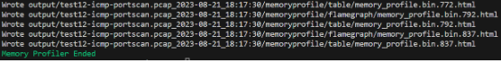

# CPU and Memory Profiling
GSoC 2023 SLIPS Final Report

### Author
Daniel Yang (danielyangkang@gmail.com)
### Github
https://github.com/danieltherealyang/StratosphereLinuxIPS
### Repo Link
CPU Profiling:
https://github.com/stratosphereips/StratosphereLinuxIPS/pull/362
Memory Profiling:
https://github.com/stratosphereips/StratosphereLinuxIPS/pull/388

## Overview
### Goal
This project aims to provide a robust and easy to use profiling framework for slips. The features created should have a simple interface and minimal involvement needed to get usable interactive data to find areas to improve the program.

### Current State
The following features are provided for CPU and memory profiling.
Both will have live profiling mode and a development (dev) profiling mode. Live mode allows for real time data passing, primarily done through a redis channel. Dev mode aggregates the data for a single run and outputs profiling results.
CPU dev mode integrates viztracer to collect profiling data and create a visual output for the data.
CPU live mode uses yappi to collect data over a sampling interval of 20 seconds periodically outputting the data into the “cpu_profile” redis channel.
Memory dev and live mode both integrate memray to collect data. Dev mode collects all process data as bin files and outputs as html files. Each process’ data is in a separate file because there is currently no viable way, supported or unsupported by memray, to combine separate process data together.
Memory live mode is intended to be integrated into the web interface. Since only one process can be profiled at a time with live mode, the multiprocess.Process class is extended with additional functionality when the feature is enabled. The web interface should send the PID into the redis channel “memory_profile” to switch which process to profile.

***Note***: Not recommended to run both profilers at the same time as of now. It is not tested thoroughly and could also cause issues with speed.

### What’s left to do
1. The CPU and Memory live modes need to be integrated into the web interface so that there can be a panel that polls the respective redis channels and displays accordingly. The ideal way is for the CPU live profiler to have its own panel either just displaying the text in the redis channel or the table can get parsed into proper UI elements. The Memory live profiler should have a panel displaying a web terminal, where the output of the terminal command should be displayed in the browser. As proof of concept, think of VSCode’s integrated terminal using xterm.js. There also needs to be a way to see PIDs of currently running processes and switching which process is currently profiled.
2. The memory profiler dev mode outputs data in a really cumbersome way, putting each process into a separate file. Having tried to work around this myself, I find that there is currently no good way to aggregate separate files together and compare interprocess data. To fix this, we might need to consider contacting the developers of memray, the tool which was integrated into the memory profiling feature or create a private fork of the tool for customization to the needs of slips.
3. The live memory profiler is currently only one way communication, where the pid to get profiled gets sent into a redis channel for IPC and the profiler class manages everything internally. Since all of this is to get around the fact that memray does not have multiprocess live profiling built in, the web interface is going to need a way to receive updates on the status of the profiler so that it knows when to reconnect the web terminal client using “memray live <port>”.


## Usage
### CPU Profiler Dev Mode
#### Step 1
To start with, go to slips.yaml and make sure the feature is enabled.


and set number of tracer entries (dev mode only) to cpu_profiler_dev_mode_entries = 1000000

The first two settings cpu_profiler_enable and cpu_profiler_mode should be self explanatory. The cpu_profiler_multiprocess setting decides whether the profiler tracks all processes or only one.
If this setting is set to: “no” then only the main process that initiates slips gets tracked.

The setting ```cpu_profiler_dev_mode_entries``` sets the size of the circular buffer for the profiler. If the runtime of the profiler is too long and the data at the start of the run gets lost due to the circular buffer filling up, increase this number.


### Step 2

Next, just run slips as normal. For an example command, run:
``` ./slips.py -e 1 -f dataset/test12-icmp-portscan.pcap ```

The program should run pretty similarly to how it normally runs with some small differences. At the beginning of the run, you should see


this means that the profiler starts a recursive process to run the same command used to run slips but with the tracer context active. This is so that all the data can be captured.

Then, at the end of the run, you should see:

```Loading trace data from processes 0/17```

After this completes, you should see this at the bottom of the terminal


### Step 3

Now we need to view the recorded data.
Just run the command at the bottom

```vizviewer <file-name>.json```


### Step 4

From there, go to your browser and open up the path http://localhost:9001


Use WASD to zoom in and move left/right.


### CPU Profiler Live Mode
#### Step 1
Go to slips.yaml and make sure the settings are set correctly.
```cpu_profiler_enable = True```
```cpu_profiler_mode = live```

You can also set maximum output lines (live mode only)  to adjust profiler behavior.
```cpu_profiler_output_limit = 20```

and set the wait time between sampling sequences in seconds (live mode only)
```cpu_profiler_sampling_interval = 20```

The ```cpu_profiler_output_limit``` sets the number of lines for the updates and ```cpu_profiler_sampling_interval``` sets the number of seconds between profiler updates to the cpu_profile redis channel.

#### Step 2
Run slips.py as normal. The output shouldn’t be any different than if this feature were disabled. The only difference should be


the **CPU Profiler Started** line in the output.

If we print out the data getting sent to the “cpu_profile” redis channel, it should be in this format:


### Memory Profiler Dev Mode
#### Step 1

The memory profiler settings are much simpler.
in slips.yaml, first, enable memory profiling
```memory_profiler_enable = True```


and set profiling mode:

```memory_profiler_mode = dev```

now, profile all subprocesses
```memory_profiler_multiprocess = True```

#### Step 2

Now just run slips.py. You should see this at the start


After the run is done, you should see


When all of the html files are finished generating, you should see



#### Step 3
Now navigate to the output directory under your run. There are two directories, ```flamegraph/``` and ```table/``` where the html files are located.
Under **flamegraph**, the opening the files should result in something like this


At the top, there is a graph showing the allocated memory size over time. The slider can be used to adjust the time frame. The graph shows memory that was allocated after tracking started and not deallocated by the time tracking ended. Below that, there is a stack trace where the x axis is the proportion of memory allocated to the function.

**Notes for reading the flamegraph**: the snapshots generated by memray flamegraph normally show you only a single point in time.
By default, that’s the point when the process’s heap memory usage was highest.

Under the table directory, the files are much simpler. They just show a table of the memory allocations.


### Memory Profiler Live Mode
#### Step 1

Go to ```slips.yaml``` and use the following settings

```
memory_profiler_enable = True
memory_profiler_mode = True
memory_profiler_multiprocess = True
```

### Step 2
Running slips.py should result in the following output


The output is almost the same as normal except for the “Memory Profiler Started” message and the “Child process started - PID: <pid>”. The child process messages are an indication that the Process class was successfully patched and signal listeners are functioning correctly.

### Step 3
Now, in order to interact with the live profiler, send the pid into the “memory_profile” redis channel. After the message is sent, run “memray live 1234” to receive the profiling data.

---

### Testing

For dev mode, it is pretty simple to see if everything is working correctly. Just run and check if output is the same as the examples given. This section will be mainly about testing live mode so that the state of the profilers can get verified over the runtime of the program. There is no formal testing framework since the state of the profiler is different across runs.

#### Testing CPU Profiler Live Mode

##### Step 1
Make sure the feature is enabled and the memory profiler is disabled.

##### Step 2
In cpu_profiler.py, add the print(stringio.getvalue()) in the following function.

```python
def _sampling_loop(self):
        stringio = io.StringIO()
        while self.is_running:
            # code omitted . . .
            self.print() #prints to stringio, not stdout
            print(stringio.getvalue()) #Add this line before self.db.publish()
            self.db.publish('cpu_profile', stringio.getvalue())
```


##### Step 3
Verify that you get profiler updates at regular intervals mixed into your regular terminal output.


#### Testing Memory Profiler Live Mode
##### Step 1
Enable live memory profiling.

##### Step 2
Make sure the last two lines shown below are uncommented in the LiveMultiprocessProfiler class located in memory_profiler.py.


##### Step 3
Run slips.py like normal.
You should see some red text, indicating that the signal has been received. The text is output by the MultiprocessPatchMeta class located in memory_profiler.py. The red print statements can be used to debug the signal processing steps at each point in time.


After a few seconds, the profiling data should pop up.


#### Alternate Testing Memory Profiler Live Mode
##### Step 1
As always, make sure the live memory profiler is enabled in slips.yaml.

##### Step 2
In slips.py, uncomment the following line in start() for the Main class.
```
self.cpu_profiler_init()
self.memory_profiler_init()
# uncomment line to see that memory profiler works correctly
# Should print out red text if working properly
self.memory_profiler_multiproc_test() # <- uncomment this line
```

If you want to see the profiling data and not just the red text indicating that IPC signals were received, uncomment the following line in memory_profiler_multiproc_test() also in the Main class.
```
# Message passing
self.db.publish("memory_profile", processes[1].pid) # successful
subprocess.Popen(["memray", "live", "1234"]) # <- uncomment this line
time.sleep(5) # target_function will timeout and tracker will be cleared
self.db.publish("memory_profile", processes[0].pid) # end but maybe don't start
time.sleep(5) # mem_function will get tracker started
self.db.publish("memory_profile", processes[0].pid) # start successfully
input()
```

##### Step 3
Just run slips.py and check if output is similar to below.


After the test finishes running, it will not terminate and just wait for input. Press [Ctrl-C] to exit and [Enter] to continue with the run.

### Implementation Specification
#### Profiler Interface


The ProfilerInterface is an abstract interface that defines all the methods that a profiler class should have. The methods defined are: _create_profiler, start, stop, and print.

The CPUProfiler and MemoryProfiler classes are meant to be called by the main slips.py. Since the behaviors are different depending on the settings in slips.yaml, these top level profiling classes act as Factory Method class, which takes on the identity of either DevProfiler or LiveProfiler depending on the class constructor parameters.
CPUProfiler Class
The CPUProfiler class is a profiler utility that allows you to profile CPU usage in different modes and output formats. It utilizes the ProfilerInterface, DevProfiler, and LiveProfiler classes to manage profiling behavior.

##### Constructor
```python
def __init__(self, db, output, mode="dev", limit=20, interval=20):
```

db: A database or communication object used for publishing profiling results. This must be a redis db object.
output: The directory path where profiling results will be saved or communicated.
mode: The profiling mode. It can be "dev" (development) or "live" (live).
limit: The maximum number of function stats to display.
interval: The time interval (in seconds) between each sampling loop iteration.

##### Methods
**_create_profiler(self)**
Creates and returns an instance of the appropriate profiler library based on the selected mode. Returns a profiler instance.

**start(self)**
Starts the CPU profiling

**stop(self)**
Stops the CPU profiling.

**print(self)**
Prints the CPU profiling results.

#### MemoryProfiler Class
The MemoryProfiler class is a profiler utility designed to profile memory usage in different modes and output formats. It utilizes the ProfilerInterface, DevProfiler, and LiveProfiler classes to manage memory profiling behavior.

##### Class Attributes

**profiler**
A class-level attribute representing the current profiler instance. This attribute can be an instance of DevProfiler or LiveProfiler depending on the mode chosen.

##### Constructor

```python
def __init__(self, output, db=None, mode="dev", multiprocess=True):
```

* output: The directory path where memory profiling results will be saved or communicated.
* db: A database or communication object used for publishing memory profiling results (only applicable in live mode).
* mode: The profiling mode. It can be "dev" (development) or "live" (live).
* multiprocess: A boolean indicating whether the profiler should support multi process memory profiling.

##### Methods

**_create_profiler(self)**
Creates and initializes an instance of the appropriate memory profiler based on the selected mode. This method is intended for internal use.

**start(self)**
Starts the memory profiling. Depending on the mode, this method may initiate memory tracking.

**stop(self)**
Stops the memory profiling. Depending on the mode, this method may stop memory tracking.

**print(self)**
This method is currently a placeholder and doesn't implement memory profiling output. It can be overridden in the subclasses for specific functionality.

#### Memory Profiler Structure


The LiveProfiler class uses the Factory Method to change its behavior based on whether multiprocess profiling is desired. The control logic for this design pattern is almost identical to the MemoryProfiler and CPUProfiler classes.

#### Memory Multi Process Profiler Structure


#### LiveMultiprocessProfiler Class

The LiveMultiprocessProfiler class is a specialized profiler utility designed for memory profiling in a multiprocess environment. It leverages multiprocessing and threading to manage memory profiling for multiple processes simultaneously.
##### Class Attributes

**original_process_class**
A class-level attribute that stores the original multiprocessing.Process class. It is restored once the profiler is stopped.

**signal_handler_thread**
A thread that continuously checks a Redis database for signals to start and stop memory profiling for specific processes.

**db**
A reference to a redis database object used for sending and receiving signals related to memory profiling.

##### Constructor
```python
def __init__(self, db=None):
```
db: A database or communication object used for sending and receiving memory profiling signals.

##### Methods
**_create_profiler(self)**
This method is currently a placeholder and doesn't implement memory profiling. It can be overridden in subclasses for specific memory profiling implementations.

**_handle_signal(self)**
Function that runs in signal_handler_thread. A continuous loop that checks a Redis channel for signals indicating which processes to start and stop memory profiling for. It manages the memory profiling for different processes based on the received signals.

**_test_thread(self)**
This method is currently a placeholder for testing purposes. It sends test signals to start memory profiling for processes.

**start(self)**
Overrides the start method of ProfilerInterface. It prepares the profiler to handle memory profiling in a multiprocess environment.

**stop(self)**
Overrides the stop method of ProfilerInterface. It restores the original multiprocessing.Process class and cleans up resources.

**print(self)**
This method is currently a placeholder and doesn't implement memory profiling output. It can be overridden in subclasses for specific output functionality.

#### MultiprocessPatchMeta Class
A metaclass that provides patches and enhancements for the multiprocessing.Process class to support memory profiling in a multiprocess environment.

##### Class attributes
**tracker**
Stores the memray Tracker object. Must be set to None when tracking is not active and set to memray.Tracker(destination=<port>) when active. tracker.__enter__() starts tracking by entering the tracker object context. To stop tracking, tracker.__exit__(None, None, None) must be run.

**signal_interval**
Sets the interval in seconds for the start_signal_thread and end_signal_thread to check start and end signals.

**poll_interval**
Sets the interval in seconds which the main thread polls the start and end signals when they are set so that the event signal is polled until the signal is unset. This results in synchronous behavior for set_start_signal() and set_end_signal().

**port**
Sets the port for the tracker to listen on.

##### Methods
Several methods have been added and overridden in the MultiprocessPatchMeta class to support memory profiling:

**set_start_signal(self, block=False)**
Sets the start signal for memory profiling. If the start signal is set, this method triggers the memory profiling process to start.
- block (bool, optional): If True, the method will block until the start signal is processed.

**set_end_signal(self, block=False)**
Sets the end signal for memory profiling. If the end signal is set, this method triggers the memory profiling process to end.
- block (bool, optional): If True, the method will block until the end signal is processed.

**execute_tracker(self, destination)**
Initializes and executes the memory tracker for the current process. The tracker captures memory usage and relevant data.
- destination: The destination for memory profiling data. Typically, a socket destination.

**start_tracker(self)**
Starts the memory tracker for the current process. Acquires the necessary locks and begins memory profiling.

**end_tracker(self)**
Ends the memory tracker for the current process. Releases locks and stops memory profiling.

**_check_start_signal(self)**
A background thread that continuously checks for the start signal. When the start signal is received, this method triggers the memory tracker to start.

**_check_end_signal(self)**
A background thread that continuously checks for the end signal. When the end signal is received, this method triggers the memory tracker to end.

**start(self)**
Overrides the start method of multiprocessing.Process. Extends the behavior of the original start method to include starting the background signal threads and memory tracker.

**_pop_map(self)**
Removes the current process from the proc_map_global dictionary, which tracks active processes.

**_release_lock(self)**
Releases the global lock (tracker_lock_global) that is acquired when profiling memory. Ensures that the lock is released when memory profiling ends.

**_cleanup(self)**
Cleans up resources associated with the current process. Removes it from the proc_map_global dictionary and releases the lock.

**patched_run(self, *args, \*\*\kwargs)**
Overrides the run method of the multiprocessing.Process class. Enhances the run method by adding memory profiling logic and signal handling. It starts and ends memory profiling based on the signals received.

#### Notes
This section is going to focus on the multiprocess live memory profiling implementation since it is the most complex and every other feature is simple enough to understand by reading through.

The following variables are used to keep track of the global state of the multiprocess live profiler. In order to function, the variables need to be accessible from the class LiveMultiprocessProfiler and from every instance of MultiprocessPatchMeta.
```
mp_manager: SyncManager = None
tracker_lock_global: Lock = None
tracker_lock_holder_pid: SynchronizedBase = None
proc_map_global: Dict[int, multiprocessing.Process] = None
proc_map_lock_global: Lock = None
```
These variables are initialized by LiveMultiprocessProfiler on initialization.
```
mp_manager = multiprocessing.Manager()
tracker_lock_global = mp_manager.Lock()
tracker_lock_holder_pid = multiprocessing.Value("i", 0)
proc_map_global = {}
proc_map_lock_global = mp_manager.Lock()
```

**mp_manager**
Creates a multiprocessing.Manager() object which facilitates the sharing of resources between processes, allowing for all of the Process classes to access the global state.

**tracker_lock_global**
A mutex lock which is acquired when the memray Tracker object is active in any process. The lock is then freed once the process possessing the lock stops tracking

**tracker_lock_holder_pid**
Stores the PID of the process currently getting profiled.

**proc_map_global**
Dictionary mapping PID to process object. Necessary for LiveMultiprocessProfiler to send signals to the other processes.

**proc_map_lock_global**
A mutex lock which is acquired when modifying proc_map_global.

#### Additional Notes
MultiprocessPatchMeta inherits ABCMeta because all modules inherit from class Module and multiprocess.Process. Normally metaclasses inherit from type but since Module inherits from ABC, MultiprocessPatchMeta must inherit from ABCMeta instead of type so prevent a metaclass conflict.
set_start_signal and set_end_signal in MultiprocessPatchMeta are supposed to behave synchronously when block=True is set in the parameter. This currently does not work because the line in MultiprocessPatchMeta.start_tracker: dest = memray.SocketDestination(server_port=self.port, address='127.0.0.1') blocks if the socket is not connected to with “memray live <port>”.
