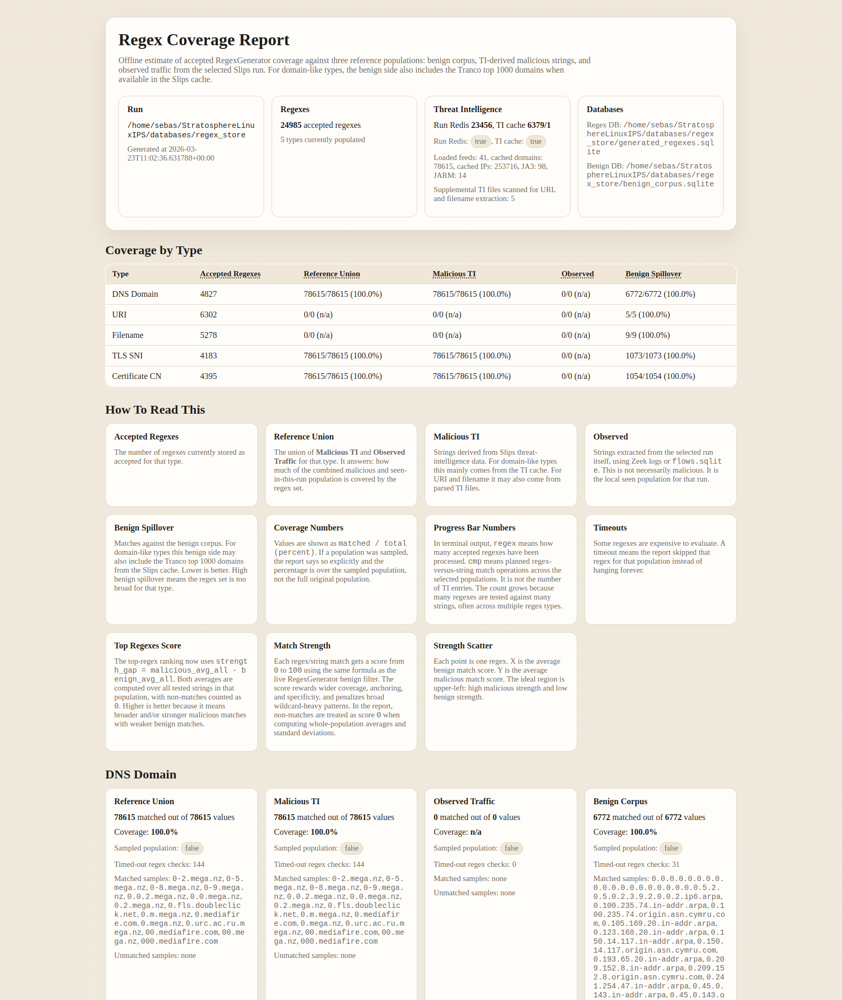

# Regex Generator Module

The `RegexGenerator` module continuously creates one pseudo-random regex at a
time for later Zeek-side use.

It uses the shared `LLM` module over Redis, validates the generated regex
against a benign corpus, and stores accepted regexes in a dedicated local
SQLite database that later Slips modules can read through `DBManager`.

## What it does

The module:

1. Reads its configuration from `config/slips.yaml`
2. Discovers runtime-ready LLM backends using the shared LLM registry
3. Chooses the next regex type with weighted random selection
4. Sends one generation request over `llm_request`
5. Waits for the matching `llm_response`
6. Validates the regex and tests it against a benign corpus
7. Stores accepted results in local SQLite. Rejected results are only persisted
   if explicitly enabled.

Supported regex types:

- `dns_domain`
- `uri`
- `filename`
- `tls_sni`
- `certificate_cn`

## Configuration

Example section in `config/slips.yaml`:

```yaml
regex_generator:
  enabled: false
  create_log_file: false
  generation_interval_seconds: 5
  allowed_backends: []
  llm_temperature: 1.2
  llm_max_tokens: 80
  llm_response_timeout_seconds: 90
  recent_history_size: 0
  max_regex_length: 180
  regex_validation_timeout_seconds: 2
  benign_match_strength_threshold: 75
  type_weights:
    dns_domain: 1
    uri: 1
    filename: 1
    tls_sni: 1
    certificate_cn: 1
  store_dir: output/regex_generator
  persistent_store_dir: databases/regex_store
  store_rejected_regexes: false
  max_stored_rejected_regexes: 10000
  seed_benign_samples: true

whitelists:
  tranco_top_benign_limit: 1000
```

Configuration reference:

- `enabled`: enables or disables the module.
- `create_log_file`: creates `output/regex_generator.log` with detailed module
  progress messages. This file rotates on the same global
  `parameters.rotation` / `parameters.rotation_period` schedule used by the
  current Slips run.
- `generation_interval_seconds`: delay between completed generation cycles.
  Set `0` to start the next cycle immediately after the previous one finishes.
- `allowed_backends`: preferred backend aliases for this module.
- `llm_temperature`: generation temperature. Kept high to keep outputs varied.
- `llm_max_tokens`: max tokens for the LLM reply. The module asks for one regex
  line only, so keep this small.
- `llm_response_timeout_seconds`: soft warning threshold while waiting for the
  matching `llm_response`. The module keeps waiting after this. Set `0` to
  disable the warning.
- `recent_history_size`: compatibility knob kept at `0`. Prompt history is not
  sent to the LLM; repetition is checked locally.
- `max_regex_length`: hard reject longer regexes.
- `regex_validation_timeout_seconds`: hard wall-clock timeout for local regex
  validation and benign-corpus matching. This prevents one pathological regex
  from freezing the module. Set `0` to disable it.
- `benign_match_strength_threshold`: score from `0` to `100` used during the
  benign scan. A regex is rejected only if its strongest benign match reaches
  or exceeds this threshold. Higher values are more permissive.
- `type_weights`: weighted random choice among the supported regex types.
- `store_dir`: directory containing `benign_corpus.sqlite` and
  `generated_regexes.sqlite`. Absolute paths are used as-is. Relative paths are
  resolved inside the current Slips run output directory. The default
  `output/regex_generator` therefore becomes `<run_output_dir>/regex_generator`.
- `persistent_store_dir`: stable directory for the regex SQLite files. Relative
  paths are resolved inside `parameters.permanent_dir`; the default
  `databases/regex_store` therefore becomes
  `<permanent_dir>/databases/regex_store`. If set, it takes precedence over
  `store_dir` and lets the generator reuse the same DBs across many Slips
  restarts.
- `store_rejected_regexes`: stores rejected regexes in SQLite for audit/debug
  purposes. Default `false` so discarded candidates do not fill the disk.
- `max_stored_rejected_regexes`: retention cap for rejected rows when
  `store_rejected_regexes` is enabled. Set `0` for unlimited retention.
- `seed_benign_samples`: seed the benign DB once with a small built-in sample.
- `whitelists.tranco_top_benign_limit`: number of ordered Tranco domains kept
  in Redis under `tranco_top_domains` and reused as benign data by
  `RegexGenerator` and the offline coverage report.

## LLM request and response usage

The module uses the existing shared LLM channels only:

- request channel: `llm_request`
- response channel: `llm_response`

Each generation request includes:

- `request_id`
- `requester = "RegexGenerator"`
- `backend`
- `messages`
- `temperature`
- `max_tokens`
- `metadata.regex_type`
- `metadata.prompt_version`
- `metadata.generation_nonce`

The prompt requires the model to return exactly one regex line. No JSON,
explanation, or code fences. The parser still accepts JSON-shaped replies as a
fallback for compatibility, but the active prompt is raw-regex only.

After the reply arrives, the module does not reject on any benign hit. It
streams the benign corpus for the selected type, computes a benign
match-strength score for each regex/string match, and rejects only if some
benign string reaches or exceeds `benign_match_strength_threshold`.

V1 keeps one request in flight at a time, so response correlation is simple:
only the matching `request_id` is accepted.
If the local LLM is slow, the module keeps waiting and only logs a warning
after `llm_response_timeout_seconds`.

If `create_log_file` is enabled, the module also writes detailed progress logs
to:

```text
output/regex_generator.log
```

This file records:

- selected regex type
- selected backend
- published `llm_request` `request_id`
- slow-wait warnings while the LLM is still working
- accepted regexes
- rejected regexes and rejection reasons

Accepted regexes are stored in the configured persistent store by default:

```text
<permanent_dir>/databases/regex_store/generated_regexes.sqlite
```

If `persistent_store_dir` is empty, the fallback location is
`<run_output_dir>/regex_generator/generated_regexes.sqlite`.

Rejected regexes are tracked in memory during the current run to reduce cheap
repeats, but they are not stored on disk unless `store_rejected_regexes` is
enabled.

## Acceptance pipeline

After the matching `llm_response` arrives, the module:

1. Extracts one regex line from the LLM reply
3. Rejects empty or malformed results
4. Applies static safety validation
5. Checks local duplicates with a bloom filter and exact SQLite lookup
6. Streams the benign corpus for the selected type
7. Computes a benign match-strength score for each regex/string match
8. Rejects only if some benign string reaches the configured threshold
9. Stores accepted regexes for later use

Static validation rejects:

- non-ASCII regexes
- regexes longer than `max_regex_length`
- lookbehind
- backreferences
- unbounded `.*`-style prefix/suffix patterns
- obviously broad patterns such as `.*` and `.+`
- nested wildcard structures that risk catastrophic backtracking
- invalid syntax

The benign match-strength score is an estimate from `0` to `100`. It is
computed per regex and per benign string using the strongest match span found
by Python `re.finditer()`.

For one matched span, the score is:

```text
score =
  40 * span_ratio
  + 12 * start_bonus
  + 12 * end_bonus
  + 16 * full_bonus
  + 30 * specificity_ratio
  - 18 * wildcard_penalty
```

The result is clipped to `0..100`. The regex keeps the highest score it
obtains against that benign string. If any benign string reaches or exceeds
`benign_match_strength_threshold`, the regex is rejected.

The terms mean:

- `span_ratio = matched_span_length / benign_string_length`
- `start_bonus = 1` if the match starts at offset `0`, else `0`
- `end_bonus = 1` if the match ends at the final character, else `0`
- `full_bonus = 1` if the match covers the entire benign string, else `0`
- `specificity_ratio = literal_chars / (literal_chars + meta_tokens)`
- `wildcard_penalty = min(1.0, wildcard_points / ((literal_chars + meta_tokens) / 2))`

Regex-specific features are measured from the regex text itself:

- `literal_chars` counts explicit alphanumeric and common structural literal
  characters such as `-`, `_`, `/`, `:`, `,`, `@`, and `=`
- escaped literals such as `\.` count as literal characters
- `meta_tokens` counts regex syntax such as `.`, `[]`, `*`, `+`, `?`, groups,
  anchors, and generic escapes
- `wildcard_points` penalize broad constructs:
  - `.*` or `.+` adds `2.5`
  - bare `.` adds `1.5`
  - `[` character classes add `1.2`
  - `*`, `+`, and `?` add `1.0`
  - generic escapes such as `\w` also add penalty

Examples:

- Regex `^google\.com$` against benign string `google.com`
  - full span match, starts at `0`, ends at the end, full-match bonus applies
  - specificity is high because most of the pattern is literal
  - wildcard penalty is low
  - score is very high, so this benign match is rejected

- Regex `google` against benign string `google.com`
  - only part of the string is covered
  - it starts at `0` but does not end at the final character
  - no full-match bonus
  - score is lower and may stay below the threshold

- Regex `.*com`
  - may match a long suffix, but it is penalized heavily by the wildcard term
  - this keeps broad permissive patterns from automatically looking “strong”

## Benign corpus and bloom filters

The module creates a benign corpus DB once and can seed it with a small sample
for all five regex types.

On each run, it also imports domain entries from the configured Slips local
whitelist file into the benign corpus for the matching domain-like regex
types:

- `dns_domain`
- `tls_sni`
- `certificate_cn`

If the daily Tranco whitelist has already been downloaded by Slips, the module
also imports the ordered configured Tranco top benign domains from Redis into
the same domain-like benign corpus.

During runtime, the module also listens for `tw_closed`. When a finished time
window belongs to one of the host IPs of the machine running Slips, it checks
that host TW for alerts and evidence:

- if the host TW has any alert or any evidence, it imports nothing from that TW
- if the host TW has zero alerts and zero evidence, it imports additional
  benign strings from that clean local TW

The runtime benign import currently uses:

- DNS query names -> `dns_domain`
- HTTP hostnames -> `dns_domain`
- TLS `server_name` -> `tls_sni`
- certificate `subject` CN -> `certificate_cn`
- filenames derived from HTTP URIs -> `filename`

The module logs the total alert count, total evidence count, and a separate
best-effort anomaly-evidence count for that finished host TW. The anomaly
count is informative only; the actual import gate is strict zero alerts and
zero evidence.

Redis storage note:

- Slips still stores the full downloaded Tranco whitelist in Redis under
  `tranco_whitelisted_domains`.
- Slips now also stores a second Redis key, `tranco_top_domains`, as an
  ordered list containing the configured top-ranked Tranco domains.
- `RegexGenerator` uses this ordered Redis list when it needs benign
  high-reputation domains for domain-like regex testing.
- The number of domains kept in `tranco_top_domains` is configured with
  `whitelists.tranco_top_benign_limit`.

It also builds one in-memory bloom filter per benign type and one bloom filter
for generated regex hashes, but these do not replace the benign corpus scan.
They help with exact membership checks and future scale improvements, while the
acceptance decision still requires computing the benign match-strength score
against the benign corpus and rejecting the regex only if some benign string
reaches or exceeds `benign_match_strength_threshold`.

The current benign acceptance gate is:

```sql
SELECT value FROM benign_strings WHERE regex_type = ?
```

streamed line by line while the module computes the benign match-strength score
for each string. The regex is rejected only if a score reaches the configured
threshold.

## Reading accepted regexes from other modules

Later modules should not open the SQLite files directly.

Use the DB helpers:

```python
self.db.get_generated_regexes(regex_type="dns_domain", limit=100)
self.db.get_generated_regexes_count(regex_type="dns_domain")
```

These helpers return accepted regexes by default.

## Offline coverage report

There is also a standalone offline report script for estimating how much the
accepted regexes cover several reference populations for a given Slips run.

Example HTML report overview:



This report is useful for explaining the module because it shows, in one page,
how many accepted regexes exist for each data type, how strongly they cover the
reference-union and malicious TI populations, and how much benign spillover
remains after negative selection.

Example:

```bash
./venv/bin/python scripts/regex_coverage_report.py \
  --run-output-dir output/eno1_2026-03-18_10:00:30 \
  --redis-port 6379
```

By default, large populations are sampled so the script finishes in practical
time. It prints terminal progress while it runs, for example:

```text
🧪 sampled estimate ███████░░░░░░░░░░░░ 31.62% | regex 247/781 | cmp 560,840/1,770,991 | type DNS Domain | ETA ⏳ 00:00:14
```

In that progress line:

- `regex 247/781` means 247 accepted regexes have been evaluated out of 781 total accepted regexes.
- `cmp 560,840/1,770,991` means regex-versus-string match operations, not raw TI entries. The number grows because many regexes are checked against many strings across the benign corpus, malicious TI, observed traffic, and reference-union populations.

The report reuses the same `0..100` match-strength function as the live
generator, but it applies it to every regex/string comparison in the selected
populations:

- non-match: score `0`
- match: the same span/anchor/specificity/wildcard formula used by
  `RegexGenerator`

For each regex and each population, the report computes:

- `match_count`: number of strings matched at all
- `avg_all ± std_all`: average and standard deviation over all tested strings,
  with non-matches counted as `0`
- `avg_match ± std_match`: average and standard deviation over only the strings
  that matched

The top-regex ranking uses:

```text
strength_gap = malicious_avg_all - benign_avg_all
```

So the “best” regexes in the report are the ones that are stronger and/or
broader on malicious strings while staying weak on benign strings.

The HTML output also adds a `Strength Scatter` plot per regex type:

- X axis: benign `avg_all`
- Y axis: malicious `avg_all`
- ideal area: upper-left

This gives a faster view of many regexes than a table alone.

If you want the exhaustive run for research, use:

```bash
./venv/bin/python scripts/regex_coverage_report.py \
  --run-output-dir /path/to/regex_store \
  --redis-port 23456 \
  --ti-cache-port 6379 \
  --ti-cache-db 1 \
  --full-scan
```

Useful knobs:

- `--sampling-ratio`: fraction of strings to evaluate from each regex-type population in estimate mode. This is applied separately to the benign corpus values, malicious TI values, observed traffic values, and reference-union values. Default: `0.1`.
- `--max-population-size`: hard cap on the number of strings evaluated for each regex type inside each population, after `--sampling-ratio` is applied.
- `--full-scan`: disable both `--sampling-ratio` and `--max-population-size`, and scan all strings in all populations for every regex type.
- `--match-timeout-seconds`: timeout for one regex tested against one regex-type population of strings.

The script writes:

- `regex_generator_coverage_report.html`
- `regex_generator_coverage_report.json`

inside the selected run output directory.

The estimate is based on:

- the RegexGenerator benign corpus DB, grouped by regex type
- the configured Tranco top benign domains from `whitelists.tranco_top_benign_limit` as extra benign data for domain-like types, when available in the Slips cache
- TI-derived malicious reference strings from Redis and TI cache files, grouped by regex type
- observed traffic strings from Zeek logs or `flows.sqlite`, grouped by regex type
- the per-type reference union, which is `malicious TI ∪ observed traffic`

This is an offline report only. It does not run continuously inside Slips.
