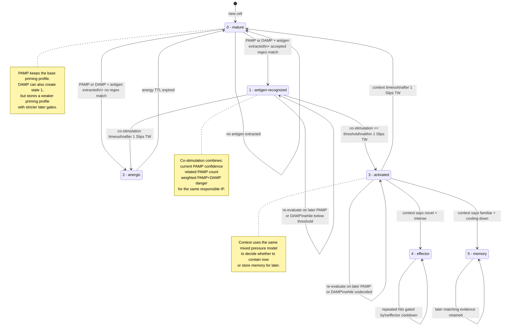
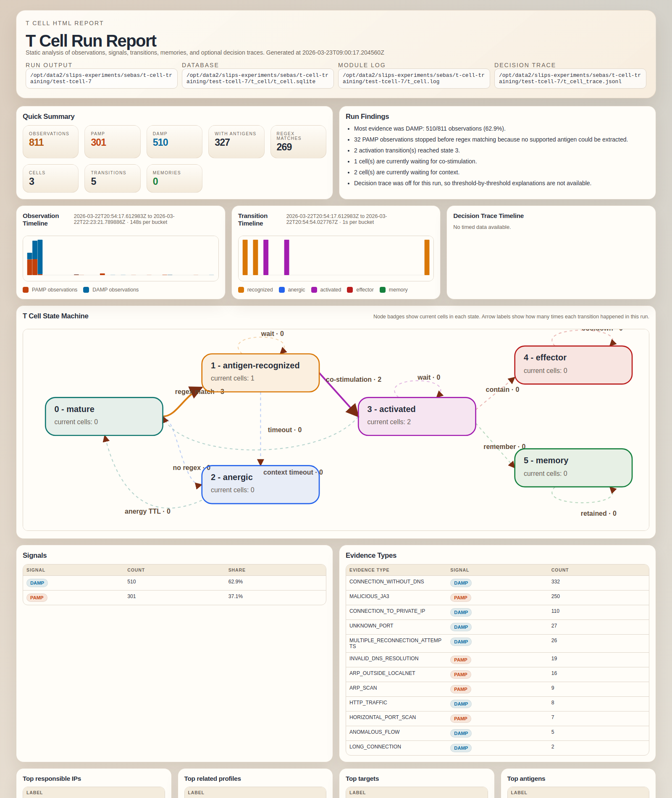

# T Cell Module

The `T Cell` module is an immune-inspired responder that consumes centrally
classified Slips evidence, looks for extracted antigens that match the
accepted RegexGenerator regex corpus, and then escalates through a small state
machine until it either becomes tolerant, publishes a containment request, or
stores a memory snapshot for later reuse. Both `PAMP` and `DAMP` evidence can
prime a new cell when an extracted antigen matches an accepted regex, but the
signal decides how strong that new cell is. `PAMP` keeps the base downstream
thresholds and waiting window, while `DAMP` stores a weaker priming profile
with stricter later thresholds, higher corroboration counts, and a shorter
waiting window. `DAMP` observations also raise the danger pressure used later
in co-stimulation and context decisions and trigger reevaluation of already
waiting cells for the same responsible IP.

The module is started by the normal Slips module loader and is enabled by
default through `t_cell.enabled: true`.

## Goals

The module adds a second-stage decision layer without changing detector
modules:

1. It listens to the shared `evidence_added` channel.
2. It creates or advances cells from `0 - mature` by using `PAMP` or `DAMP`
   evidence with extractable antigens and accepted regex matches.
3. It extracts structured antigen values from evidence and linked altflows.
4. It matches those values against accepted regexes already stored by
   `RegexGenerator`.
5. It stores `DAMP` observations as responsible-IP danger signals, folds them
   into co-stimulation and context pressure, and uses them to create weaker
   DAMP-primed cells when they match an accepted regex.
6. It computes co-stimulation and context scores using the per-cell priming
   profile that was stored at recognition time.
7. It either becomes tolerant, activates, requests blocking, or stores memory.

The target of any effector response is the IP that T Cell identifies as the
responsible source for the attack. This is not always the same as
`evidence.profile.ip`.

## Profile, Source, and Target

The evidence object carries three different notions that must not be mixed:

- `evidence.profile.ip`: the Slips profile bucket that the evidence belongs to.
  It is the host related to the evidence in the current time window.
- `evidence.attacker`: the attacking or responsible entity. In IDMEF export,
  this becomes `Source`.
- `evidence.victim`: the attacked entity. In IDMEF export, this becomes
  `Target`.

The `direction` field on `attacker` or `victim` says whether that entity was
seen on the network flow source side (`SRC`) or destination side (`DST`). That
flow-side direction is separate from the attack role:

- `attacker` maps to IDMEF `Source`
- `victim` maps to IDMEF `Target`
- `direction=SRC/DST` maps to the network flow side

T Cell uses a separate derived value called the responsible IP:

1. If `evidence.attacker` is an IP, T Cell uses `evidence.attacker.value`.
2. Otherwise, if either evidence entity is an IP on the network `SRC` side,
   T Cell uses that IP.
3. Otherwise, it falls back to `evidence.profile.ip`.

This responsible IP is the IP that T Cell:

- keys the cell on
- aggregates co-stimulation and context observations on
- sends to `new_blocking` when effector action is approved

The original `evidence.profile.ip` is still logged, because it tells you which
host/time-window context produced the evidence.

Example:

- `profile.ip = 147.32.80.37`
- `Source.IP = 138.68.100.107`
- `Target.IP = 147.32.80.37`

In that case, T Cell keeps `147.32.80.37` as the related profile context, but
the responsible IP for analysis and blocking is `138.68.100.107`.

## State Machine

One T Cell is tracked per:

- responsible IP
- regex type
- normalized antigen value

The persisted states are:

- `0 - mature`
- `1 - antigen-recognized`
- `2 - anergic`
- `3 - activated`
- `4 - effector`
- `5 - memory`

States `1 - antigen-recognized` and `3 - activated` can also carry an
explicit waiting substatus in the stored cell context:

- `1 - antigen-recognized (waiting for co-stimulation)`
- `3 - activated (waiting for context)`

This does not create new state numbers. It is an explicit runtime marker that
the cell is still in state `1` or `3`, but is currently waiting for the next
reevaluation.

Mermaid state diagram:



The runtime flow is:

1. Slips publishes an evidence on `evidence_added`.
2. The module stores one observation row in its own SQLite DB.
3. If the evidence signal is `DAMP`, the module stores the observation,
   reevaluates any waiting cells for the same responsible IP, logs
   `damp_reverification`, and still continues to antigen recognition if
   extractable antigens are present.
4. If the evidence signal is neither `PAMP` nor `DAMP`, the module logs
   `ignored_non_pamp` and stops for that evidence after storing the
   observation.
5. If no structured antigen can be extracted, the module logs
   `no_antigen_extracted` and stops for that evidence.
6. For each antigen candidate, the module loads or creates the cell in
   `0 - mature`.
7. If the cell is still under `anergic_until`, the module logs suppression and
   does nothing else.
8. If the cell is `2 - anergic` and the TTL expired, it transitions back to
   `0 - mature`.
9. If no accepted regex matches the antigen, the mature cell goes
   `0 -> 2 - anergic` and stores a new `anergic_until`, regardless of whether
   the evidence was `PAMP` or `DAMP`.
10. If a regex matches, the cell goes `0 -> 1`, stores the chosen regex
    metadata, and stores a priming profile snapshot derived from the signal
    (`PAMP` or `DAMP`).
11. The recognition observation is marked as consumed for that cell, so it
    cannot also count toward the next transition.
12. The module computes co-stimulation from the current evidence confidence,
    related `PAMP`s, and stored mixed `PAMP` + weighted `DAMP` danger for the
    same responsible IP.
13. If co-stimulation crosses the cell's effective threshold from its priming
    profile, the cell goes `1 -> 3`.
14. That activating observation is also marked as consumed for that cell, so
    it cannot also count toward the next context transition.
15. If co-stimulation stays below threshold, the cell can wait in
    `1 - antigen-recognized` for at most the effective wait window from its
    priming profile, with the cell explicitly marked as waiting for
    co-stimulation.
16. If that wait expires without enough co-stimulation, the
    cell goes `1 -> 2 - anergic`.
17. In state `3`, the module computes context signals from the same mixed
    pressure model: related `PAMP`s plus weighted `DAMP` danger.
18. If the situation is novel and intense enough for the cell's effective
    effector gate, the cell goes to `4 - effector`.
19. If the situation is familiar and clearly cooling down enough for the
    cell's effective memory gate, the cell goes to `5 - memory`.
20. If state `3` cannot decide effector or memory within the cell's effective
    wait window, the cell goes `3 -> 0 - mature`.

Both waiting states are reevaluated on later matching `PAMP`s and on later
`DAMP` observations for the same responsible IP. Because transition-causing
observations are remembered and excluded from later counts, pressure, and
novelty checks, the same evidence cannot drive a full chain of activations for
one cell.

State `4` publishes the existing `new_blocking` payload for the responsible IP
when blocking support is present. If blocking or ARP poisoning modules are not
running, the module can simulate the effector decision and log the exact
payload instead.

State `5` stores the matched regex and the full context snapshot in the T Cell
SQLite DB when the cell first enters memory. It does not emit a new Slips
evidence. Later matching evidence keeps the cell in `5 - memory`, but it does
not create repeated `memory_stored` actions for the same cell.

## Antigen Extraction

The module reuses the same field semantics already used by RegexGenerator.

Supported antigen types:

- `dns_domain`
- `uri`
- `filename`
- `tls_sni`
- `certificate_cn`

Extraction sources:

- evidence attacker or victim domain values -> `dns_domain`
- evidence attacker URL values -> hostname as `dns_domain`, path as `uri`,
  basename as `filename`
- evidence attacker or victim `SNI` -> `tls_sni`
- DNS altflow `query` -> `dns_domain`
- HTTP altflow `host` -> `dns_domain`
- HTTP altflow `uri` -> `uri`
- HTTP altflow URI basename -> `filename`
- SSL altflow `server_name` -> `tls_sni`
- SSL altflow `subject` `CN=` -> `certificate_cn`

If a `PAMP` has no structured antigen, the module logs and skips it. It does
not create an anergic cell for that case.

## Regex Matching

Matching only uses accepted regexes already stored by `RegexGenerator`.

For one antigen candidate:

- the module loads accepted regexes of the same `regex_type`
- it keeps only those that actually match the antigen value
- it ranks them by strongest match strength against the antigen
- it uses regex specificity and then newest `created_at` as tie-breakers

The chosen regex metadata is stored in the cell, transitions table, and any
memory row.

## Co-Stimulation

Co-stimulation measures how dangerous the current situation looks for the
matched antigen:

```text
co_stimulation =
  wc * confidence
  + wr * related_pamp_score
  + wd * profile_danger_score
```

Where:

- `confidence = current evidence.confidence`
- `related_pamp_score = min(1, related_pamp_count / related_pamps_saturation)`
- `profile_danger_score = min(1, combined_danger_raw / danger_saturation)`
- `combined_danger_raw = pamp_danger_raw + damp_danger_weight * damp_danger_raw`
- `pamp_danger_raw = sum(threat_level_value * confidence)` over recent `PAMP`
  observations for the same responsible IP
- `damp_danger_raw = sum(threat_level_value * confidence)` over recent `DAMP`
  observations for the same responsible IP

Related PAMPs are recent `PAMP` observations for the same responsible IP that
share either:

- the same antigen value, or
- the same matched regex hash

Default weights are normalized from configuration:

- `confidence = 0.35`
- `related_pamps = 0.25`
- `danger = 0.40`
- `damp_danger_weight = 1.5`

Default activation threshold:

- `co_stimulation_threshold = 0.65`

Effective priming profiles:

- `PAMP`: keeps the base threshold, base related-count requirements, and the
  full wait window
- `DAMP`: raises the later co-stimulation threshold, raises later effector and
  memory thresholds, adds one more required related `PAMP` for effector and
  memory, and shortens the wait window by a factor

Interpretation:

- `PAMP`s still provide antigen identity and the related-antigen correlation.
- `DAMP`s also increase the danger term, so the same recognized antigen is
  treated as riskier when the responsible IP is also showing damage or anomaly
  signals.
- If a `DAMP` itself matched an accepted regex and created the cell, the
  effective co-stimulation threshold is higher and the wait is shorter because
  the cell is marked as DAMP-primed.
- The observation that caused `0 -> 1` is excluded from later co-stimulation
  calculations for that cell.

Wait limit:

- state `1 - antigen-recognized` can wait for co-stimulation for at most the
  effective wait limit from its priming profile
- by default, `PAMP` uses one configured Slips time window
  (`parameters.time_window_width`) and `DAMP` uses half of that
- if that wait expires, the cell goes `1 -> 2 - anergic`

## Context Signals

Context signals decide how to respond once a cell is activated.

Definitions:

- `novelty_score = 1` when the matched regex has no stored memory row and no
  recent prior regex activity in `novelty_window_seconds`; otherwise `0`
- `recent_pressure` is the normalized combined danger score over
  `context_recent_window_seconds`
- `previous_pressure` is the same combined danger score over the previous
  adjacent context window
- each pressure window uses
  `combined_danger_raw = pamp_danger_raw + damp_danger_weight * damp_danger_raw`
- `trend_ratio = recent_pressure / max(previous_pressure, 0.01)`
- `recent_related_score = min(1, recent_related_count / related_pamps_saturation)`
- `decrease_score = clamp(1 - trend_ratio, 0, 1)`
- `familiarity_score = 1 - novelty_score`
- `stability_score = min(1, recent_related_count / memory_min_related_count)`

Effector score:

```text
effector_score =
  0.45 * recent_pressure
  + 0.25 * recent_related_score
  + 0.30 * novelty_score
```

Memory score:

```text
memory_score =
  0.60 * decrease_score
  + 0.25 * familiarity_score
  + 0.15 * stability_score
```

Base decisions:

- `effector` requires:
  - `effector_score >= 0.70`
  - `recent_related_count >= 4`
  - novelty still present
- `memory` requires:
  - `memory_score >= 0.60`
  - `trend_ratio <= 0.60`
  - `recent_related_count >= 3`
  - familiarity already present

If both would pass, `effector` wins.

Effective decisions:

- `PAMP`-primed cells use the base effector and memory gates.
- `DAMP`-primed cells raise the effector threshold, raise the memory
  threshold, and require one more related recent `PAMP` for both decisions.
- The observation that caused the previous state transition is excluded from
  later context pressure, recent-related counts, and novelty checks for that
  cell.

Wait limit:

- state `3 - activated` can wait for context for at most the effective wait
  limit from its priming profile
- if that wait expires without effector or memory, the cell goes
  `3 -> 0 - mature`

## Containment Behavior

When the cell reaches `4 - effector`, the module publishes the same payload
shape used by the existing Slips blocking path:

```json
{
  "ip": "<responsible_ip>",
  "block": true,
  "tw": 1,
  "interface": null
}
```

Notes:

- `ip` is the derived responsible IP, not necessarily `evidence.profile.ip`
- `tw` is `evidence.timewindow.number`
- `interface` uses the same `utils.get_interface_of_ip()` lookup as the rest
  of Slips
- `from` and `to` are omitted, so the existing blocking module falls back to
  blocking both directions
- the same cell is rate-limited with `effector_cooldown_seconds`

If no blocking-capable module is running:

- with `simulate_effector_without_blocking: true`, the module logs a simulated
  effector decision and the exact would-be payload
- with `false`, it keeps the state but only logs that the effector path is not
  available

## SQLite Storage

The T Cell module uses its own isolated SQLite DB and does not change the core
Slips evidence schema, Redis evidence payloads, `alerts.json`, STIX/TAXII
export, or SlipsWeb payloads.

Default DB location:

```text
<run_output_dir>/t_cell/t_cell.sqlite
```

Tables:

- `observations`: one processed evidence row with confidence, threat level,
  extracted antigens, matched regexes, the tracked responsible IP, and the raw
  evidence JSON
- `cells`: current state for each `responsible_ip + regex_type + antigen_value`
- `transitions`: auditable state transitions with reasons and score snapshots
- `memories`: stored state-5 regex/context snapshots

The DB is accessed through `DBManager.get_t_cell_storage()`.

## Logging

If `create_log_file` is enabled, the module writes:

```text
output/t_cell.log
```

The log is intentionally short and human-readable. It writes one line per
decision or transition, with:

- timestamp
- action
- resulting state
- evidence type and ID
- related profile IP
- responsible IP
- target IP when the evidence victim is an IP
- cell key
- matched regex hash and value when relevant
- main scores

`log_verbosity` controls how much decision detail is written:

- `1`: transitions and terminal actions only
- `2`: also log why a cell is waiting, for example
  `waiting_for_co_stimulation` with the current score, threshold, elapsed
  wait time, wait limit, and the split between `PAMP` and `DAMP` danger
- `3`: also log per-evidence debug details such as extracted antigens

### Decision Trace

For verification runs, the module also supports a separate audit trace file:

```text
<selected_run_output_dir>/t_cell_trace.jsonl
```

This trace is disabled by default. When enabled, each JSON line explains one
co-stimulation or context evaluation and includes:

- the action being decided, for example `co_stimulation_threshold_met`,
  `context_memory`, or `waiting_for_context`
- the related profile IP, responsible IP, and target IP
- the candidate antigen and matched regex
- the exact score, threshold, and weighted formula terms
- the evidence IDs that contributed to the related-PAMP count
- the evidence IDs that contributed to `PAMP` and `DAMP` danger totals
- omitted-contributor counts when the trace limit is reached

The trace path is always resolved under the output directory selected for the
current Slips run. If the config contains an absolute path or a path that tries
to escape the output directory, the module collapses it back under the selected
run output directory before writing the file.

Recommended usage:

- keep `decision_trace_mode: off` during normal runs
- use `decision_trace_mode: transitions` when you only want threshold-passing
  and state-change explanations
- use `decision_trace_mode: all` only for focused evaluation runs where you
  also want waiting decisions

Performance note:

- with `decision_trace_mode: off`, there is effectively no extra trace cost
- trace mode performs extra observation lookups and extra file writes, so it
  should be treated as a verification feature, not the normal default path

### Offline HTML Report

The module includes a separate offline report generator:

```bash
./venv/bin/python modules/t_cell/analyze_t_cell.py \
  --run-output-dir output/<run>
```

By default it writes:

```text
<selected_run_output_dir>/t_cell_report.html
```

You can then open that HTML file directly in any browser. If you want a
different output filename, pass `--out <path-to-html>`.

The report is static and self-contained. It reads the T Cell SQLite DB as the
primary source, then enriches the page with `t_cell.log` and
`t_cell_trace.jsonl` when those files exist. This means:

- it still explains the run when `log_verbosity` is `1`
- it gains richer per-evidence detail when `log_verbosity` is `2` or `3`
- it gains threshold-by-threshold explanations when decision tracing is enabled

Example report screenshot from a real run:



The page focuses on the run itself, including:

- total `PAMP` and `DAMP` observations
- evidence type mix
- a rendered T-cell state-machine graph with per-state and per-transition counts
- extracted antigens and matched regexes
- current cells and their states
- transition reasons and state-path counts
- memories stored so far
- observation, transition, and trace timelines
- a sortable Recent Observations table at the bottom of the page
- a sortable Transitions table that defaults to grouping rows by T cell
- a compact, collapsed configuration snapshot at the very end

How to read the report:

- **Quick Summary** and **Run Findings** tell you first whether the module saw
  mostly `PAMP` or `DAMP`, whether cells were created at all, and whether the
  run stalled because no supported antigen could be extracted.
- **Observation / Transition timelines** show when pressure and state changes
  happened over time. This is the fastest way to see whether the module was
  mostly idle, mostly collecting danger, or actively moving cells.
- **T Cell State Machine** overlays the abstract state machine with run data:
  each node shows how many cells are currently in that state, and each arrow
  shows how many times that transition happened in the run.
- **Signals**, **Evidence Types**, and the top-* panels show what fed the
  danger model: which evidence classes dominated, which responsible IPs or
  targets were involved most often, and which antigens or unmatched `PAMP`
  values kept appearing.
- **Transitions** is the per-cell transition history. It is sortable and
  defaults to grouping rows by T cell, so you can read one cell's path from
  `0 - mature` onward without manually regrouping the table.
- **Current Cells** shows the cells that still exist now, their current state,
  any explicit waiting substatus such as `waiting for co-stimulation` or
  `waiting for context`, and the latest co-stimulation / effector / memory
  scores that were stored on the cell.
- **Stored Memories** shows which cells have already reached
  `5 - memory`, along with the saved context snapshot that will be reused
  later.
- **Decision Trace** is the threshold-audit section. When enabled, it is where
  you verify why a threshold passed by checking the weighted formula terms and
  contributing evidence IDs.
- **Recent Observations** stays at the bottom as the raw sortable evidence
  audit table. It is the best section to correlate what Slips generated with
  what T Cell actually received and stored.

Color mapping:

- `0 - mature` -> cyan
- `1 - antigen-recognized` -> yellow
- `2 - anergic` -> blue
- `3 - activated` -> magenta
- `4 - effector` -> red
- `5 - memory` -> green

## Configuration

Example section from `config/slips.yaml`:

```yaml
t_cell:
  enabled: true
  create_log_file: true
  log_colors: true
  log_verbosity: 1
  decision_trace_mode: off
  decision_trace_file: t_cell_trace.jsonl
  decision_trace_max_evidence: 10
  store_dir: output/t_cell
  persistent_store_dir: ""
  observation_retention_seconds: 604800
  anergy_ttl_seconds: 21600
  related_lookback_seconds: 3600
  related_pamps_saturation: 5
  danger_saturation: 2.5
  damp_danger_weight: 1.5
  co_stimulation_threshold: 0.65
  co_stimulation_weights:
    confidence: 0.35
    related_pamps: 0.25
    danger: 0.40
  priming_profiles:
    PAMP:
      strength: 1.0
      co_stimulation_threshold_offset: 0.0
      effector_threshold_offset: 0.0
      memory_threshold_offset: 0.0
      state_wait_timeout_factor: 1.0
      effector_min_related_count_offset: 0
      memory_min_related_count_offset: 0
    DAMP:
      strength: 0.6
      co_stimulation_threshold_offset: 0.15
      effector_threshold_offset: 0.10
      memory_threshold_offset: 0.05
      state_wait_timeout_factor: 0.5
      effector_min_related_count_offset: 1
      memory_min_related_count_offset: 1
  novelty_window_seconds: 86400
  context_recent_window_seconds: 1800
  effector_threshold: 0.70
  effector_min_related_count: 4
  effector_cooldown_seconds: 1800
  memory_threshold: 0.60
  memory_trend_ratio_max: 0.60
  memory_min_related_count: 3
  simulate_effector_without_blocking: true
```

Reference:

- `enabled`: enable or disable the module
- `create_log_file`: create `output/t_cell.log`
- `log_colors`: keep ANSI colors in the module log
- `log_verbosity`: `1` logs transitions/actions only, `2` adds decision
  summaries, `3` adds per-evidence debug details
- `decision_trace_mode`: `off`, `transitions`, or `all`
- `decision_trace_file`: JSONL audit file for threshold explanations, always
  created under the selected run output directory
- `decision_trace_max_evidence`: contributor cap per trace list
- `store_dir`: run-local directory for the SQLite DB
- `persistent_store_dir`: optional stable absolute directory for the DB
- `observation_retention_seconds`: retention for observation rows
- `anergy_ttl_seconds`: how long a non-matching cell remains tolerant
- `related_lookback_seconds`: lookback for co-stimulation correlation
- `related_pamps_saturation`: saturation point for related PAMP score
- `danger_saturation`: saturation point for weighted combined profile danger
- `damp_danger_weight`: multiplier applied to raw `DAMP` danger before it is
  added to the `PAMP` danger term
- `co_stimulation_threshold`: threshold for `1 -> 3`
- `co_stimulation_weights`: normalized internally
- `priming_profiles`: signal-specific offsets and wait factors applied after
  `0 -> 1` to mark how strongly a cell was primed
- `priming_profiles.PAMP`: base-strength profile, usually zero offsets
- `priming_profiles.DAMP`: weaker profile that raises later thresholds,
  raises related-count requirements, and shortens waiting
- `novelty_window_seconds`: window for novelty suppression
- `context_recent_window_seconds`: context window size
- `effector_threshold`: minimum effector score
- `effector_min_related_count`: minimum related count before effector
- `effector_cooldown_seconds`: per-cell effector cooldown
- `memory_threshold`: minimum memory score
- `memory_trend_ratio_max`: maximum recent/previous pressure ratio for memory
- `memory_min_related_count`: minimum related count before memory
- `simulate_effector_without_blocking`: log a simulated effector action when
  blocking modules are absent

## Evidence Signal Dependency

The module relies on the central `evidence_signal` field that Slips adds before
evidence is stored or published.

See [Evidence Signals](evidence_signals.md) for:

- the global `PAMP` / `DAMP` configuration
- the current evidence inventory by module
- the default shipped signal mapping

T Cell antigen recognition and state creation now support both `PAMP` and
`DAMP` when an extracted antigen matches an accepted regex. The signal is
stored as a priming profile inside the cell and changes the later effective
thresholds, required related-counts, and wait limits. `DAMP` observations are
still stored in the T Cell observation table and still contribute weighted
danger to co-stimulation and context calculations for the same responsible IP.
