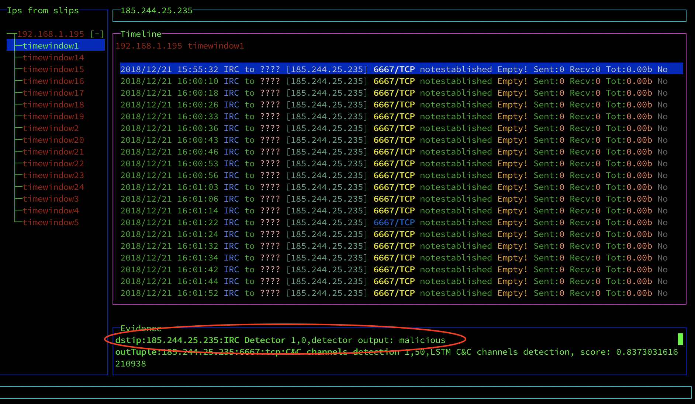

IRC Machine Learning Detection Module for SLIPS
===

**Goal:** Classify IRC three-tuple whether is malicious or not

Feature Extraction
---- 

Features are computed by the [IRC Feature Extractor Zeek package](https://github.com/stratosphereips/IRC-Zeek-package) that we have created during our research. The package extends the functionality of Zeek by automatically recognizing IRC communication in a packet capture (pcap) file and extracting features for each IRC three-tuple in the communication. IRC three-tuple is defined as the group of flows between the source IP, destination IP, and destination port. The source port is neglected to include multiple TCP connections in a single IRC three-tuple.

The extrated features for each IRC three-tuple are
 - **Total Size** - Size in bytes that were sent in IRC three-tuple. It reflects how many messages were sent and how long they were.
- **Duration** - Duration of the IRC three-tuple in milliseconds (i.e., the difference between the time of the last message and the time of the first message in the IRC three-tuple).
- **Number of Messages** - The total number of messages in the IRC three-tuple.
- **Number of IRC Flows in the IRC Three-tuple** - As we have mentioned before, the source port is neglected in unifying communication into IRC three-tuples because it is randomly chosen when a TCP connection is established. We suppose that artificial users could use a higher number of source ports than the real users since the number of connections of the artificial users was higher than the number of connections of the real users.
- **Message Periodicity** - We suppose that bots that are controlled by botnet master use IRC for sending commands periodically, so we wanted to obtain the value of periodicity. To do that, we created a method that would return a number between 0 and 1 - i.e. one if the message sequence is perfectly periodical, zero if the message sequence is not periodical at all.
- **Message Word Entropy** - To consider whether the user sends the same message multiple times in a row, or whether the message contains a limited number of words, we compute a word entropy across all of the messages in the IRC three-tuple.
- **Mean of Nickname Special Characters** - To identify whether the nickname of the user in the IRC three-tuple is randomly generated or not. Therefore, in this feature, we compute the average usage of non-alphabetic characters in the nickname.
- **Mean of Message Special Characters** - If the message contains many sent commands, it will most likely contain a lot of different characters than the ordinary message. With this feature, we obtain the mean usage of non-alphabetic characters across all messages in the IRC three-tuple.

Classification
----

Once the features are computed and extracted into a log file `zeek_files/irc_features.log`, the module receives an event trigger from SLIPS for every IRC three-tuple. The model uses the computed features as an input into a classification model. Then the model classifies the IRC three-tuple as malicious or non-malicious otherwise.

Visualization
----

The classification output is visualized as an evidence in the Kalipso module shown in the example output below. The evidence output is highlighted with a red circle:

