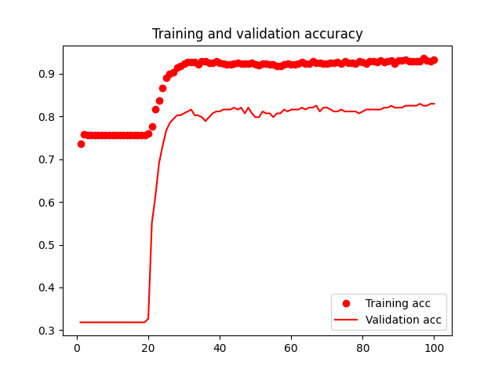
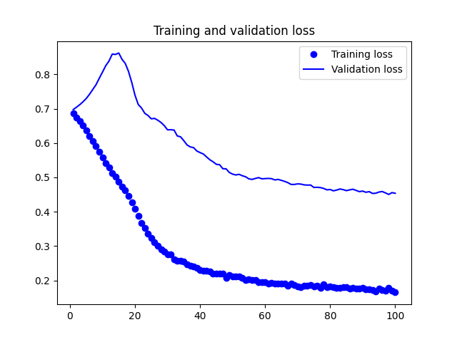
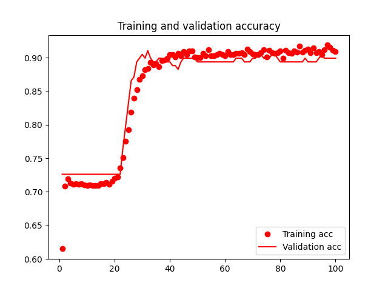
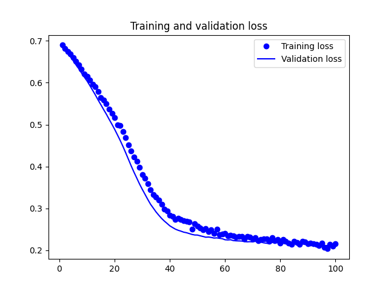
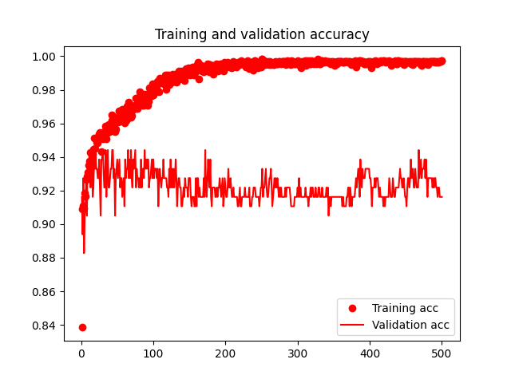
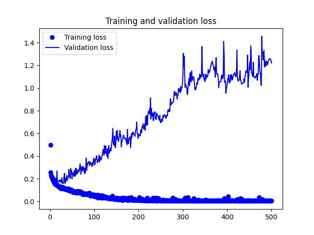
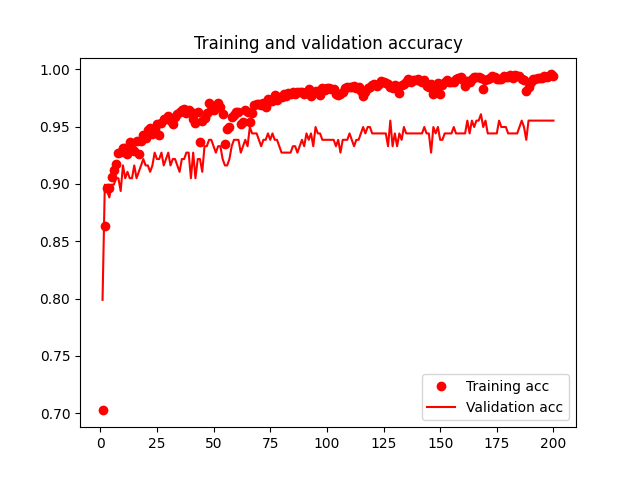
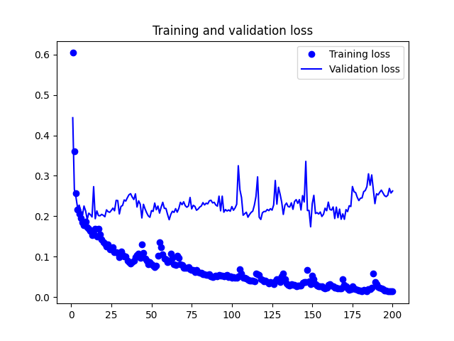
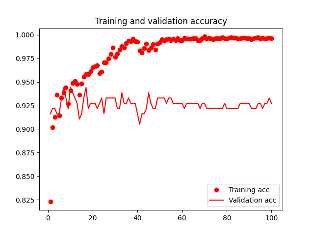
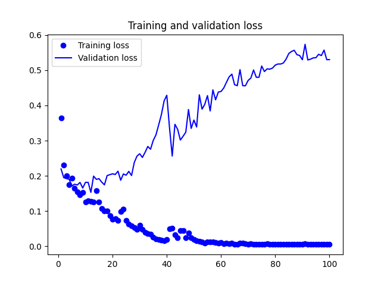

# RNN Command and Control detection for Slips
This is the code of the module plus training programs of the RNN neural network that detects command and control channels in Slips.

There are several models that we have been trying. Each model is documented here with a version number and training performance. 

# Who gets alerted
The C&C alert from this module is used to alert on the __source__ of the connection, and also the __destination__ of the connection. 

# Machine Learning models

## v1. Embedding + GRU
The first ML model we implemened is v1. It is a bidirectional GRU network.

### Features
- Each letter is encoded to an integer.
- All 4-tuples have a max length of 500 letters.
- All 4-tuples are padded to have the same length. Pad is done with integer 0.

### Model
- One embedding layer that converts each 'integer token' into a vector of dimensionality 16.
- A bidirectional GRU layer with 32 inputs/units. Using `return_sequences=False` to indicate that the layer should only return the output of the GRU at the last time step instead of the full sequence of outputs.
- A dense FF layer of 32 units with Relu activation.
- A dropout layer with 0.5 change of dropout
- An output layer with 1 unit and sigmoid activation.
- Model compiled with crossentropy and RMSprop optimizer. Learning rate 0.0001 and momentum 0.05, and metric accuracy.

The summary is 

        Model: "sequential"
        _________________________________________________________________
        Layer (type)                Output Shape              Param #   
        =================================================================
        embedding (Embedding)       (None, None, 16)          800       
                                                                        
        bidirectional (Bidirection  (None, 64)                9600      
        al)                                                             
                                                                        
        dense (Dense)               (None, 32)                2080      
                                                                        
        dropout (Dropout)           (None, 32)                0         
                                                                        
        dense_1 (Dense)             (None, 1)                 33        
                                                                        
        =================================================================
        Total params: 12513 (48.88 KB)
        Trainable params: 12513 (48.88 KB)
        Non-trainable params: 0 (0.00 Byte)

### Train Performance

The final train performance after 100 epochs is:

train_loss: 0.1652
val_loss: 0.4539
train_accuracy: 0.9322
val_accuracy: 0.8296





### Test Performance
        Test Loss: 0.17785538733005524
        Test Accuracy: 0.926008939743042


---
## v1.1 Embedding + GRU
Same as model v1 but with better separation of train and evaluation datasets, the new test dataset and the use of an embedding layer.

## Train performance
loss: 0.2159 - accuracy: 0.9089 - val_loss: 0.2114 - val_accuracy: 0.8994




## Test performance
        Test Loss: 0.2069242298603058
        Test Accuracy: 0.9035874605178833


---
## v1.2 Embedding + GRU
Same as v1 but with different hyperparameters found by optuna.


        Model: "sequential"
        _________________________________________________________________
        Layer (type)                Output Shape              Param #   
        =================================================================
        embedding (Embedding)       (None, None, 64)          3200      
                                                                        
        bidirectional (Bidirection  (None, 64)                18816     
        al)                                                             
                                                                        
        dense (Dense)               (None, 32)                2080      
                                                                        
        dropout (Dropout)           (None, 32)                0         
                                                                        
        dense_1 (Dense)             (None, 1)                 33        
                                                                        
        =================================================================
        Total params: 24129 (94.25 KB)
        Trainable params: 24129 (94.25 KB)

## Training

Found hyperparameters with optuna

        # Best hyperparameters: {'learning_rate': 0.001896219962316226, 'dropout_rate': 0.3405832906149749, 'momentum_rate': 0.05593281020818976, 'embedded_dim': 64}





## Testing
        Test Loss: 1.2258477210998535
        Test Accuracy: 0.9304932951927185


---
# v1.3 Embedding + GRU
A test model that was rapidly superseded


---
# v.1.4 Embedding + GRU
As v1, but more optimization with optuna.

         Layer (type)                Output Shape              Param #
        =================================================================
         embedding (Embedding)       (None, None, 60)          3000
        
         bidirectional (Bidirection  (None, 64)                18048
         al)
        
         dense (Dense)               (None, 32)                2080
        
         dropout (Dropout)           (None, 32)                0
        
         dense_1 (Dense)             (None, 1)                 33
        
        =================================================================

Total params: 23161 (90.47 KB)
Trainable params: 23161 (90.47 KB)
Non-trainable params: 0 (0.00 Byte)

## Training





## Testing
        Test Loss: 0.5616011023521423
        Test Accuracy: 0.939461886882782


---
# v.1.5 Embedding + GRU
As v1, with more optimization with optuna (500 searches) and trained on Docker on Linux for python 3.10.12. This model works in Docker for Linux and Docker for macos M1.

## Training
Model: "sequential"

        ┏━━━━━━━━━━━━━━━━━━━━━━━━━━━━━━━━━━━━━━┳━━━━━━━━━━━━━━━━━━━━━━━━━━━━━┳━━━━━━━━━━━━━━━━━┓
        ┃ Layer (type)                         ┃ Output Shape                ┃         Param # ┃
        ┡━━━━━━━━━━━━━━━━━━━━━━━━━━━━━━━━━━━━━━╇━━━━━━━━━━━━━━━━━━━━━━━━━━━━━╇━━━━━━━━━━━━━━━━━┩
        │ embedding (Embedding)                │ (None, 500, 1, 94)          │           4,700 │
        ├──────────────────────────────────────┼─────────────────────────────┼─────────────────┤
        │ reshape_1 (Reshape)                  │ (None, 500, 94)             │               0 │
        ├──────────────────────────────────────┼─────────────────────────────┼─────────────────┤
        │ bidirectional (Bidirectional)        │ (None, 32)                  │          10,752 │
        ├──────────────────────────────────────┼─────────────────────────────┼─────────────────┤
        │ dense (Dense)                        │ (None, 24)                  │             792 │
        ├──────────────────────────────────────┼─────────────────────────────┼─────────────────┤
        │ dropout (Dropout)                    │ (None, 24)                  │               0 │
        ├──────────────────────────────────────┼─────────────────────────────┼─────────────────┤
        │ dense_1 (Dense)                      │ (None, 1)                   │              25 │
        └──────────────────────────────────────┴─────────────────────────────┴─────────────────┘
 Total params: 48,809 (190.66 KB)
 Trainable params: 16,269 (63.55 KB)
 Non-trainable params: 0 (0.00 B)
 Optimizer params: 32,540 (127.11 KB)

## Testing 
        Test Loss: 0.47594040632247925
        Test Accuracy: 0.9304932951927185





---

# Training of Models to do Command and Control detection
Slips comes with a pre-trained model that we trained in the datasets shown in the folder `modules/rnn_cc_detection/datasets`. The datasets comes from many verified malware C&C connections that we have executed. The dataset also has normal connections that could be misdetected if not in included in the training. 

However, you can add your own connections and letters to the training dataset, or you can also use the current ones to train your own model. 

If you see how we train our models, check `training_code/rnn_model_training.py`. This can be used like this:

```bash
python training_code/rnn_model_training.py -v 3 -D datasets/all_datasets_raw -S new_rnn_model.h5
```

Once the model is saved in a new file, you can just replace the old one for this one, since Slips is searching for a file called `rnn_model.h5`.

```bash
cp new_rnn_model.h5 rnn_model.h5
```

# Testing
During testing, or inference, Slips loads the model and waits for new 'letters' to be reported in the corresponding Redis channel. The letter are the Stratosphere Letters as describe below. 

Slips checks each new letter (each new flow) to see if there is a match with a C&C. This is very CPU intensive, but it is necessary to detect C&C as soon as they happen not force the user to wait until the end of the time windows to do a check. 

During testing this module also uses a threshold to know if the match of the recently arrived letter is good enough with the model. A threshold of 0.99 similarity is currently used to ensure that the behavioral model that it is being received and output of the model are very similar and have less errors.

`threshold confidence`: The detection of the C&C is augmented with a confidence level. This confidence level depend on the lenght of the received behavioral model in the current traffic, that is, the length  of the strings of letters that is being seen in the traffic and evaluated. If the length is more than 100 letters, the confidence is 1. If it is less, the confidence is decreased as a percentage. So a string with 20 letters (and a match with the model over the threshold) can never have more than a 0.2 confidence. This is because more flows mean more confidence.

# Comparison of Models
In order to know which model is better, we run all models against our dataset and see which is better. Unfortunately there are not so many C&C connections to afford a separate final test for now. Maybe we can do that later. The important part is that all models split the dataset in training/validation and testing. The model is trained in the training/validation dataset and once the best hypherparameters are selected, then the generalization power is computed in the testing dataset.


# Training
Slips comes with a pre-trained model that we trained in the datasets shown in this folder. The datasets comes from many verified malware C&C connections that we have executed. The dataset also has normal connections that could be misdetected if not in included in the training. 

However, you can add your own connections and letters to the training dataset and retrain your own NN model. For that there is a python file called `training_code/rnn_model_training.py` that can be used.

```bash
python training_code/rnn_model_training.py -v 3 -D datasets/all_datasets_raw -S new_rnn_model.h5
```

Once the model is saved in a new file, you can just replace the old one for this one, since Slips is searching for a file called `rnn_model.h5`.

```bash
cp new_rnn_model.h5 rnn_model.h5
```


# Dataset
The folder `datasets` contain some datasets for trainign a new model. The file you should use is `datasets/all_datasets_raw`.
This file has 7631 outtupples with the ID, label, name and stratoletters. Example:

```bash
[2263] | From-Normal-UDP-DNS--3                                        | 147.32.80.9-147.32.84.131-38302-udp       | 11.R.R.R.R.R.R.R.R.R.R.R.R.R.R.R.R.R.R.R.
```


# Stratosphere Letters
Slips detects network behaviors. The behavior is represented by how a specific user interacts with a specific service, and is more than just connections or flows. The behavior is constructed by getting together all the flows that share 4 pieces of data: `source IP`, `destination IP`, `destination port`, and `protocol`. It ignores the source port. This aggregation is called an `4-tuple`.

For each `4-tuple` this module analyzes the `periodicity`, `size` and `duration` of each flow (the periodicity is a ratio computed by three consecutive flows, see the code). 

These features are then discretized in ranges of values so to avoid work with continual variables. The size can be `small`, `medium` or `large`, the duration `short`, `medium`, or `long`, the periodicity `strong periodicty`, `weak periodicity`, `weak non-periodicity`, `strong non-periodicity` or `no data` (no data for when there are not still three flows minimum to compute it). Each combination of `size`, `duration` and `frequency` is assigned an ASCII symbol that uniquely represents the combination. See Figure 1.

Betwee the letters, symbols are added to represent the absolute time passed, since it is not the same to have a strong periodicty of 1 second, that one of 1 day. 
- `.`: Time between the last two flows was between 0 and 5 seconds.
- `,`: Time between the last two flows was between 5 and 60 seconds.
- `+`: Time between the last two flows was between 60 and 5 minutes.
- `*`: Time between the last two flows was between 5 minutes and 1 hour.
- `0`: Time between the last two flows was more than 1 hour and it is considered a timeout. Meaning there can be many `0` together. 


Figure 1

For example, the connection identified with the 4-tuple `192.168.0.253-166.78.144.80-80-tcp`, may have the following behavioral model:

88*y*y*i*H*H*H*y*0yy*H*H*H*y*y*y*y*H*h*y*h*h*H*H*h*H*y*y*y*H*

This chain of states that we call the `behavioral model` highlight some of the characteristics of the C&C channel. In this case it tell us that flows are highly periodic (letters ‘h’, ‘i’), with some lost periodicity near the beginning (letters ‘y’). The flows also have a large size with a medium duration. 

Looking at the letters it can be seen that this is a rather periodic connection, and effectively checking its flows we confirm that hypothesis. Using these type of models we are able to generate the behavioral characteristics of a large number of malicious actions. 

For now, Slips only creates behavioral models for TCP flows, and not UDP.

