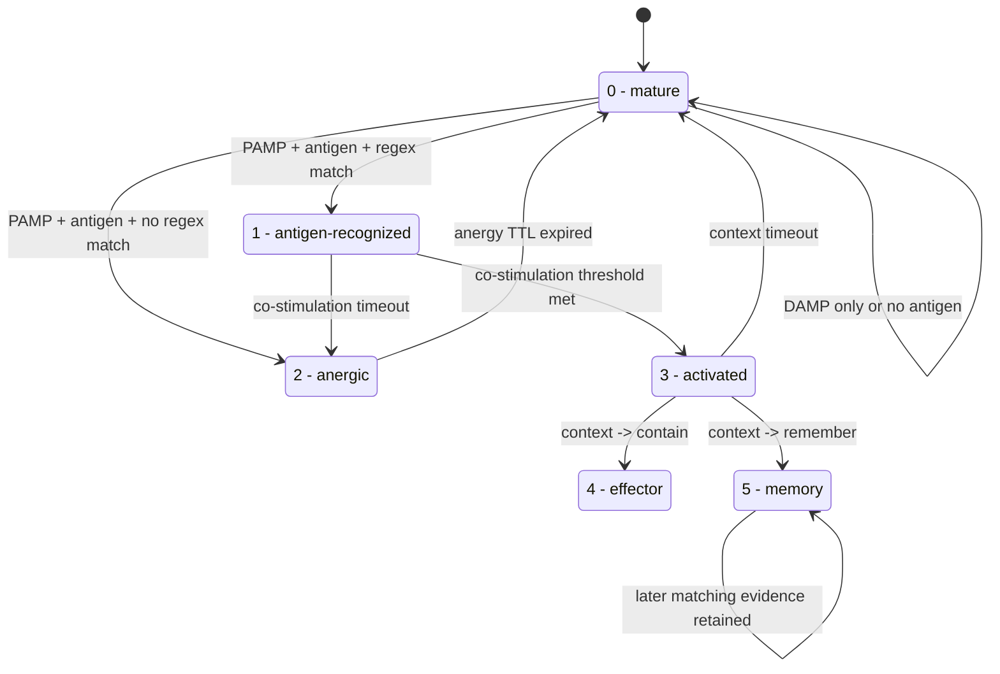

# T Cell Module

`modules/t_cell/t_cell.py` implements an immune-inspired responder for Slips.

It does not modify detector modules. Instead, it subscribes to the shared
`evidence_added` channel, reads the centrally assigned `evidence_signal`, and
creates one T Cell per:

- responsible IP
- regex type
- normalized antigen value

Main behavior:

- only `PAMP` evidence starts antigen recognition and cell creation
- antigens are extracted from evidence fields plus linked DNS/HTTP/SSL altflows
- accepted regexes come from the existing RegexGenerator SQLite store
- `evidence.profile.ip` is the related host context, while containment and
  T-cell ownership use the evidence's responsible IP
- stored `DAMP` observations raise the danger pressure used by
  co-stimulation and context for the same responsible IP
- optional decision tracing writes a separate JSONL audit file showing which
  evidence IDs contributed to threshold calculations
- co-stimulation and context scores decide whether the cell becomes tolerant,
  activates, requests containment, or stores memory
- state `1 - antigen-recognized` and state `3 - activated` can each wait for
  at most one configured Slips time window before timing out to `2 - anergic`
  or `0 - mature`
- once a cell reaches `5 - memory`, later matching evidence keeps it in memory
  without emitting repeated `memory_stored` actions
- containment reuses the existing `new_blocking` payload shape
- all T Cell state is stored in its own SQLite DB and log file

## State Machine



Artifacts:

- module log: `output/t_cell.log`
- optional trace file: `<run_output_dir>/t_cell_trace.jsonl`
  The configured trace path is always forced under the selected run output
  directory.
- module DB: `<run_output_dir>/t_cell/t_cell.sqlite`
- offline HTML report: `<run_output_dir>/t_cell_report.html`

## Local HTML Report

Use the included offline report generator to build a static HTML page from a
completed or running Slips output directory:

```bash
./venv/bin/python modules/t_cell/analyze_t_cell.py \
  --run-output-dir output/<run>
```

By default it writes:

```text
output/<run>/t_cell_report.html
```

The report reads the T Cell SQLite DB first, then enriches the page with the
module log and decision trace when those files exist. That means it still gives
useful summaries when `log_verbosity` is `1` or `2`, and becomes more detailed
when verbosity `3` or decision tracing is enabled.

See [docs/t_cell_module.md](../../docs/t_cell_module.md) for the full design,
configuration, formulas, and DB schema.
